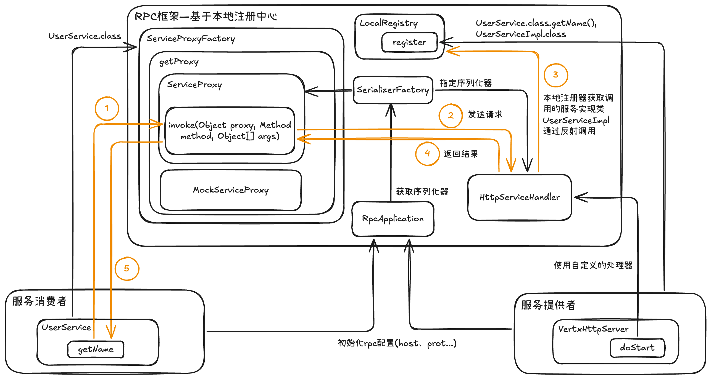
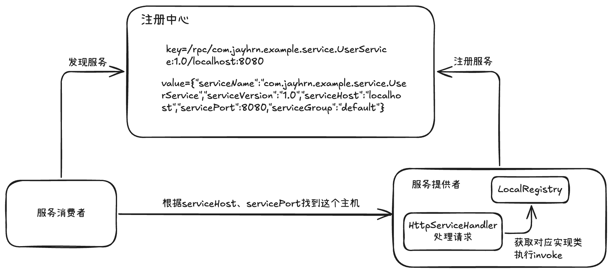

# RPC项目框架
> 从 0 到 1 ，开发自己的RPC框架

项目地址：[jay-rpc](https://github.com/JayHrn/jay-rpc)

## 项目介绍

项目分为了基础版和拓展版。

### 介绍
基于`Java`+`Etcd`+`Vert.x`的高性能`RPC`框架，用新颖的技术浅从0到1开发轮子。

可以学习并实践基于`Vert.x`的网络服务器、序列化器、基于`Etcd`和`ZooKeeper`的注册中心、反射、动态代理、`SPI`机制、自定义网络协议、多种设计模式（单例/工厂/装饰者等）、负载均衡器设计、重试和容错机制、`Spring Boot Starter`注解驱动开发等，大幅提升架构设计能力。

### 项目特点

该项目是一个侧重技术架构的轮子类项目，区别于增删改查、泛滥的业务系统，学到很多后端架构设计方面的知识技能，比如网络协议设计、注册中心、动态代理和`SPI`机制、多种设计模式、负载均衡、重试，机制、容错机制等等。

### 项目收获

- 如何拆解需求，从0开始设计实现RPC框架？

- 如何运用设计模式+`SPI`机制扩展项目？

- 如何更优雅地加载和管理全局配置？

- 如何自定义高性能的RPC协议？

- 如何基于`Vert.x`设计实现TCP服务器和客户端？

- 如何基于Etcd设计高性能的注册中心？

- 如何设计实现负载均衡器，提高系统性能？

- 如何设计实现重试和容错机制，提高系统稳定性？

- 如何基于注解和`Spring Boot Starter`设计项目启动机制？

- 如何从多个角度分析优化项目？

- 此外，还能学会很多作图、思考问题、对比方案的方法，提升排查问题、自主解决Bug的能力。

基于`Java`+`Etcd`+`Vert.x`的高性能`RPC`框架。

## 技术选型

### 后端

后端技术以 Java 为主，但所有的思想和设计都是可以复用到其他语言的，代码不同罢了。

- ⭐️ Vert.x 框架
- ⭐️ Etcd 云原生存储中间件（jetcd 客户端）
- ZooKeeper 分布式协调工具（curator 客户端）
- ⭐️ SPI 机制
- ⭐️ 多种序列化器
  - JSON 序列化
  - Kryo 序列化
  - Hessian 序列化
- ⭐️ 多种设计模式
  - 双检锁单例模式
  - 工厂模式
  - 代理模式
  - 装饰者模式
- ⭐️ Spring Boot Starter 开发
- 反射和注解驱动
- Guava Retrying 重试库
- JUnit 单元测试
- Logback 日志库
- Hutool、Lombok 工具库

## 源码目录

- jay-rpc-easy：Jay RPC 框架简易版
- jay-rpc-common：示例代码公用模块
- jay-rpc-consumer：示例服务消费者
- jay-rpc-provider：示例服务提供者
- jay-rpc-core：Jay RPC 框架核心代码
- jay-rpc-springboot-consumer：示例服务消费者（Spring Boot 框架）
- jay-rpc-springboot-provider：示例服务提供者（Spring Boot 框架）
- jay-rpc-spring-boot-starter：注解驱动的 RPC 框架，可在 Spring Boot 项目中快速使用

## 文档目录

[手写RPC框架教程（1-简易版）](docx/手写RPC框架教程（1-简易版）/手写RPC框架教程（1-简易版）.md)

[手写RPC框架教程（2-全局配置加载）](docx/手写RPC框架教程（2-全局配置加载）/手写RPC框架教程（2-全局配置加载）.md)  

[手写RPC框架教程（3-接口 Mock）](docx/手写RPC框架教程（3-接口Mock）/手写RPC框架教程（3-接口Mock）.md)  

[手写RPC框架教程（4-序列化器与 SPI 机制）](docx/手写RPC框架教程（4-序列化器与SPI机制）/手写RPC框架教程（4-序列化器与SPI机制）.md)  

[手写RPC框架教程（5-注册中心基本实现）](docx/手写RPC框架教程（5-注册中心基本实现）/手写RPC框架教程（5-注册中心基本实现）.md)  

[手写RPC框架教程（6-注册中心优化）](docx/手写RPC框架教程（6-注册中心优化）/手写RPC框架教程（6-注册中心优化）.md)  

[手写RPC框架教程（7-自定义协议）](docx/手写RPC框架教程（7-自定义协议）/手写RPC框架教程（7-自定义协议）.md)  

[手写RPC框架教程（8-负载均衡）](docx/手写RPC框架教程（8-负载均衡）/手写RPC框架教程（8-负载均衡）.md)  

[手写RPC框架教程（9-重试机制）](docx/手写RPC框架教程（9-重试机制）/手写RPC框架教程（9-重试机制）.md)  

[手写RPC框架教程（10-容错机制）](docx/手写RPC框架教程（10-容错机制）/手写RPC框架教程（10-容错机制）.md)  

[手写RPC框架教程（11-启动机制和注解驱动）](docx/手写RPC框架教程（11-启动机制和注解驱动）/手写RPC框架教程（11-启动机制和注解驱动）.md)  

[手写RPC框架教程（12-扩展思路）](docx/手写RPC框架教程（12-扩展思路）/手写RPC框架教程（12-扩展思路）.md)

### RPC 框架简易版

1. RPC 基本概念和作用
2. RPC 框架实现思路 | 基本设计
3. RPC 框架实现思路 | 扩展设计
4. 简易版 RPC 开发 | 项目初始化
5. 简易版 RPC 开发 | web 服务器
6. 简易版 RPC 开发 | 本地服务注册器
7. 简易版 RPC 开发 | 序列化器
8. 简易版 RPC 开发 | 请求处理器
9. 简易版 RPC 开发 | 消费者代理
10. 简易版 RPC 开发 | 测试验证

### RPC 框架扩展版

1. 全局配置加载 | 扩展版项目初始化
2. 全局配置加载 | 配置加载实现
3. 全局配置加载 | 维护全局配置对象
4. 接口 Mock 设计实现
5. 序列化器 | 主流序列化器对比
6. 序列化器 | 多种序列化器实现
7. 序列化器 | SPI 机制
8. 序列化器 | 可扩展序列化器实现（SPI + 工厂模式）
9. 注册中心 | 注册中心核心能力
10. 注册中心 | 注册中心技术选型
11. 注册中心 | Etcd 云原生中间件入门
12. 注册中心 | 基于 Etcd 实现注册中心
13. 注册中心 | 可扩展注册中心实现（SPI + 工厂模式）
14. 注册中心优化 | 心跳检测和续期机制
15. 注册中心优化 | 服务节点下线机制
16. 注册中心优化 | 消费端服务缓存
17. 注册中心优化 | 缓存更新（Etcd 监听机制）
18. 注册中心优化 | ZooKeeper 注册中心实现
19. 自定义协议 | 需求分析及方案设计
20. 自定义协议 | 消息结构设计（参考 Dubbo）
21. 自定义协议 | 网络传输设计（基于 Vert.x 实现 TCP 服务器）
22. 自定义协议 | 编码 / 解码器
23. 自定义协议 | TCP 请求处理器
24. 自定义协议 | TCP 请求客户端
25. 自定义协议 | 粘包半包问题分析
26. 自定义协议 | 使用 Vert.x 解决粘包半包问题
27. 自定义协议 | 客户端代码优化（装饰者模式）
28. 负载均衡 | 负载均衡概念和常用算法
29. 负载均衡 | 一致性 Hash
30. 负载均衡 | 多种负载均衡器实现
31. 负载均衡 | 可扩展负载均衡器实现（SPI + 工厂模式）
32. 重试机制 | 重试等待策略
33. 重试机制 | 重试方案设计
34. 重试机制 | 多种重试策略实现
35. 重试机制 | 可扩展重试策略实现（SPI + 工厂模式）
36. 容错机制 | 容错策略和实现方式
37. 容错机制 | 容错方案设计
38. 容错机制 | 多种容错策略实现
39. 容错机制 | 可扩展容错策略实现（SPI + 工厂模式）
40. 启动机制 | 框架快速启动类
41. 启动机制 | 注解驱动设计
42. 启动机制 | Spring Boot Starter 注解驱动实现
43. 项目扩展思路

## 项目中期框架

时间：2025年06月18日

项目实现基于本地注册中心简易版的RPC框架，为了便于维护配置信息，实现了全局配置加载功能，同时为便捷测试代码，引入接口Mock功能，最后根据SPI机制实现自定义序列化器。

项目功能：简易RPC框架+全局配置+接口Mock+自定义序列化器与SPI机制

## 注册中心基本实现调用关系

