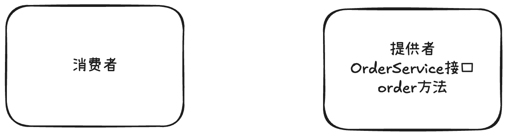

## 基本概念

### 什么是RPC

专业定义：RPC(`Remote Procedure Call`)即远程过程调用，是一种计算机通信协议，它允许程序在不同的计算机之间进行通信和交互，就像本地调用一样。

简单理解，新开了一家卖海鲜的熟食店，现在你作为消费者想要把海鲜购买到家。如果是以前，你只自己跑腿到线下店铺购买，耗时耗力。但现在有了手机、网络、外卖平台，你只需要在家动动手指，就肩能点个外卖让骑手把海鲜配送到家，你不需要关注网络是怎么传输的、外卖平台是怎么操作的、骑手小哥是怎么配送的，只负责享受海鲜就行了。

### 为什么需要RPC

回到RPC的概念，RPC允许一个程序（称为服务消费者）像调用自己程序的方法一样，调用另一个程序（称为服务提供者）的接口，而不需要了解数据的传输处理过程、底层网络通信的细节等。这些都会由RPC框架帮你完成，使得开发者可以轻松调用远程服务，快速开发分布式系统。

举个例子，现在有个项目A提供了点餐服务，项目B需要调用点餐服务完成下单。

点餐服务和接口的示例伪代码如下：

```java
interface OrderService
    //点餐，返回orderId
    long order(参数1, 参数2, 参数3);
}
```

如果没有RPC框架，项目B怎么调用项目A的服务呢？

首先，由于项目A和项目B都是独立的系统，不像SDK一样作为依赖包引入。那么就需要项目A提供web服务，并且编写一个点餐接口暴露服务，比如访问`http://jayhrn.cn`就能调用点餐服务；然后项目B作为服务消费者，需要自己构造请求，并通过HttpClient请求上述地址。如果项目B需要调用更多第三方服务，每个服务和方法的调用都编写一个HTTP请求，那么会非常麻烦！

示例伪代码：

```java
url "http://jayhrn.cn";
req=new Req(参数1, 参数2, 参数3);
res httpclient.post(url).body(req).execute();
orderId = res.data.orderId;
```

而有了RPC框架，项目B可以通过一行代码完成调用！

示例伪代码如下：

```java
orderId = orderService.order(参数1, 参数2, 参数3);
```

看起来就跟调用自己项目的方法没有任何区别！

## RPC框架实现思路

### 基本设计

RPC框架为什么能帮我们简化调用？如何实现一个RPC框架呢？



服务消费者和服务提供者

消费者想要调用提供者，就需要提供者启动一个`web`服务，然后通过请求客户端发送HTTP或者其他协议的请求来调用。

比如请求`jayhrn.cn/order`地址后，提供者会调用`orderService`的`order`方法：


但如果提供者提供了多个服务和方法，每个接口和方法都要单独写一个接口？消费者要针对每个接口写一段`HTTP`调用的逻辑么？

其实可以提供一个统一的服务调用接口，通过请求处理器根据客户端的请求参数来进行不同的处理、调用不同的服务和方法。

> 可以在服务提供者程序维护一个本地服务注册器，记录服务和对应实现类的映射。

举个例子，消费者要调用`OrderService`服务的`order`方法，可以发送请求，参数`services=OrderService， method=order`，然后请求处理器会根据`service`从服务注册器中找到对应的服务实现类并且通过`Java`的反射机制调用`method`指定的方法。


需要注意的是，由于`Java`对象无法直接在网络中传输，所以要对传输的参数进行序列化和反序列化。


为了简化消费者发请求的代码，实现类似本地调用的体验。可以基于**代理模式**，为消费者要调用的接口生成一个代理对象，由代理对象完成请求和响应的过程。

所谓代理，就是有人帮你做一些事情，不用自己操心。

至此，一个最简易的RPC框架架构图诞生了：


虚线框部分，就是RPC框架需要提供的模块和能力。

### 扩展设计

#### 服务注册发现

问题1：消费者如何知道提供者的调用地址呢？

类比生活场景，我们点外卖时，外卖小哥如何知道我们的地址和店铺的地址？肯定是买家和卖家分别填写地址，由平台来保存的。因此，我们需要一个注册中心，来保存服务提供者的地址。消费者要调用服务时，只需从注册中心获取对应服务的提供者地址即可。


一般用现成的第三方注册中心，比如`Redis`、`Zookeeper`即可。

#### 负载均衡

问题2：如果有多个服务提供者，消费者应该调用哪个服务提供者呢？

我们可以给服务调用方增加负载均衡能力，通过指定不同的算法来决定调用哪一个服务提供者，比如轮询、随机、根据性能动态调用等。

架构图如下：


#### 容错机制

问题3：如果服务调用失败，应该如何处理呢？

为了保证分布式系统的高可用，我们通常会给服务的调用增加一定的容错机制，比如失败重试、降级调用其他接口等等。

架构图如下：


#### 其他

除了上面几个经典设计外，如果想要做一个优秀的RPC框架，还要考虑很多问题。

比如：

- 服务提供者下线了怎么办？需要一个失效节点剔除机制。

- 服务消费者每次都从注册中心拉取信息，性能会不会很差？可以使用缓存来优化性能。

- 如何优化RPC框架的传输通讯性能？比如选择合适的网络框架、自定义协议头、节约传输体积等。

- 如何让整个框架更利于扩展？比如使用Java的`SPI`机制、配置化等等。

## 开发简易版RPC框架

架构设计图：


### 项目准备

#### 项目初始化

创建项目根目录：【这里用到的JDK 为 `21`】


删除项目内`src`文件夹，其他内容可自行选择性删除，在项目中另外新建四个模块（**注意`Parent`选择`None`**，也就是子项目不要依赖父工程)，分别是：

- `jay-rpc-easy`：Jay RPC 框架简易版
- `jay-rpc-common`：示例代码公用模块
- `jay-rpc-consumer`：示例服务消费者
- `jay-rpc-provider`：示例服务提供者


分别介绍几个模块：

- `jay-rpc-common`:示例代码的公共依赖，包括接口、Model等

- `jay-rpc-consumer`:示例服务消费者代码

- `jay-rpc-provider`:示例服务提供者代码

- `jay-rpc-easy`:简易版RPC框架

#### 公共模块

公共模块`jay-rpc-common`需要同时被消费者和服务提供者引入，主要是编写和服务相关的接口和数据模型。

1. 用户实体类`User`


注意，对象需要实现序列化接口，为后续网络传输序列化提供支特。

2. 用户服务接口`UserService`，提供一个获取用户的方法


#### 服务提供者

服务提供者`jay-rpc-provider`是真正实现了接口的模块。

1. 在`jay-rpc-provider`模块的`pom.xml`文件中引入依赖

```xml
<dependencies>
        <dependency>
            <groupId>com.jayhrn.jayrpc</groupId>
            <artifactId>jay-rpc-easy</artifactId>
            <version>1.0-SNAPSHOT</version>
        </dependency>
        <dependency>
            <groupId>com.jayhrn.example</groupId>
            <artifactId>jay-rpc-common</artifactId>
            <version>1.0-SNAPSHOT</version>
        </dependency>
        <!-- https://mvnrepository.com/artifact/cn.hutool/hutool-all -->
        <dependency>
            <groupId>cn.hutool</groupId>
            <artifactId>hutool-all</artifactId>
            <version>5.8.38</version>
        </dependency>
        <!-- https://mvnrepository.com/artifact/org.projectlombok/lombok -->
        <dependency>
            <groupId>org.projectlombok</groupId>
            <artifactId>lombok</artifactId>
            <version>1.18.38</version>
        </dependency>
        <dependency>
            <groupId>junit</groupId>
            <artifactId>junit</artifactId>
            <version>3.8.1</version>
            <scope>test</scope>
        </dependency>
</dependencies>
```

2. 编写服务实现类，实现公共模块中定义的用户服务接口。功能是打印用户的名称，并且返回参数中的用户对象。

   代码如下：


3. 编写服务提供者启动类`EasyProvider`，之后会在该类的main方法中编写提供服务的代码。

   代码如下：


#### 服务消费者

服务消费者`jay-rpc-consumer`是需要调用服务的模块。

1. 在`jay-rpc-consumer`项目的`pom.xml`文件中引入依赖，和提供者模块的依赖一致：

```xml
<dependencies>
        <dependency>
            <groupId>com.jayhrn.jayrpc</groupId>
            <artifactId>jay-rpc-easy</artifactId>
            <version>1.0-SNAPSHOT</version>
        </dependency>
        <dependency>
            <groupId>com.jayhrn.example</groupId>
            <artifactId>jay-rpc-common</artifactId>
            <version>1.0-SNAPSHOT</version>
        </dependency>
        <!-- https://mvnrepository.com/artifact/cn.hutool/hutool-all -->
        <dependency>
            <groupId>cn.hutool</groupId>
            <artifactId>hutool-all</artifactId>
            <version>5.8.38</version>
        </dependency>
        <!-- https://mvnrepository.com/artifact/org.projectlombok/lombok -->
        <dependency>
            <groupId>org.projectlombok</groupId>
            <artifactId>lombok</artifactId>
            <version>1.18.38</version>
        </dependency>
        <dependency>
            <groupId>junit</groupId>
            <artifactId>junit</artifactId>
            <version>3.8.1</version>
            <scope>test</scope>
        </dependency>
</dependencies>
```

2. 创建服务消费者启动类`EasyConsumer`编写调用接口的代码。

   代码如下：


需要注意的是，现在是无法获取到`userService`实例的，所以预留为`null`。我们之后的目标是，能够通过RPC框架，快速得到一个支持远程调用服务提供者的代理对象，像调用本地方法一样调用`UserService`的方法。

### web服务器

接下来，我们要先让服务提供者提供可远程访问的服务。那么，就需要一个web服务器，能够接受处理请求、并返回响应。

web服务器的选择有很多，比如`Spring Boot`内嵌的`Tomcat`、`NIO`框架`Netty`和`Vert.x`等等。

此处使用高性的`NIO`框架`Vert.x`来作为RPC框架的web服务器。

官方文档：https://vertx.io/

1. 在`jay-rpc-easy`模块中引入`Vert.x`和工具类的依赖：

```xml
<dependencies>
        <!-- https://mvnrepository.com/artifact/io.vertx/vertx-core -->
        <dependency>
            <groupId>io.vertx</groupId>
            <artifactId>vertx-core</artifactId>
            <version>5.0.0</version>
        </dependency>
        <dependency>
            <groupId>cn.hutool</groupId>
            <artifactId>hutool-all</artifactId>
            <version>5.8.38</version>
        </dependency>
        <dependency>
            <groupId>org.projectlombok</groupId>
            <artifactId>lombok</artifactId>
            <version>1.18.38</version>
            <scope>provided</scope>
        </dependency>
        <dependency>
            <groupId>junit</groupId>
            <artifactId>junit</artifactId>
            <version>3.8.1</version>
            <scope>test</scope>
        </dependency>
</dependencies>
```

2. 编写一个web服务器的接口`HttpServer`，定义统一的启动服务器方法，便于后续的扩展，比如实现多种不同的web服务器。

   代码如下：


3. 编写基于`Vert.x`实现的web服务器`VertxHttpServer`，能够监听指定端口并处理请求，放在`server`包里，和`HttpServer`接口同一个包。

   代码如下：

```java
package com.jayhrn.jayrpc.server;

import io.vertx.core.Vertx;

/**
 * Vertx HTTP 服务器
 *
 * @Author JayHrn
 * @Date 2025/6/15 16:44
 * @Version 1.0
 */
public class VertxHttpServer implements HttpServer {
    /**
     * 启动服务器
     *
     * @param port 端口
     */
    @Override
    public void doStart(int port) {
        // 穿件Vertx实例
        Vertx vertx = Vertx.vertx();

        // 创建HTTP服务器
        io.vertx.core.http.HttpServer server = vertx.createHttpServer();

        // 监听端口并处理请求
        server.requestHandler(request -> {
            // 处理HTTP请求
            System.out.println("收到请求: " + request.method() + " " + request.uri());
            // 发送HTTP响应
            request.response()
                    .putHeader("content-type", "text/plain")
                    .end("Hello Vert.x HTTP Server");
        });

        // 启动HTTP服务器并监听端口请求
        server.listen(port)
                .onSuccess(response -> {
                    System.out.println("Server is listening on port " + port);
                })
                .onFailure(response -> {
                    System.out.println("Failed to start server on port " + port);
                });
    }
}
```

4. 验证web服务器能否启动成功并接受请求。

   修改示例服务提供者模块的`EasyProvider`类，编写启动web服务的代码，如下：


直接运行访问端口`8080`即可看到页面输出：Hello Vert.x HTTP Server

### 本地服务注册器

我们现在故的简易RPC框架主要是跑通流程，所以暂时先不用第三方注册中心，直接把服务注册到服务提供者本地即可。

在RPC模块中创建本地服务注册器`LocalRegistry`，当前目录结构如下：


使用线程安全的`ConcurrentHashMap`存储服务注册信息，key为服务名称、value为服务的实现类。之后就可以根据要调用的服务名称获取到对应的实现类，然后通过反射进行方法调用了。

代码如下：

```java
package com.jayhrn.jayrpc.registry;

import java.util.Map;
import java.util.concurrent.ConcurrentHashMap;

/**
 * 本地注册中心
 * @Author JayHrn
 * @Date 2025/6/15 17:05
 * @Version 1.0
 */
public class LocalRegistry {
    /**
     * 注册信息存储
     */
    private static final Map<String, Class<?>> map = new ConcurrentHashMap<>();

    /**
     * 注册服务
     * @param serviceName 服务名称
     * @param implClass 实现类
     */
    public static void register(String serviceName, Class<?> implClass) {
        map.put(serviceName, implClass);
    }

    /**
     * 根据服务名称获取服务
     * @param serviceName 服务名称
     * @return
     */
    public static Class<?> get(String serviceName) {
        return map.get(serviceName);
    }

    /**
     * 删除服务
     * @param serviceName 服务名称
     */
    public static void remove(String serviceName) {
        map.remove(serviceName);
    }

}
```

注意，本地服务注册器和注册中心的作用是有区别的。注册中心的作用侧重于管理注册的服务、提供服务信息给消费者；而本地服务注册器的作用是根据服务名获取到对应的实现类，是完成调用必不可少的模块。

服务提供者启动时，需要注册服务到注册器中，修改`EasyProvider`代码如下：

```java
package com.jayhrn.example.provider;

import com.jayhrn.example.service.UserService;
import com.jayhrn.jayrpc.registry.LocalRegistry;
import com.jayhrn.jayrpc.server.VertxHttpServer;

/**
 * 服务提供者
 *
 * @Author JayHrn
 * @Date 2025/6/15 16:33
 * @Version 1.0
 */
public class EasyProvider {
    public static void main(String[] args) {
        // 注册服务
        LocalRegistry.register(UserService.class.getName(), UserServiceImpl.class);

        // 启动web服务器
        VertxHttpServer vertxHttpServer = new VertxHttpServer();
        vertxHttpServer.doStart(8080);
    }
}
```

### 序列化器

服务在本地注册后，我们就可以根据请求信息取出实现类并调用方法了。

但是在编写处理请求的逻辑前，我们要先实现序列化器模块。因为无论是请求或响应，都会涉及参数的传输。而`Java`对象是存活在`JVM`虚拟以机中的，如果想在其他位置存储并访问、或者在网络中进行传输，就需要进行序列化和反序列化。

序例化和反序列化：

- 序列化：将`Java`对象转为可传输的字节数组。

- 反序列化：将字节数组转换为`Java`对象。

有很多种不同的序列化方式，比如`Java`原生序列化、JSON、Hessian、Kryo、protobuf等。

为了实现方便，此处选择`Java`原生的序列化器。

1. 在`jay-rpc-easy`模块中编写序列化接口`Serializer`，提供序列化和反序列化两个方法，便于后续扩展更多的序列化器。

   代码放在`com.jayhrn.jayrpc.serializer`包里，代码如下：

```java
package com.jayhrn.jayrpc.serializer;

import java.io.IOException;

/**
 * 序列化器接口
 *
 * @Author JayHrn
 * @Date 2025/6/15 17:12
 * @Version 1.0
 */
public interface Serializer {
    /**
     * 序列化
     *
     * @param obj 对象
     * @param <T>
     * @return
     * @throws IOException
     */
    <T> byte[] serialize(T obj) throws IOException;

    /**
     * 反序列化
     *
     * @param bytes
     * @param type
     * @param <T>
     * @return
     * @throws IOException
     */
    <T> T deserialize(byte[] bytes, Class<T> type) throws IOException;
}
```

2. 基于`Java`自带的序列化器实现`JdkSerializer`，代码放在和`Serializer`同一个包里，代码如下：

```javascript
package com.jayhrn.jayrpc.serializer;

import java.io.*;

/**
 * 基于JDK实现的序列化器
 *
 * @Author JayHrn
 * @Date 2025/6/15 17:18
 * @Version 1.0
 */
public class JdkSerializer implements Serializer {
    /**
     * 序列化
     *
     * @param obj 对象
     * @param <T>
     * @return
     * @throws IOException
     */
    @Override
    public <T> byte[] serialize(T obj) throws IOException {
        ByteArrayOutputStream byteArrayOutputStream = new ByteArrayOutputStream();
        ObjectOutputStream objectOutputStream = new ObjectOutputStream(byteArrayOutputStream);
        objectOutputStream.writeObject(obj);
        objectOutputStream.close();
        return byteArrayOutputStream.toByteArray();
    }

    /**
     * 反序列化
     *
     * @param bytes
     * @param type
     * @param <T>
     * @return
     * @throws IOException
     */
    @Override
    public <T> T deserialize(byte[] bytes, Class<T> type) throws IOException {
        ByteArrayInputStream byteArrayInputStream = new ByteArrayInputStream(bytes);
        ObjectInputStream objectInputStream = new ObjectInputStream(byteArrayInputStream);
        try {
            return (T) objectInputStream.readObject();
        } catch (ClassNotFoundException e) {
            throw new RuntimeException(e);
        } finally {
            objectInputStream.close();
        }
    }
}
```

### 提供者处理调用 - 请求处理器

请求处理器是RPC框架的实现关键，它的作用是：处理接收到的请求，并根据请求参数找到对应的服务和方法，通过反射实现调用，最后封装返回结果并响应请求。

1. 在RPC模块中编写请求和响应封装类。

   目录结构如下：


请求类`RpcRequest`的作用是封装调用所需的信息，比如服务名称、方法名称、调用参数的类型列表、参数列表。这些都是`Java`反射机制所需的参数。

代码如下：

```java
package com.jayhrn.jayrpc.model;

import lombok.AllArgsConstructor;
import lombok.Builder;
import lombok.Data;
import lombok.NoArgsConstructor;

import java.io.Serializable;

/**
 * 请求类: 封装调用所需的信息，比如服务名称、方法名称、调用参数的类型列表、参数列表
 *
 * @Author JayHrn
 * @Date 2025/6/15 17:21
 * @Version 1.0
 */
@Data
@Builder
@AllArgsConstructor
@NoArgsConstructor
public class RpcRequest implements Serializable {
    /**
     * 服务名称
     */
    private String serviceName;
    /**
     * 方法名称
     */
    private String methodName;
    /**
     * 参数类型列表
     */
    private Class<?>[] parameterTypes;
    /**
     * 参数列表
     */
    private Object[] args;
}
```

响应类`RpcResponse`的作用是封装调用方法得到的返回值、以及调用的信息（比如异常情况）等。

代码如下：

```java
package com.jayhrn.jayrpc.model;

import lombok.AllArgsConstructor;
import lombok.Builder;
import lombok.Data;
import lombok.NoArgsConstructor;

import java.io.Serializable;

/**
 * 响应类: 封装调用方法得到的返回值、以及调用的信息（比如异常情况）等
 *
 * @Author JayHrn
 * @Date 2025/6/15 17:22
 * @Version 1.0
 */
@Data
@Builder
@AllArgsConstructor
@NoArgsConstructor
public class RpcResponse implements Serializable {
    /**
     * 响应数据
     */
    private Object data;

    /**
     * 响应数据类型（预留）
     */
    private Class<?> dataType;

    /**
     * 响应信息
     */
    private String message;

    /**
     * 异常信息
     */
    private Exception exception;

}
```

2. 编写请求处理器`HttpServerHandler`

业务流程如下：

(1) 反序列化请求为对象，并从请求对象中获取参数。

(2) 根据服务名称从本地注册器中获取到对应的服务实现类。

(3) 通过反射机制调用方法，得到返回结果。

(4) 对返回结果进行封装和序列化，并写入到响应中。

代码放在`jay-rpc-easy`模块的`com.jayhrn.jayrpc.server`包下，代码如下：

```java
package com.jayhrn.jayrpc.server;

import com.jayhrn.jayrpc.model.RpcRequest;
import com.jayhrn.jayrpc.model.RpcResponse;
import com.jayhrn.jayrpc.registry.LocalRegistry;
import com.jayhrn.jayrpc.serializer.JdkSerializer;
import com.jayhrn.jayrpc.serializer.Serializer;
import io.vertx.core.Handler;
import io.vertx.core.buffer.Buffer;
import io.vertx.core.http.HttpServerRequest;
import io.vertx.core.http.HttpServerResponse;

import java.io.IOException;
import java.lang.reflect.Method;

/**
 * HTTP 请求处理
 *
 * @Author JayHrn
 * @Date 2025/6/15 17:29
 * @Version 1.0
 */
public class HttpServiceHandler implements Handler<HttpServerRequest> {
    @Override
    public void handle(HttpServerRequest httpServerRequest) {
        // 指定序列化器
        final Serializer serializer = new JdkSerializer();

        // 记录日志
        System.out.println("Received request: " + httpServerRequest.method() + " " + httpServerRequest.uri());

        // 异步处理
        httpServerRequest.bodyHandler(body -> {
            byte[] bytes = body.getBytes();
            RpcRequest rpcRequest = null;
            try {
                rpcRequest = serializer.deserialize(bytes, RpcRequest.class);
            } catch (Exception e) {
                e.printStackTrace();
            }

            // 构造响应对象结果
            RpcResponse rpcResponse = new RpcResponse();
            if (rpcRequest == null) {
                rpcResponse.setMessage("rpcRequest is null");
                doResponse(httpServerRequest, rpcResponse, serializer);
                return;
            }
            try {
                // 通过本地注册器获取要调用的服务实现类，通过反射调用
                Class<?> implClass = LocalRegistry.get(rpcRequest.getServiceName());
                Method method = implClass.getMethod(rpcRequest.getMethodName(), rpcRequest.getParameterTypes());
                Object result = method.invoke(implClass.newInstance(), rpcRequest.getArgs());
                // 封装返回结果
                rpcResponse.setData(result);
                rpcResponse.setDataType(method.getReturnType());
                rpcResponse.setMessage("ok");
            } catch (Exception e) {
                e.printStackTrace();
                rpcResponse.setMessage(e.getMessage());
                rpcResponse.setException(e);
            }
            // 响应
            doResponse(httpServerRequest, rpcResponse, serializer);
        });
    }

    /**
     * 响应
     *
     * @param httpServerRequest HTTP请求
     * @param rpcResponse       rpc响应结果
     * @param serializer        序列化器
     */
    private void doResponse(HttpServerRequest httpServerRequest, RpcResponse rpcResponse, Serializer serializer) {
        HttpServerResponse httpServerResponse = httpServerRequest.response()
                .putHeader("content-type", "application/json");
        try {
            byte[] serialized = serializer.serialize(rpcResponse);
            httpServerResponse.end(Buffer.buffer(serialized));
        } catch (IOException e) {
            e.printStackTrace();
            httpServerResponse.end(Buffer.buffer());
        }
    }
}
```

需要注意，不同的web服务器对应的请求处理器实现方式也不同，比如`Vert.x`中是通过实现`Handler<HttpServerRequest>`接口来自定义请求处理器的。并且可以通过`httpServerRequest.bodyHandler`异步处理请求。

3. 给HttpServer绑定请求处理器。

修改`VertxHttpServer`的代码，通过`server.requestHandler`绑定请求处理器。

修改后的代码如下：

```java
package com.jayhrn.jayrpc.server;

import io.vertx.core.Vertx;

/**
 * Vertx HTTP 服务器
 *
 * @Author JayHrn
 * @Date 2025/6/15 16:44
 * @Version 1.0
 */
public class VertxHttpServer implements HttpServer {
    /**
     * 启动服务器
     *
     * @param port 端口
     */
    @Override
    public void doStart(int port) {
        // 穿件Vertx实例
        Vertx vertx = Vertx.vertx();

        // 创建HTTP服务器
        io.vertx.core.http.HttpServer server = vertx.createHttpServer();

        // 监听端口并处理请求，使用自定义的处理器
        server.requestHandler(new HttpServiceHandler());

        // 启动HTTP服务器并监听端口请求
        server.listen(port)
                .onSuccess(response -> {
                    System.out.println("Server is listening on port " + port);
                })
                .onFailure(response -> {
                    System.out.println("Failed to start server on port " + port);
                });
    }
}
```

至此，引入了RPC框架的服务提供者模块，己经能够接受请求并完成服务调用了。

### 消费方发起调用 - 代理

对于`EasyConsumer`类中的`UserService userService = null`这个具体的实现类哪里来，我们可以通过生成代理对象来简化消费方的调用。

### 静态代理

静态代理是指为每一个特定类型的接口或对象，编写一个代理类。

比如在`jay-rpc-consumer`模块中，创建一个静态代理`UserServiceProxy`，实现`UserService`接口和`getUser`方法。


只不过实现`getUser`方法时，不是复制粘贴服务提供者`UserServicelmpl`中的代码，而是要构造HTTP请求去调用服务提供者。

需要注意发送请求前要将参数序列化，代码如下：

```java
package com.jayhrn.example.consumer;

import cn.hutool.http.HttpRequest;
import cn.hutool.http.HttpResponse;
import com.jayhrn.example.model.User;
import com.jayhrn.example.service.UserService;
import com.jayhrn.jayrpc.model.RpcRequest;
import com.jayhrn.jayrpc.model.RpcResponse;
import com.jayhrn.jayrpc.serializer.JdkSerializer;
import com.jayhrn.jayrpc.serializer.Serializer;

/**
 * 用户服务静态代理
 *
 * @Author JayHrn
 * @Date 2025/6/15 17:52
 * @Version 1.0
 */
public class UserServiceProxy implements UserService {
    @Override
    public User getUser(User user) {
        // 制定序列化器
        final Serializer serializer = new JdkSerializer();

        // 构造请求
        RpcRequest rpcRequest = RpcRequest.builder()
                .serviceName(UserService.class.getName())
                // 方法名称
                .methodName("getUser")
                // 参数类型User类型
                .parameterTypes(new Class[]{User.class})
                // 参数就是user
                .args(new Object[]{user})
                .build();
        try {
            // 序列化 (Java对象 => 字节数组)
            byte[] bodyBytes = serializer.serialize(rpcRequest);

            // 发送请求
            try (HttpResponse httpResponse = HttpRequest.post("http://localhost:8080")
                    .body(bodyBytes)
                    .execute()) {
                // 获取响应
                byte[] result = httpResponse.bodyBytes();
                // 反序列化 (字节数组 => Java对象)
                RpcResponse rpcResponse = serializer.deserialize(result, RpcResponse.class);
                return (User) rpcResponse.getData();
            }
        } catch (Exception e) {
            e.printStackTrace();
        }

        return null;
    }
}
```

然后修改`EasyConsumer`，`new`一个代理对象`UserServiceProxy`并赋值给`userService`，就能完成调用：

```java
package com.jayhrn.example.consumer;

import com.jayhrn.example.model.User;
import com.jayhrn.example.service.UserService;
import com.jayhrn.jayrpc.proxy.ServiceProxyFactory;

/**
 * 服务消费者
 *
 * @Author JayHrn
 * @Date 2025/6/15 16:35
 * @Version 1.0
 */
public class EasyConsumer {
    public static void main(String[] args) {
        // 静态代理
        UserService userService = new UserServiceProxy();
        User user = new User();
        user.setName("JayHrn");
        // 调用
        User newUser = userService.getUser(user);
        if (newUser != null) {
            System.out.println(newUser.getName());
        } else {
            System.out.println("user == null");
        }
    }
}
```

静态代理虽然很好理解（就是写个实现类），但缺点也很明显，我们如果要给每个服务接口都写一个实现类，是非常麻烦的，这种代理方式的灵活性很差！

所以RPC框架中，我们会使用动态代理。

### 动态代理

动态代理的作用是，根据要生成的对象的类型，自动生成一个代理对象。

常用的动态代理实现方式有`JDK`动态代理和基于字节码生成的动态代理（比如`CGLB`)。前者简单易用、无需引入额外的库，但缺点是只对接口进行代理；后者更灵活、可以对任何类进行代理，但性略低于`JDK`动态代理。
此处我们使用`JDK`动态代理。

1. 在`jay-rpc-easy`模块中编写动态代理类`ServiceProxy`，要实现`InvocationHandler`接口的`invoke`方法。

   

   代码如下（几乎就是把静态代理的代码搬运过来）：

```java
package com.jayhrn.jayrpc.proxy;

import cn.hutool.http.HttpRequest;
import cn.hutool.http.HttpResponse;
import com.jayhrn.jayrpc.model.RpcRequest;
import com.jayhrn.jayrpc.model.RpcResponse;
import com.jayhrn.jayrpc.serializer.JdkSerializer;
import com.jayhrn.jayrpc.serializer.Serializer;

import java.io.IOException;
import java.lang.reflect.InvocationHandler;
import java.lang.reflect.Method;

/**
 * 服务代理（JDK 动态代理）
 *
 * @Author JayHrn
 * @Date 2025/6/15 18:27
 * @Version 1.0
 */
public class ServiceProxy implements InvocationHandler {
    /**
     * 调用代理
     *
     * @return
     * @throws Throwable
     */
    @Override
    public Object invoke(Object proxy, Method method, Object[] args) throws Throwable {
        // 指定序列化器
        Serializer serializer = new JdkSerializer();

        // 构造请求
        RpcRequest rpcRequest = RpcRequest.builder()
                .serviceName(method.getDeclaringClass().getName())
                .methodName(method.getName())
                .parameterTypes(method.getParameterTypes())
                .args(args)
                .build();
        try {
            // 序列化
            byte[] bodyBytes = serializer.serialize(rpcRequest);
            // 发送请求
            // TODO: 注意，这里地址被硬编码了（需要使用注册中心和服务发现机制解决）
            try (HttpResponse httpResponse = HttpRequest.post("http://localhost:8080")
                    .body(bodyBytes)
                    .execute()) {
                // 接受响应
                byte[] result = httpResponse.bodyBytes();
                // 反序列化
                RpcResponse rpcResponse = serializer.deserialize(result, RpcResponse.class);
                return rpcResponse.getData();
            }
        } catch (IOException e) {
            e.printStackTrace();
        }
        return null;
    }
}
```

解释下上述代码，当用户调用某个接口的方法时，会改为自动调用`invoke`方法。在`invoke`方法中，我们可以获取到要调用的方法信息、传入的参数列表等，这不就是我们服务提供者需要的参数么？用这些参数来构造请求对象就可以完成调用了。

需要注意的是，上述代码中，请求的服务提供者地址被硬编码了，需要使用注册中心和服务发现机制来解决。

2. 创建动态代理工厂`ServiceProxyFactory`，作用是根据指定类创建动态代理对象。

   使用了工厂设计模式，来简化对象的创建过程，代码如下：


上述代码中，主要是通过`Proxy.newProxyInstance`方法为指定类型创建代理对象。

3. 最后，在`EasyConsumer`中，就可以通过调用工厂来为`UserService`获取动态代理对象了。

   代码如下：


至此，简易版的RPC框架已经开发完成。