## 容错机制

### 需求分析

我们已经给RPC框架增加了重试机制，提升了服务消费端的可靠性和健壮性。

但如果重试超过了一定次数仍然失败，我们又该怎么处理呢？

或者说当调用出现失败时，我们一定要重试么？有没有其他的策略呢？

### 设计方案

#### 容错机制

容错是指系统在出现异常情况时，可以通过一定的策略保证系统仍然稳定运行，从而提高系统的可靠性和健壮性。

在分布式系统中，容措机制尤为重要，因为分布式系统中的各个组件都可能存在网络故障、节点故障等各种异常情况。要顾全大局，尽可消除偶发/单点故障对系统带来的整体影响。

打个比方，将分布式系统类比为一家公司，如果公司某个优秀员工请假了，需要“触发容错”，让另一个普通员工顶上，这本质上是容错机制的一种降级策略。

容错机制一般都是在系统出现错误时才触发的，我们需要重点学习容错策略和容错实现方式。

#### 容错策略

容错策略有很多种，常用的容错策略主要是以下几个：

- Fail-Over故障转移：一次调用失败后，切换一个其他节点再次进行调用，也算是一种重试

- Fail-Back失败自动恢复：系统的某个功出现调用失败或错误时，通过其他的方法，恢复该功能的正常。可以理解为降级，比如重试、调用其他服务等

- Fail-Safe静默处理：系统出现部分非重要功的异常时，直接忽略掉，不做任何处理，就像错误没有发生过一样

- Fail-Fast快速失败：系统出现调用错误时，立刻报错，交给外层调用方处理

#### 容错实现方式

容错其实是个比较广泛的概念，除了上面几种策略外，很多技术都可以起到容错的作用。

比如：

1. 重试：重试本质上也是一种容错的降级策略，系统错误后再试一次。
2. 限流：当系统压力过大、已经出现部分错误时，通过限制执行操作（接受请求）的频率或数量，对系统进行保护。
3. 降级：系统出现错误后，改为执行其他更稳定可用的操作。也可以叫做“兜底”或"有损服务”，这种方式的本质是：即使牺性一定的服务质量，也要保证系统的部分功能可用，保证基本的功能需求得到满足。
4. 熔断：系统出现故障或异常时，暂时中断对该服务的请求，而是执行其他操作，以避免连锁故障。
5. 超时控制：如果请求或操作长时间没处理完成，就进行中断，防止阻塞和资源占用。

注意，在实际项目中，根据对系统可靠性的需求，我们通常会结合多种策略或方法实现容错机制。

#### 容错方案设计

回归到我们的RPC框架，之前已经给系统增加重试机制了，算是实现了一部分的容错能力。

现在，我们可以正式引入容错机制，通过更多策略来进一步增加系统可靠性。

容错方案的设计可以是很灵活的。

这里提供2种方案：

1. 先容错再重试：当系统发生异常时，首先会触发容错机制，比如记录日志、进行告警等，然后可以选择是否进行重试。这种方案其实是把重试当故容错机制的一种可选方案。
2. 先重试再容错：在发生错误后，首先尝试重试操作，如果重试多次仍然失败，则触发容错机制，比如记录日志、进行告警等。

但其实这2种方案其实完全可以结合使用！

系统错误时，先通过重试操作解决一些临时性的异常，比如网络波动、服务端临时不可用等。如果重试多次后仍然失败，说明可能存在更严重的问题，这时可以触发其他的容措策略，比如调用降级服务、熔断、限流、快速失败等，来减少异常的影响，保障系统的稳定性和可靠性。

举个具体的例子：

1. 系统调用服务A出现网络错误，使用容错策略-重试。
2. 重试3次失败后，使用其他容错策略-降级。
3. 系统改为调用不依赖网络的服务B，完成操作

### 开发实现

#### 多种容错策略实现

在RPC项目中新建`fault.tolerant`包，将所有容错相关的代码放到该包下。

**[1] 编写容措策略通用接口**

提供一个容措方法，使用Map类型的参数接受上下文信息（可用于灵活地传递容措处理需要用到的数据），并且接受一个具体的异常类参数。

由于容错是应用到发送请求操作的，所以容错方法的返回值是RpcResponse(响应)。

代码如下：

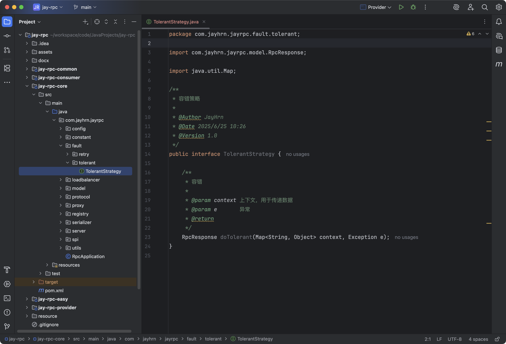

**[2] 快速失败容错策略实现**

很好理解，就是遇到异常后，将异常再次抛出，交给外层处理。

代码如下：

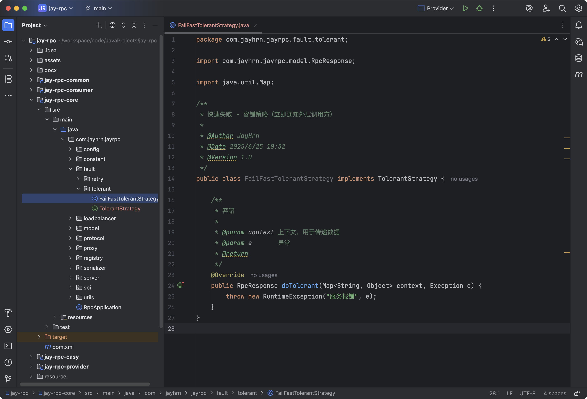

**[3] 静默处理容错策略实现**

也很好理解，就是遇到异常后，记己录一条日志，然后正常返回一个响应对象，就好像没有出现过报措。

代码如下：

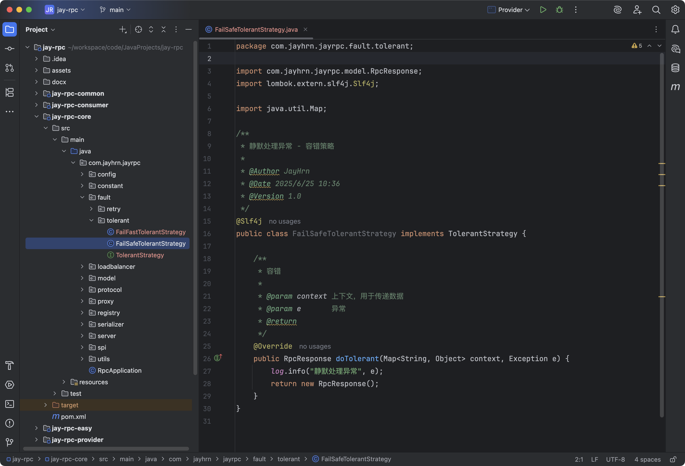

**[4] 其他容错策略**

还可以自行实现更多的容错策略，比如`FailBackTolerantStrategy`故障恢复策略：

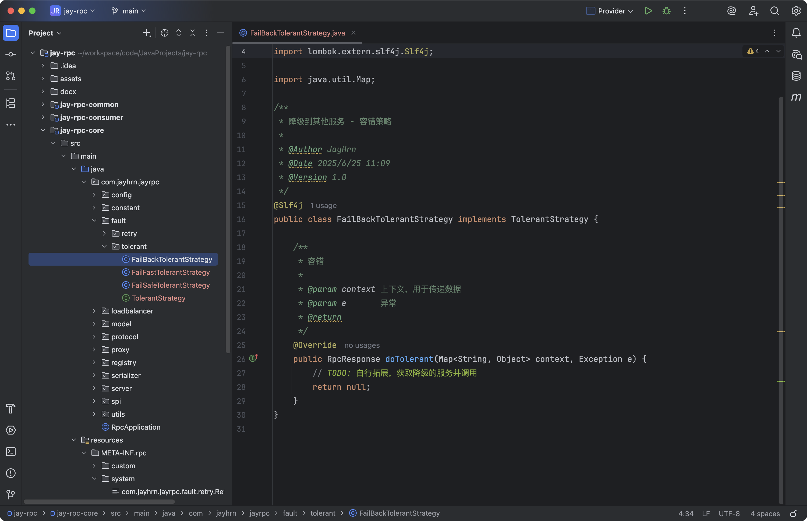

还有`FailOverTolerantStrategy`故障转移策略：

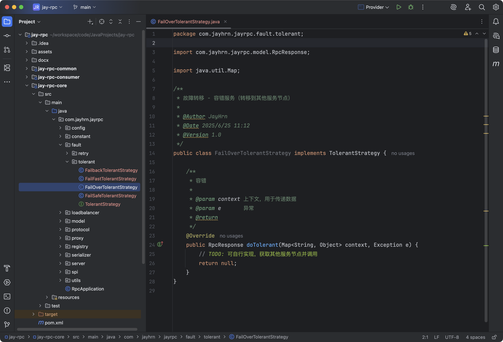

#### 支持配置和拓展容错策略

一个成熟的RPC框架可能会支持多种不同的容错策略，像序列化器、注册中心、负载均衡器一样，我们的需求是，让开发者能够填写配置来指定使用的容错策略，并且支持自定义容错策略，让框架更易用、更利于扩展。

要实现这点，开发方式和序列化器、注册中心、负载均衡器都是一样的，都可以使用工厂创建对象、使用`SPI`动态动加载自定义的注册中心。

**[1] 容错策略常量**

在`fault.tolerant`包下新建`TolerantStrategyKeys`类，列举所有支持的容错策略键名。

代码如下：

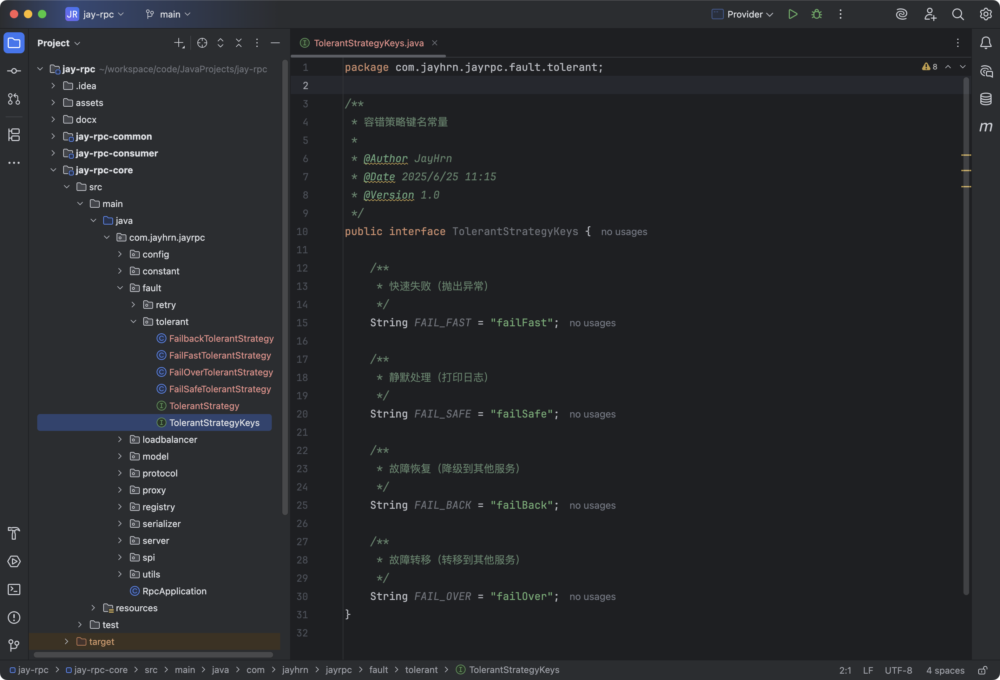

**[2] 使用工厂模式，根据key从SPI获取容错第略对象实例**

在`fault.tolerant`包下新建`TolerantStrategyFactory`类，代码如下：

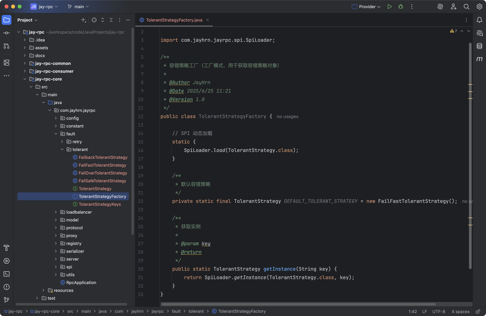

**[3] 编写容措策略接口的SPl配置**

在`META-INF`的`rpc/system`目录下编写容措策略接口的`SPl`配置文件，文件名称为`com.jayhrn.jayrpc.fault.tolerant.TolerantStrategy`

如图：

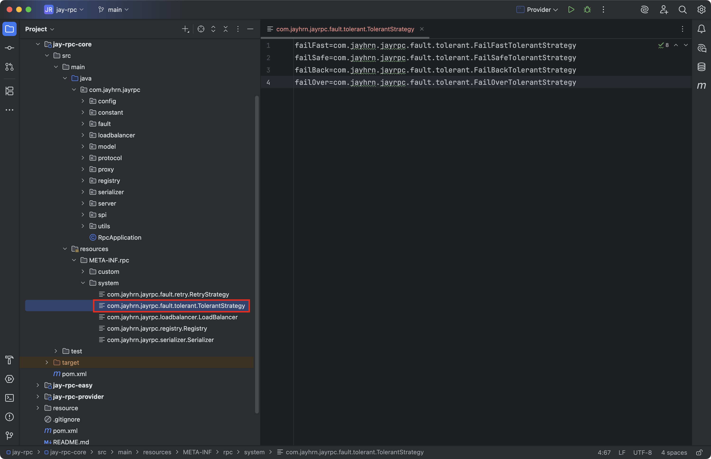

**[4] RpcConfig全局配置新增容错策略**

代码如下：

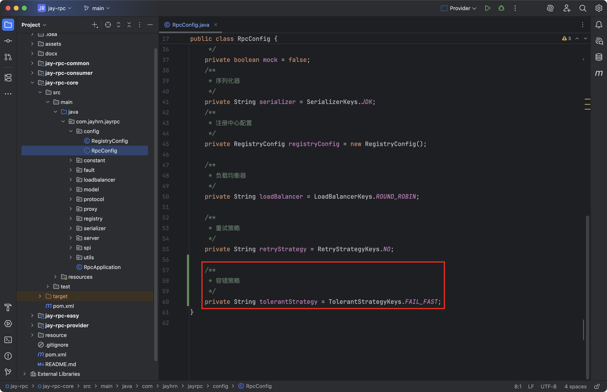

#### 应用容错策略

容错功的应用非常简单，我们只需要修改`ServiceProxy`的部分代码，在重试多次抛出异常时，从工厂中获取容错策略并执行即可。

修改的代码如下：修改后的`ServiceProxy`的完整代码如下：

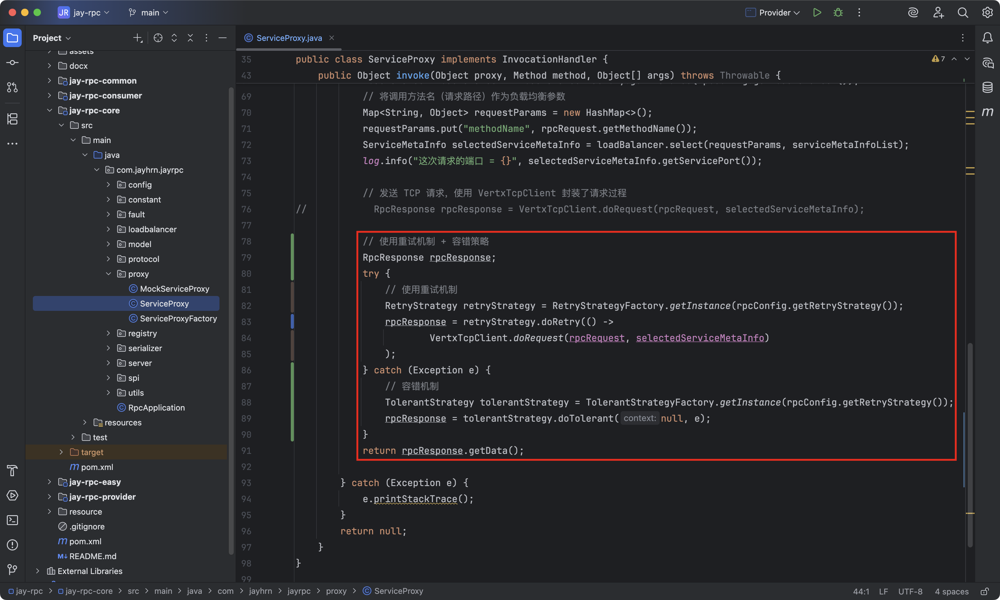

我们这里已经有了捕获异常处理，可以去除最外层的异常处理，完整的代码如下：

```java
/**
 * 调用代理
 *
 * @return
 * @throws Throwable
 */
@Override
public Object invoke(Object proxy, Method method, Object[] args) throws Throwable {

    // 构造请求
    String serviceName = method.getDeclaringClass().getName();

    RpcRequest rpcRequest = RpcRequest.builder()
            .serviceName(serviceName)
            .methodName(method.getName())
            .parameterTypes(method.getParameterTypes())
            .args(args)
            .build();

    // 从注册中心获取服务提供者请求地址
    RpcConfig rpcConfig = RpcApplication.getRpcConfig();
    // 获取指定类别的注册中心
    Registry registry = RegistryFactory.getInstance(rpcConfig.getRegistryConfig().getRegistry());
    ServiceMetaInfo serviceMetaInfo = new ServiceMetaInfo();
    serviceMetaInfo.setServiceName(serviceName);
    serviceMetaInfo.setServiceVersion(RpcConstant.DEFAULT_SERVICE_VERSION);
    List<ServiceMetaInfo> serviceMetaInfoList = registry.serviceDiscovery(serviceMetaInfo.getServiceKey());
    if (CollUtil.isEmpty(serviceMetaInfoList)) {
        throw new RuntimeException("暂无服务地址");
    }

    // 负载均衡
    LoadBalancer loadBalancer = LoadBalancerFactory.getInstance(rpcConfig.getLoadBalancer());
    // 将调用方法名（请求路径）作为负载均衡参数
    Map<String, Object> requestParams = new HashMap<>();
    requestParams.put("methodName", rpcRequest.getMethodName());
    ServiceMetaInfo selectedServiceMetaInfo = loadBalancer.select(requestParams, serviceMetaInfoList);
    log.info("这次请求的端口 = {}", selectedServiceMetaInfo.getServicePort());

    // 发送 TCP 请求，使用 VertxTcpClient 封装了请求过程
//            RpcResponse rpcResponse = VertxTcpClient.doRequest(rpcRequest, selectedServiceMetaInfo);

    // 使用重试机制 + 容错策略
    RpcResponse rpcResponse;
    try {
        // 使用重试机制
        RetryStrategy retryStrategy = RetryStrategyFactory.getInstance(rpcConfig.getRetryStrategy());
        rpcResponse = retryStrategy.doRetry(() ->
                VertxTcpClient.doRequest(rpcRequest, selectedServiceMetaInfo)
        );
    } catch (Exception e) {
        // 容错机制
        TolerantStrategy tolerantStrategy = TolerantStrategyFactory.getInstance(rpcConfig.getRetryStrategy());
        rpcResponse = tolerantStrategy.doTolerant(null, e);
    }
    return rpcResponse.getData();
}
```

由于之前的发送`HTTP`请求的代码直接删除了，现重现封装了，给出最终的`ServiceProxy`代码

```java
package com.jayhrn.jayrpc.proxy;

import cn.hutool.core.collection.CollUtil;
import cn.hutool.http.HttpRequest;
import cn.hutool.http.HttpResponse;
import com.jayhrn.jayrpc.RpcApplication;
import com.jayhrn.jayrpc.config.RpcConfig;
import com.jayhrn.jayrpc.constant.RpcConstant;
import com.jayhrn.jayrpc.fault.retry.RetryStrategy;
import com.jayhrn.jayrpc.fault.retry.RetryStrategyFactory;
import com.jayhrn.jayrpc.fault.tolerant.TolerantStrategy;
import com.jayhrn.jayrpc.fault.tolerant.TolerantStrategyFactory;
import com.jayhrn.jayrpc.loadbalancer.LoadBalancer;
import com.jayhrn.jayrpc.loadbalancer.LoadBalancerFactory;
import com.jayhrn.jayrpc.model.RpcRequest;
import com.jayhrn.jayrpc.model.RpcResponse;
import com.jayhrn.jayrpc.model.ServiceMetaInfo;
import com.jayhrn.jayrpc.registry.Registry;
import com.jayhrn.jayrpc.registry.RegistryFactory;
import com.jayhrn.jayrpc.serializer.Serializer;
import com.jayhrn.jayrpc.serializer.SerializerFactory;
import com.jayhrn.jayrpc.server.tcp.VertxTcpClient;
import lombok.extern.slf4j.Slf4j;

import java.io.IOException;
import java.lang.reflect.InvocationHandler;
import java.lang.reflect.Method;
import java.util.HashMap;
import java.util.List;
import java.util.Map;

/**
 * 服务代理（JDK 动态代理）
 *
 * @Author JayHrn
 * @Date 2025/6/15 18:27
 * @Version 1.0
 */
@Slf4j
public class ServiceProxy implements InvocationHandler {
    /**
     * 调用代理
     *
     * @return
     * @throws Throwable
     */
    @Override
    public Object invoke(Object proxy, Method method, Object[] args) throws Throwable {

        // 构造请求
        String serviceName = method.getDeclaringClass().getName();

        RpcRequest rpcRequest = RpcRequest.builder()
                .serviceName(serviceName)
                .methodName(method.getName())
                .parameterTypes(method.getParameterTypes())
                .args(args)
                .build();

        // 从注册中心获取服务提供者请求地址
        RpcConfig rpcConfig = RpcApplication.getRpcConfig();
        // 获取指定类别的注册中心
        Registry registry = RegistryFactory.getInstance(rpcConfig.getRegistryConfig().getRegistry());
        ServiceMetaInfo serviceMetaInfo = new ServiceMetaInfo();
        serviceMetaInfo.setServiceName(serviceName);
        serviceMetaInfo.setServiceVersion(RpcConstant.DEFAULT_SERVICE_VERSION);
        List<ServiceMetaInfo> serviceMetaInfoList = registry.serviceDiscovery(serviceMetaInfo.getServiceKey());
        if (CollUtil.isEmpty(serviceMetaInfoList)) {
            throw new RuntimeException("暂无服务地址");
        }

        // 负载均衡
        LoadBalancer loadBalancer = LoadBalancerFactory.getInstance(rpcConfig.getLoadBalancer());
        // 将调用方法名（请求路径）作为负载均衡参数
        Map<String, Object> requestParams = new HashMap<>();
        requestParams.put("methodName", rpcRequest.getMethodName());
        ServiceMetaInfo selectedServiceMetaInfo = loadBalancer.select(requestParams, serviceMetaInfoList);
        log.info("这次请求的端口 = {}", selectedServiceMetaInfo.getServicePort());

//            // 发送 http 请求，使用 HttpRequest
//            // 指定序列化器
//            Serializer serializer = SerializerFactory.getInstance(RpcApplication.getRpcConfig().getSerializer());
//            byte[] bodyBytes = serializer.serialize(rpcRequest);
//            RpcResponse rpcResponse = doHttpRequest(selectedServiceMetaInfo, bodyBytes, serializer);

        // 发送 TCP 请求，使用 VertxTcpClient 封装了请求过程
//            RpcResponse rpcResponse = VertxTcpClient.doRequest(rpcRequest, selectedServiceMetaInfo);

        // 使用重试机制 + 容错策略
        RpcResponse rpcResponse;
        try {
            // 使用重试机制
            RetryStrategy retryStrategy = RetryStrategyFactory.getInstance(rpcConfig.getRetryStrategy());
            rpcResponse = retryStrategy.doRetry(() ->
                    VertxTcpClient.doRequest(rpcRequest, selectedServiceMetaInfo)
            );
        } catch (Exception e) {
            // 容错机制
            TolerantStrategy tolerantStrategy = TolerantStrategyFactory.getInstance(rpcConfig.getRetryStrategy());
            rpcResponse = tolerantStrategy.doTolerant(null, e);
        }
        return rpcResponse.getData();
    }

    /**
     * 发送 HTTP 请求
     *
     * @param selectedServiceMetaInfo
     * @param bodyBytes
     * @return
     * @throws IOException
     */
    private static RpcResponse doHttpRequest(ServiceMetaInfo selectedServiceMetaInfo, byte[] bodyBytes) throws IOException {
        final Serializer serializer = SerializerFactory.getInstance(RpcApplication.getRpcConfig().getSerializer());
        // 发送 HTTP 请求
        try (HttpResponse httpResponse = HttpRequest.post(selectedServiceMetaInfo.getServiceAddress())
                .body(bodyBytes)
                .execute()) {
            byte[] result = httpResponse.bodyBytes();
            // 反序列化
            RpcResponse rpcResponse = serializer.deserialize(result, RpcResponse.class);
            return rpcResponse;
        }
    }
}
```

如果想配置不同的容错策略，可以配置`消费者端`的配置文件`application.properties`即可。


### 测试

**[1] 服务是否正常运行**

由于比较难测试，我们首先看看能否正常启动服务。

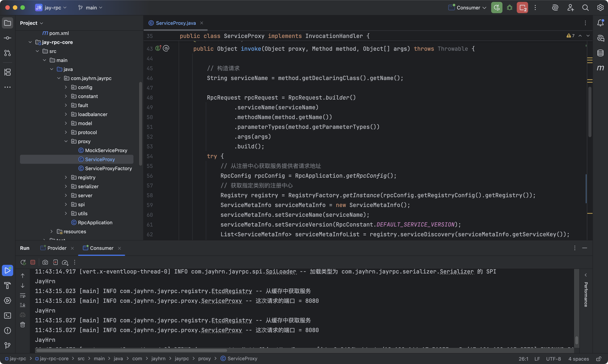

**[2] 测试重试并且测试容错**

我们需要修改消费端的配置`application.properties`文件，其他内容保持不变，服务端不用配置如下内容，如下内容只会在消费端使用到（发起请求方才会进行负载均衡、重试、容错）。

```properties
# 轮询负载均衡
rpc.loadBalancer=roundRobin
# 固定时间间隔重试策略
rpc.retryStrategy=fixedInterval
# 快速失败，直接抛出异常
rpc.tolerantStrategy=failFast
```

同时还需要修改下`VertxTcpClient`类，如果不修改异常没有办法被捕获，就会无法进行重试：

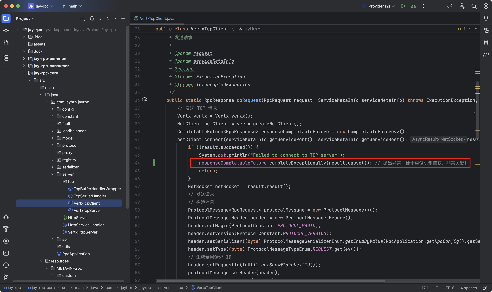

这样在连接失败时：

- `CompletableFuture` 会进入异常态
- `get()` 会抛出 `ExecutionException`
- `doRetry()` 能捕获它并触发重试机制

流程：如果服务器关闭（TCP 连接失败） → 会抛出异常 → 被 `Retryer` 捕获 → 自动重试

启动服务端，端口分别为`8080`，`8081`，`8082`，在消费端开启断点调试，位置如下图所示：

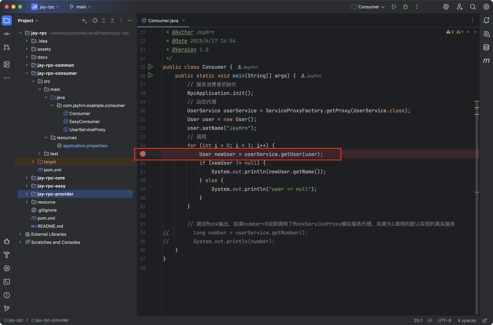

以`Debug`模式启动服务端，在第二次循环时，关掉端口为`8081`的服务，接着程序执行到`User newUser = userService.getUser(user)`时，进入该方法，发现运行到`rpcResponse = retryStrategy.doRetry`时会进行重试需要等待几秒（此时正在进行重试）然后查看控制台就会看到输出重试，抛出异常后`容错机制`会按照`快速容错策略`直接抛出异常`RunTimeException`，结果如下图所示。

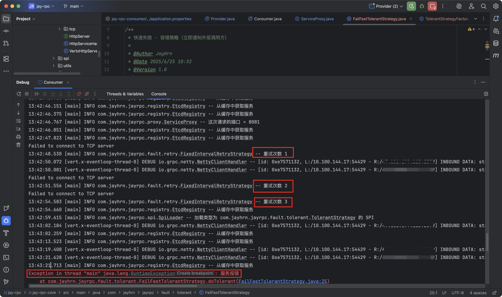

### 拓展

- 实现Fail-Back 容错机制

- 实现Fail-Over 容错机制

- 实现更多容错方案

### RPC框架-容错机制(注册中心)

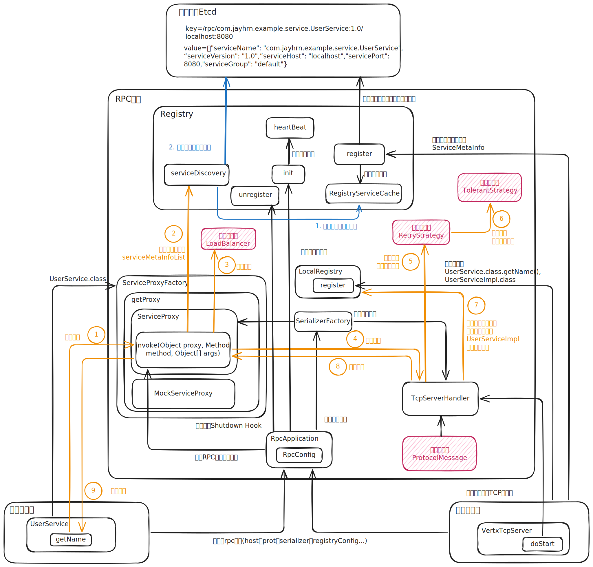