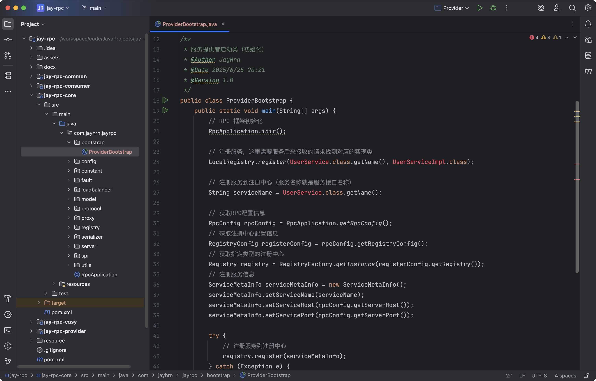
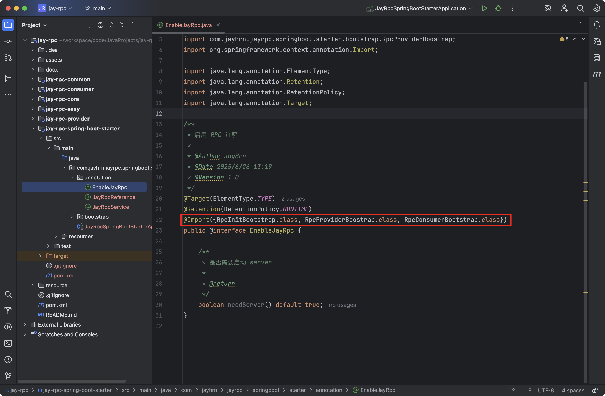

## 启动机制与注册驱动

### 需求分析

回归到我们的RPC项目，其实框架目前是不够易用的。光是我们的示例服务提供者，就要写下面这段又臭又长的代码！


接下来，我们就来优化框架的易用性，通过建立合适的启动机制和注解驱动机制，帮助开发者最少只用一行代码，就能轻松使用框架！

### 设计方案

#### 启动机制设计

其实很简单，把所有启动代码封装成一个专门的启动类或方法，然后由服务提供者/服务消费者调用即可。

但有一点我们需要注意，服务提供者和服务消费者需要初始化的模块是不同的，比如服务消费者不需要启动Web服务器。

所以我们需要针对服务提供者和消费者分别编写一个启动类，如果是二者都需要初始化的模块，可以放到全局应用类`RpcApplication`中，复用代码的同时保证启动类的可维护、可扩展性。

#### 注解驱动设计

除了启动类外，其实还有一种更牛的方法，能帮助开发者使用框架。

它的做法是注解区动，开发者只需要在服务提供者实现类打上一个DubboService注解，就快速注册服务；同样的，只要在服务消费者字段打上一个`DubboReference`注解，就快速使用服务。


由于现在的Java项目基本都使用Spring Boot框架，所以Dubbo还贴心地推出了Spring Boot Starter，用更少的代码在Spring Boot项目中使用框架。

那我们也可以有样学样，创建一个Spring Boot Starter项目，并通过注解区动框架的初始化，完成服务注册和获取引用。

### 开发实现

#### 启动机制

我们在`rpc`项目中新建包名`bootstrap`，所有和框架启动初始化相关的代码都放到该包下。

#### 服务提供者启动类

新建`ProviderBootstrap`类，先直接复制之前服务提供者示例项目中的初始化代码，然后略微改造，支持用户传入自己要注册的服务。



在注册服务时，我们需要填入多个字段，比如服务名称、服务实现类，参考代码如下：

```java
// 注册服务
String serviceName = UserService.class.getName();
LocalRegistry.register(serviceName, UserServiceImpl.class);
```

我们可以将这些字段进行封装，在`model`包下新建`ServiceRegisterInfo`类，代码如下：


这样一来，服务提供者的初始化方法只需要接受封装的注册信息列表作为参数即可，简化了方法。

服务提供者完整代码如下：

```java
package com.jayhrn.jayrpc.bootstrap;

import com.jayhrn.jayrpc.RpcApplication;
import com.jayhrn.jayrpc.config.RegistryConfig;
import com.jayhrn.jayrpc.config.RpcConfig;
import com.jayhrn.jayrpc.model.ServiceMetaInfo;
import com.jayhrn.jayrpc.model.ServiceRegisterInfo;
import com.jayhrn.jayrpc.registry.LocalRegistry;
import com.jayhrn.jayrpc.registry.Registry;
import com.jayhrn.jayrpc.registry.RegistryFactory;
import com.jayhrn.jayrpc.server.tcp.VertxTcpServer;

import java.util.List;

/**
 * 服务提供者启动类（初始化）
 *
 * @Author JayHrn
 * @Date 2025/6/25 20:21
 * @Version 1.0
 */
public class ProviderBootstrap {
    /**
     * 初始化
     *
     * @param serviceRegisterInfoList 注册服务列表
     */
    public static void init(List<ServiceRegisterInfo<?>> serviceRegisterInfoList) {
        // RPC 框架初始化
        RpcApplication.init();
        // RPC全局配置信息
        final RpcConfig rpcConfig = RpcApplication.getRpcConfig();

        // 注册服务
        for (ServiceRegisterInfo<?> serviceRegisterInfo : serviceRegisterInfoList) {
            // 服务名称
            String serviceName = serviceRegisterInfo.getServiceName();
            // 注册服务，这里需要服务后来接收的请求找到对应的实现类
            LocalRegistry.register(serviceName, serviceRegisterInfo.getImplClass());

            // 获取注册中心配置信息
            RegistryConfig registerConfig = rpcConfig.getRegistryConfig();
            // 获取指定类型的注册中心
            Registry registry = RegistryFactory.getInstance(registerConfig.getRegistry());
            // 注册服务信息
            ServiceMetaInfo serviceMetaInfo = new ServiceMetaInfo();
            serviceMetaInfo.setServiceName(serviceName);
            serviceMetaInfo.setServiceHost(rpcConfig.getServerHost());
            serviceMetaInfo.setServicePort(rpcConfig.getServerPort());

            try {
                // 注册服务到注册中心
                registry.register(serviceMetaInfo);
            } catch (Exception e) {
                throw new RuntimeException(e);
            }
        }

        // 启动 TCP 服务
        VertxTcpServer vertxTcpServer = new VertxTcpServer();
        vertxTcpServer.doStart(8080);
    }
}
```

现在，我们想要在服务提供者项目中使用RPC框架，就非常简单了。只需要定义要注册的服务列表，然后一行代码调用`ProviderBootstrap.init`方法即可完成初始化。

示例代码如下：


#### 服务消费者启动类

服务消费者启动类的实现就更简单了，因为它不需要注册服务、也不需要启动Web服务器，只需要执行`RpcApplication.init`完成框架的通用初始化即可，在`boostrap`包新建`ConsumerBoostrap`类。

服务消费者启动类的完整代码如下：


服务消费者示例项目的代码不会有明显的变化，只不过改为调用启动类了。

示例代码如下：


#### Spring Boot Starter 注解驱动

注意，为了便于学习，不和已有项目的代码混淆，我们再来创建一个新的项目模块，专门用于实现`Spring Boot Starter注解驱动`的RPC框架。

Dubbo是在框架内引入了spring-context，会让整个框架更内聚，但是不利于学习理解。

**1. Spring Boot Starter 项目初始化**

在项目根目录处右键新建`jay-rpc-spring-boot-starter`模块，坐标需要额外添加`spring-boot-configuration-processor`，其他不用添加，最终的`pom.xml`引入`jay-rpc-core`模块，最终的`pom.xml`文件下面代码所示：

```xml
<?xml version="1.0" encoding="UTF-8"?>
<project xmlns="http://maven.apache.org/POM/4.0.0" xmlns:xsi="http://www.w3.org/2001/XMLSchema-instance"
         xsi:schemaLocation="http://maven.apache.org/POM/4.0.0 https://maven.apache.org/xsd/maven-4.0.0.xsd">
    <modelVersion>4.0.0</modelVersion>
    <parent>
        <groupId>org.springframework.boot</groupId>
        <artifactId>spring-boot-starter-parent</artifactId>
        <version>3.5.3</version>
        <relativePath/> <!-- lookup parent from repository -->
    </parent>
    <groupId>com.jayhrn.jayrpc</groupId>
    <artifactId>jay-rpc-spring-boot-starter</artifactId>
    <version>0.0.1-SNAPSHOT</version>
    <name>jay-rpc-spring-boot-starter</name>
    <description>jay-rpc-spring-boot-starter</description>
    <url/>
    <licenses>
        <license/>
    </licenses>
    <developers>
        <developer/>
    </developers>
    <scm>
        <connection/>
        <developerConnection/>
        <tag/>
        <url/>
    </scm>
    <properties>
        <java.version>21</java.version>
    </properties>
    <dependencies>
        <dependency>
            <groupId>org.springframework.boot</groupId>
            <artifactId>spring-boot-starter</artifactId>
        </dependency>

        <dependency>
            <groupId>org.springframework.boot</groupId>
            <artifactId>spring-boot-configuration-processor</artifactId>
            <optional>true</optional>
        </dependency>

        <dependency>
            <groupId>com.jayhrn.jayrpc</groupId>
            <artifactId>jay-rpc-core</artifactId>
            <version>1.0-SNAPSHOT</version>
        </dependency>

        <dependency>
            <groupId>org.springframework.boot</groupId>
            <artifactId>spring-boot-starter-test</artifactId>
            <scope>test</scope>
        </dependency>

        <dependency>
            <groupId>org.projectlombok</groupId>
            <artifactId>lombok</artifactId>
            <scope>provided</scope>
        </dependency>
    </dependencies>

    <build>
        <plugins>
            <plugin>
                <groupId>org.apache.maven.plugins</groupId>
                <artifactId>maven-compiler-plugin</artifactId>
                <configuration>
                    <annotationProcessorPaths>
                        <path>
                            <groupId>org.springframework.boot</groupId>
                            <artifactId>spring-boot-configuration-processor</artifactId>
                        </path>
                        <path>
                            <groupId>org.projectlombok</groupId>
                            <artifactId>lombok</artifactId>
                        </path>
                    </annotationProcessorPaths>
                </configuration>
            </plugin>
            <plugin>
                <groupId>org.springframework.boot</groupId>
                <artifactId>spring-boot-maven-plugin</artifactId>
                <configuration>
                    <excludes>
                        <exclude>
                            <groupId>org.projectlombok</groupId>
                            <artifactId>lombok</artifactId>
                        </exclude>
                    </excludes>
                </configuration>
            </plugin>
        </plugins>
    </build>

</project>
```

至此，Spring Boot Starter项目已经完成初始化。

#### 定义注解

实现注解驱动的第一步是定义注解，要定义哪些注解呢？我们怎么知道应该定义哪些注解呢？

我们可以参考知名框架Dubbo的注解。

比如：

1. @EnableDubbo：在Spring Boot主应用类上使用，用于启用Dubbo功能。
2. @DubboComponentScan：在Spring Boot主应用类上使用，用于指定Dubbo组件扫描的包路径。
3. @DubboReference：在消费者中使用，用于声明Dubbo服务使用。
4. @DubboService：在提供者中使用，用于声明Dubbo服务。
5. @DubboMethod：在提供者和消费者中使用，用于配置Dubbo方法的参数、超时时间等。
6. @DubboTransported：在Dubbo提供者和消费者中使用，用于指定传输协议和参数，例如传输协议的类型、端口等。

当然，这些注解我们不需要全部用到，遵循最小可用化原则，我们只需要定义3个注解。

在`jay-rpc-spring-boot-starter`项目下新建`annotation`包，将所有注解代码放到该包下。


**[1] @EnableJayRpc**

用于全局标识项目需要引入RPC框架、执行初始化方法。由于服务消费者和服务提供者初始化的模块不同，我们需要在`EnableJayRpc`注解中，指定是否需要启动服务器等属性。

代码如下：


当然，你也可以将`EnableJayRpc`注解拆分为两个注解（比如`EnableJayRpcProvider`、`EnableJayRpcConsumer`)，分别用于标识服务提供者和消费者，但可能存在模块重复初始化。

**[2] @JayRpcService** 

服务提供者注解，在需要注册和提供的服务类上使用。

`JayRpcService`注解中，需要指定服务注册信息属性，比如服务接口实现类、版本号等（也可以包括服务名称）。

代码如下：


**[3] @JayRpcReference**

服务消费者注解，在需要注入服务代理对象的`属性`上使用，类似Spring中的`@Resource`注解。

`JayRpcReference`注解中，需要指定调用服务相关的属性，比如服务接口类（可能存在多个接口）、版本号、负载均衡器、重试策略、是否Mock模拟调用等。

代码放在`annotation`包下：

```java
package com.jayhrn.jayrpc.springboot.starter.annotation;

import com.jayhrn.jayrpc.constant.RpcConstant;
import com.jayhrn.jayrpc.fault.retry.RetryStrategyKeys;
import com.jayhrn.jayrpc.fault.tolerant.TolerantStrategyKeys;
import com.jayhrn.jayrpc.loadbalancer.LoadBalancerKeys;

import java.lang.annotation.ElementType;
import java.lang.annotation.Retention;
import java.lang.annotation.RetentionPolicy;
import java.lang.annotation.Target;

/**
 * 服务消费者注解（用于注入服务）
 *
 * @Author JayHrn
 * @Date 2025/6/26 13:28
 * @Version 1.0
 */
@Target(ElementType.FIELD)
@Retention(RetentionPolicy.RUNTIME)
public @interface JayRpcReference {

    /**
     * 服务接口类
     *
     * @return
     */
    Class<?> interfaceClass() default void.class;

    /**
     * 版本
     *
     * @return
     */
    String serviceVersion() default RpcConstant.DEFAULT_SERVICE_VERSION;

    /**
     * 负载均衡
     *
     * @return
     */
    String loadBalance() default LoadBalancerKeys.ROUND_ROBIN;

    /**
     * 重试策略
     *
     * @return
     */
    String retryStrategy() default RetryStrategyKeys.NO;

    /**
     * 容错策略
     *
     * @return
     */
    String tolerantStrategy() default TolerantStrategyKeys.FAIL_FAST;

    /**
     * 模拟调用
     *
     * @return
     */
    boolean mock() default false;
}
```

#### 注解驱动

在`jay-rpc-spring-boot-starter`模块中新建`bootstrap` 包，并且分别针对上面定义的3个注解新建启动类。

项目的目录结构如图：


**[1] RPC框架全局启动类RpcInitBootstrap**

我们的需求是，在Spring框架初始化时，获取`@EnableJayRpc`注解的属性，并初始化RPC框架。

怎么获取到具有注解的属性呢？

可以实现Spring的`ImportBeanDefinitionRegistrar`接口，并且在`registerBeanDefinitions`方法中，获取到项目的注解和注解属性。

代码放在`bootstrap`包，完整代码如下：

```java
package com.jayhrn.jayrpc.springboot.starter.bootstrap;

import com.jayhrn.jayrpc.RpcApplication;
import com.jayhrn.jayrpc.config.RpcConfig;
import com.jayhrn.jayrpc.server.tcp.VertxTcpServer;
import com.jayhrn.jayrpc.springboot.starter.annotation.EnableJayRpc;
import lombok.extern.slf4j.Slf4j;
import org.springframework.beans.factory.support.BeanDefinitionRegistry;
import org.springframework.context.annotation.ImportBeanDefinitionRegistrar;
import org.springframework.core.type.AnnotationMetadata;

/**
 * RPC 框架启动
 *
 * @Author JayHrn
 * @Date 2025/6/26 13:38
 * @Version 1.0
 */
@Slf4j
public class RpcInitBootstrap implements ImportBeanDefinitionRegistrar {
    /**
     * Spring 初始化时执行，初始化 RPC 框架
     *
     * @param importingClassMetadata
     * @param registry
     */
    @Override
    public void registerBeanDefinitions(AnnotationMetadata importingClassMetadata, BeanDefinitionRegistry registry) {
        ImportBeanDefinitionRegistrar.super.registerBeanDefinitions(importingClassMetadata, registry);
        boolean needServer = (boolean) importingClassMetadata.getAnnotationAttributes(EnableJayRpc.class.getName())
                .get("needServer");

        // RPC 框架初始化（配置和注册中心）
        RpcApplication.init();

        // 全局配置
        final RpcConfig rpcConfig = RpcApplication.getRpcConfig();

        // 启动服务器，这个可以判断是否是服务提供者还是服务消费者，服务提供者才启动服务
        if (needServer) {
            VertxTcpServer vertxTcpServer = new VertxTcpServer();
            vertxTcpServer.doStart(rpcConfig.getServerPort());
        } else {
            log.info("不启动 RPC server");
        }
    }
}
```

上述代码中，我们从Spring元信息中获取到了`EnableJayRpc`注解的`needServer`属性，并通过它来判断是否要启动服务器。

**[2] RPC服务提供者启动类RpcProviderBootstrap**

服务提供者启动类的作用是，获取到所有包含`@JayRpcService`注解的类，并且通过注解的属性和反射机制，获取到要注册的服务信息，并且完成服务注册。

怎么获取到所有包含`@JayRpcService`注解的类呢？

像前面设计方案中提到的，可以主动扫描包，也可以利用Spring的特性监听Bean的加载。

此处我们选泽后者，实现更简单，而且能直接获取到服务提供者类的Bean对象。

只需要让启动类实现`BeanPostProcessor`接口的`postProcessAfterInitialization`方法，就可以在某个服务提供者Bean初始化后，执行注册服务等操作了。

完整代码如下：

```java
package com.jayhrn.jayrpc.springboot.starter.bootstrap;

import com.jayhrn.jayrpc.RpcApplication;
import com.jayhrn.jayrpc.config.RegistryConfig;
import com.jayhrn.jayrpc.config.RpcConfig;
import com.jayhrn.jayrpc.model.ServiceMetaInfo;
import com.jayhrn.jayrpc.registry.LocalRegistry;
import com.jayhrn.jayrpc.registry.Registry;
import com.jayhrn.jayrpc.registry.RegistryFactory;
import com.jayhrn.jayrpc.springboot.starter.annotation.JayRpcService;
import lombok.extern.slf4j.Slf4j;
import org.springframework.beans.BeansException;
import org.springframework.beans.factory.config.BeanPostProcessor;

/**
 * RPC 服务提供者启动
 *
 * @Author JayHrn
 * @Date 2025/6/26 13:57
 * @Version 1.0
 */
@Slf4j
public class RpcProviderBoostrap implements BeanPostProcessor {
    /**
     * Bean 初始化后执行，注册服务
     * 每个 Bean 初始化后都会调用这个函数如何判断是否包含注解，包含就进行注册服务
     *
     * @param bean
     * @param beanName
     * @return
     * @throws BeansException
     */
    @Override
    public Object postProcessAfterInitialization(Object bean, String beanName) throws BeansException {
        // 获取 bean 对象
        Class<?> beanClass = bean.getClass();
        // 判断这个Bean是否包含 @JayRpcService 注解，注解用于服务实现类上，例如 UserServiceImpl 类上
        JayRpcService jayRpcService = beanClass.getAnnotation(JayRpcService.class);
        if (jayRpcService != null) {
            // 需要注册服务
            // 1. 获取服务注册基本信息，如果配置了则直接获取实现的接口
            Class<?> interfaceClass = jayRpcService.interfaceClass();
            // 如果是默认值，则处理
            if (interfaceClass == void.class) {
                // 此时通过 beanClass.getInterfaces()[0] 获取到 UserService.class，如果该注解没有配置 interfaceClass 这个属性
                interfaceClass = beanClass.getInterfaces()[0];
            }
            // 服务名称，全限定名
            String serviceName = interfaceClass.getName();
            String serviceVersion = jayRpcService.serviceVersion();
            // 2. 注册服务
            // 本地注册
            LocalRegistry.register(serviceName, beanClass);

            // 全局配置，默认优先走配置文件，其次类默认配置
            final RpcConfig rpcConfig = RpcApplication.getRpcConfig();
            // 注册服务到注册中心
            RegistryConfig registryConfig = rpcConfig.getRegistryConfig();
            Registry registry = RegistryFactory.getInstance(registryConfig.getRegistry());
            ServiceMetaInfo serviceMetaInfo = new ServiceMetaInfo();
            serviceMetaInfo.setServiceName(serviceName);
            serviceMetaInfo.setServiceVersion(serviceVersion);
            serviceMetaInfo.setServiceHost(rpcConfig.getServerHost());
            serviceMetaInfo.setServicePort(rpcConfig.getServerPort());
            try {
                registry.register(serviceMetaInfo);
            } catch (Exception e) {
                throw new RuntimeException(serviceName + " 服务注册失败", e);
            }
        }
        return BeanPostProcessor.super.postProcessAfterInitialization(bean, beanName);
    }
}
```

其实上述代码中，绝大多数服务提供者初始化的代码都只需要从之前写好的启动类中复制粘贴，只不过换了一种参数获取方式。

**[3] RPC服务消费者启动类RpcConsumerBootstrap**

和服务提供者启动类的实现方式类似，在Bean初始化后，通过反射获取到Bean的所有属性，如果属性包含`@JayRpcReference`注解，那么就为该属性动态生成代理对象并赋值。

完整代码如下：

```java
package com.jayhrn.jayrpc.springboot.starter.bootstrap;

import com.jayhrn.jayrpc.proxy.ServiceProxyFactory;
import com.jayhrn.jayrpc.springboot.starter.annotation.JayRpcReference;
import lombok.extern.slf4j.Slf4j;
import org.springframework.beans.BeansException;
import org.springframework.beans.factory.config.BeanPostProcessor;

import java.lang.reflect.Field;

/**
 * RPC 服务消费者启动
 *
 * @Author JayHrn
 * @Date 2025/6/26 14:15
 * @Version 1.0
 */
@Slf4j
public class RpcConsumerBootstrap implements BeanPostProcessor {

    /**
     * Bean 初始化后执行，注入服务
     *
     * @param bean
     * @param beanName
     * @return
     * @throws BeansException
     */
    @Override
    public Object postProcessAfterInitialization(Object bean, String beanName) throws BeansException {
        // 获取类对象，所有的类都会判断
        Class<?> beanClass = bean.getClass();
        // 遍历对象的所有属性
        Field[] fields = beanClass.getDeclaredFields();
        for (Field field : fields) {
            // 判断每个属性是否包含 @JayRpcReference 注解
            JayRpcReference jayRpcReference = field.getAnnotation(JayRpcReference.class);
            if (jayRpcReference != null) {
                // 为属性生成代理对象，获取注解中指定的接口类型
                Class<?> interfaceClass = jayRpcReference.interfaceClass();
                // 如果注解中没有显式指定接口类型（默认值为 void.class）
                if (interfaceClass == void.class) {
                    // 则使用字段的声明类型作为接口类型
                    interfaceClass = field.getType();
                }
                field.setAccessible(true);
                // 使用工厂生成接口的代理对象，该对象负责远程调用
                Object proxyObject = ServiceProxyFactory.getProxy(interfaceClass);
                try {
                    field.set(bean, proxyObject);
                    field.setAccessible(false);
                } catch (IllegalAccessException e) {
                    throw new RuntimeException("为字段注入代理对象失败", e);
                }
            }
        }
        return BeanPostProcessor.super.postProcessAfterInitialization(bean, beanName);
    }
}
```

上述代码中，核心方法是`beanClass.getDeclaredFields`，用于获取类中的所有属性。看到这里我们必须要把反射的常用语法熟记于心。

**[4] 注册已编写的启动类**

最后，在Spring中加载我们已经编写好的启动类。

如何加载呢？

我们的需求是，仅在用户使用`@EnableJayRpc`注解时，才启动RPC框架。所以，可以通过给`EnableJayRpc`增加`@Import`注解，来注册我们自定义的启动类，实现灵活的可选加载。

修改后的`EnableJayRpc`注解代码如下：



至此，一个基于注解码驱动的RPC框架Starter开发完成。

### 测试

让我们使用IDEA新建2个使用Spring Boot框架的项目。

分别创建如下两个

- 示例Spring Boot消费者：`jay-rpc-springboot-consumer`
- 示例Spring Boot提供者：`jay-rpc-springboot-provider`

任何依赖都不用勾选，每个项目都引入如下依赖：


**[1] 示例服务提供者项目的入口类加上@EnableJayRpc注解**

由于是服务提供者，我们需要启动服务，所以`needServer`默认值是`true`，不需要进行配置，代码如下：


服务提供者提供一个简单的服务，新建`UserServiceImpl`，代码如下：


**[2] 示例服务消费者的入口类加上@EnableJayRpc(needServer=false)注解**

这里我们由于是服务消费者，不需要启动服务，需要标记标识`needServer=false`，代码如下：


消费者编写一个Spring的Bean，引入`UserService`属性并打上`@JayRpcReference`注解，表示需要使用远程服务提供者的服务。

代码如下：


服务消费者编写单元测试，验证否调用远程服务：


**[3] 启动服务提供者入口类**

如下图：


可以看到服务消费者`RPC server`并没有启动，符合预期。

最后，执行服务消费者的单元测试，验证否跑通整个流程。

如下图，调用成功：


服务提供者也收到了调用：


至此，我们就够通过使用注解的方式，给项目引入RPC框架了。

### 拓展

- Spring Boot Starter项目支持读取yml/yaml配置文件来启动RPC框架。