## 全局配置加载

### 需求分析

在RPC框架运行的过程中，会涉及到很多的配置信息，比如注册中心的地址、序列化方式、网络服务器端口号等。

之前的简易版RPC项目中，我们是在程序里硬编码了这些配置，不利于维护。而且RPC框架是需要被其他项目作为服务提供者或者服务消费者引入的，我们应当允许引入框架的项目通过编写配置文件来自定义配置。并且一般情况下，服务提供者和服务消费者需要编写相同的RPC配置。

因此，我们需要一套全局配置加载功能。够让RPC框架轻松地从配置文件中读取配置，并且维护一个全局配置对象，便于框架快速获取到一致的配置。

### 设计方案

#### 配置项

首先我们梳理需要的配置项，刚开始就一切从简，只提供以下几个配置项即可：

- `name`：名称

- `version`：版本号

- `serverHost`：服务器主机名

- `serverPort`：服务器端口号

以下是一些常见的RPC框架配置项，仅做了解即可：

1. 注册中心地址：服务提供者和服务消费者都需要指定注册中心的地址，以便进行服务的注册和发现。
2. 服务接口：服务提供者需要指定提供的服务接口，而服务消费者需要指定要调用的服务接口。
3. 序列化方式：服务提供者和服务消费者都需要指定序列化方式，以便在网络中传输数据时进行序列化和反序列化。
4. 网络通信协议：服务提供者和服务消费者都需要选择合适的网络通信协议，比如TCP、HTTP等。
5. 超时设置：服务提供者和服务消费者都需要设置超时时间，以便在调用服务时进行超时处理。
6. 负载均衡策略：服务消费者需要指定负载均衡策略，以决定调用哪个服务提供者实例。
7. 服务端线程模型：服务提供者需要指定服务端线程模型，以决定如何处理客户端请求。

#### 读取配置文件

如何读取配置文件呢？这里可以使用Java的`Properties`类自行编写，但是更推荐使用一些第三方工具库，比如Hutool的Setting模块，可以直接读取指定名称的配置文件中的部分配置信息，并且转换成`Java`对象，非常方便。

一般情况下，我们读取的配置文件名称为`application.properties`,还可以通过指定文件名称后缀的方式来区分多环境，比如`application-prod.properties`表示生产环境、`application-test.properties`表示测试环境。

### 开发实现

#### 项目初始化

1. 先新建`jay-rpc-core`模块，后面的RPC项目开发及扩展均在该项目进行，也可以直接复制`jay-rpc-easy`内容

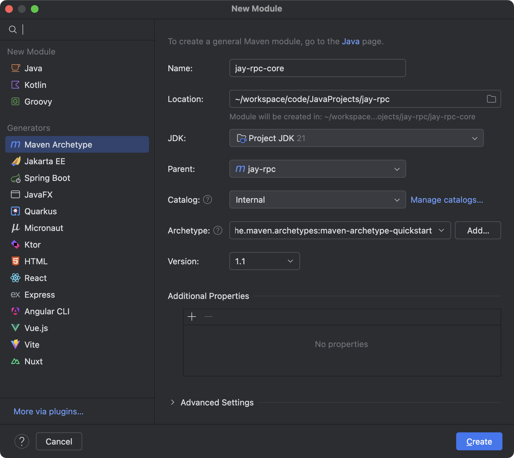

2. 在`pom.xml`文件中导入需要的`jar`包，给项目引入日志库和单元测试依赖，便于后续开发。

```xml
<dependencies>
        <dependency>
            <groupId>io.vertx</groupId>
            <artifactId>vertx-core</artifactId>
            <version>5.0.0</version>
        </dependency>
        <dependency>
            <groupId>cn.hutool</groupId>
            <artifactId>hutool-all</artifactId>
            <version>5.8.38</version>
        </dependency>
        <dependency>
            <groupId>org.projectlombok</groupId>
            <artifactId>lombok</artifactId>
            <version>1.18.38</version>
            <scope>provided</scope>
        </dependency>
        <!-- https://mvnrepository.com/artifact/ch.qos.logback/logback-classic -->
        <dependency>
            <groupId>ch.qos.logback</groupId>
            <artifactId>logback-classic</artifactId>
            <version>1.5.18</version>
            <scope>compile</scope>
        </dependency>
        <dependency>
            <groupId>junit</groupId>
            <artifactId>junit</artifactId>
            <version>3.8.1</version>
            <scope>test</scope>
        </dependency>
</dependencies>
```

3. 将`jay-rpc-consumer`和`jay-rpc-provider`项目引入的`RPC`依赖都替换成`jay-rpc-core`代码如下

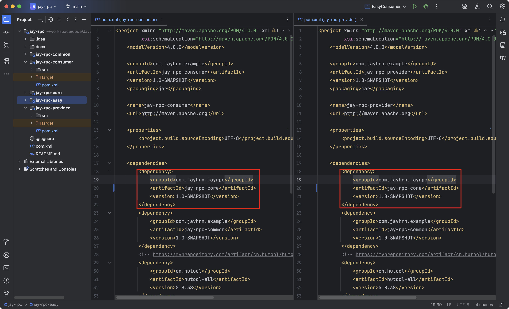

#### 配置加载

1. 在`config`包下新建配置类`RpcConfig`，用于保存配置信息。

   可以给属性指定一些默认值，完整代码如下：

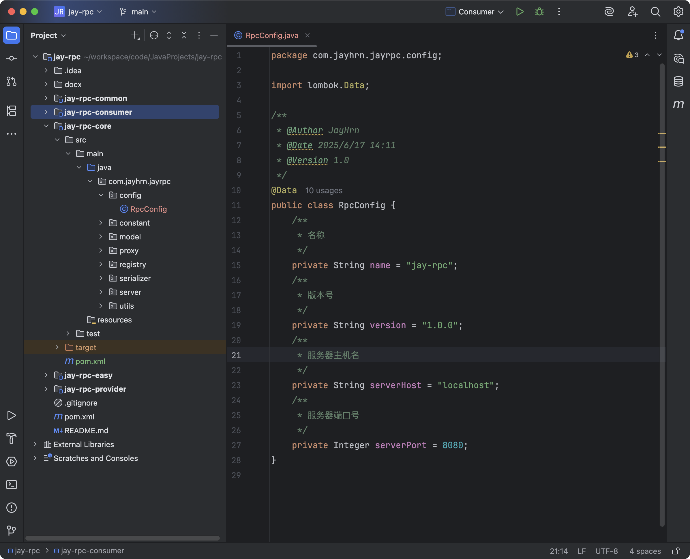

2. 在`utils`包下新建工具类`ConfigUtils`，作用是读取配置文件并返回配置对象，可以简化调用。

   工具类应当尽量通用，和业务不强绑定，提高使用的灵活性。比如支特外层传入要读取的配置内容前缀、支特传入环境等。

   完整代码如下：

```java
package com.jayhrn.jayrpc.utils;

import cn.hutool.core.util.StrUtil;
import cn.hutool.setting.dialect.Props;

/**
 * 配置工具类
 *
 * @Author JayHrn
 * @Date 2025/6/17 14:15
 * @Version 1.0
 */
public class ConfigUtils {

    /**
     * 加载配置对象
     *
     * @param tClass
     * @param prefix
     * @param <T>
     * @return
     */
    public static <T> T loadConfig(Class<T> tClass, String prefix) {
        return loadConfig(tClass, prefix, "");
    }

    /**
     * 加载配置对象，支持区分环境
     *
     * @param tClass
     * @param prefix
     * @param environment 环境，例如dev环境
     * @param <T>
     * @return
     */
    public static <T> T loadConfig(Class<T> tClass, String prefix, String environment) {
        StringBuilder configFileBuilder = new StringBuilder("application");
        if (StrUtil.isNotBlank(environment)) {
            configFileBuilder.append("-").append(environment);
        }
        configFileBuilder.append(".properties");
        Props props = new Props(configFileBuilder.toString());
        return props.toBean(tClass, prefix);
    }
}
```

之后，调用`ConfigUtils`的静态方法就能读取配置了。

3. 在`constant`包中新建`RpcConstant`接口，用于存储RPC框架相关的常量。

   比如默认配置文件的加载前缀为`rpc`：

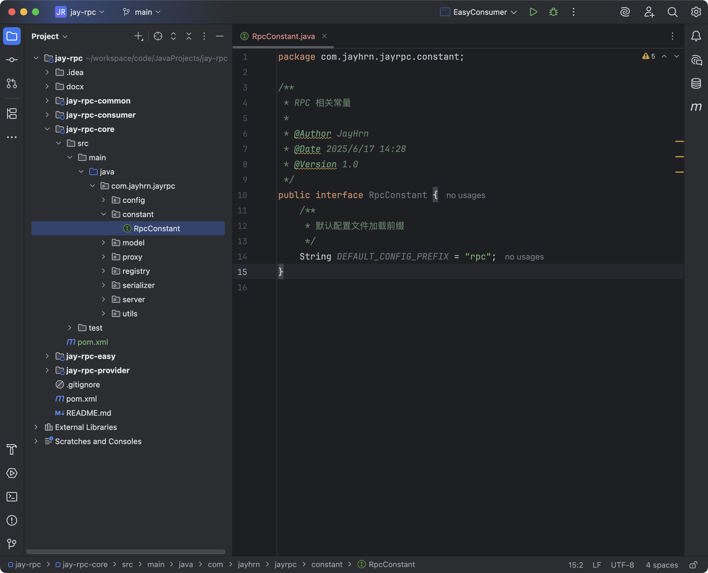

#### 维护全局配置对象

RPC框架中需要维护一个全局的配置对象。在引入RPC框架的项目启动时，从配置文件中读取配置并创建对象实例，之后就可以集中地从这个对象中获取配置信息，而不用每次加载配置时再重新读取配置、并创建新的对象，减少了性能开销。

使用设计模式中的单例模式，就能够很轻松地实现这个需求了。

一般情况下，我们会使用`holder`来维护全局配置对象实例。在我们的项目中，可以换一个更优雅的命名，使用`RpcApplication`类作为`RPC`项目的启动入口、并目维护项目全局用到的变量。

完整代码如下：

```java
package com.jayhrn.jayrpc;

import com.jayhrn.jayrpc.config.RpcConfig;
import com.jayhrn.jayrpc.constant.RpcConstant;
import com.jayhrn.jayrpc.utils.ConfigUtils;
import lombok.extern.slf4j.Slf4j;

/**
 * RPC 框架应用
 * 相当于holder，存放了项目全局用到的变量。双检锁单例模式实现
 *
 * @Author JayHrn
 * @Date 2025/6/17 14:32
 * @Version 1.0
 */
@Slf4j
public class RpcApplication {
    private static volatile RpcConfig rpcConfig;

    /**
     * 框架初始化，支持传入自定义配置
     *
     * @param newRpcConfig 配置类
     */
    public static void init(RpcConfig newRpcConfig) {
        rpcConfig = newRpcConfig;
        log.info("rpc init, config: {}", newRpcConfig.toString());
    }

    /**
     * 初始化
     */
    public static void init() {
        RpcConfig newRpcConfig;
        try {
            newRpcConfig = ConfigUtils.loadConfig(RpcConfig.class, RpcConstant.DEFAULT_CONFIG_PREFIX);
        } catch (Exception e) {
            // 配置加载类失败，使用默认值
            newRpcConfig = new RpcConfig();
        }
        init(newRpcConfig);
    }

    /**
     * 获取配置
     *
     * @return RpcConfig对象
     */
    public static RpcConfig getRpcConfig() {
        if (rpcConfig == null) {
            synchronized (RpcApplication.class) {
                if (rpcConfig == null) {
                    init();
                }
            }
        }
        return rpcConfig;
    }
}
```

上述代码其实就是双检锁单例模式的经典实现，支持在获取配置时才调用方法实现懒加载。

为了便于扩展，还支持自己传入配置对象；如果不传入，则默认调用前面写好的`ConfigUtils`来加载配置。

以后RPC框架内只需要写一行代码，就能正确加载到配置：

```java
RpcConfig rpc = RpcApplication.getRpcConfig();
```

### 测试

#### 测试配置文件读取

在`jay-rpc-consumer`项目的`resources`目录下编写配置文件` application.properties `，代码如下：

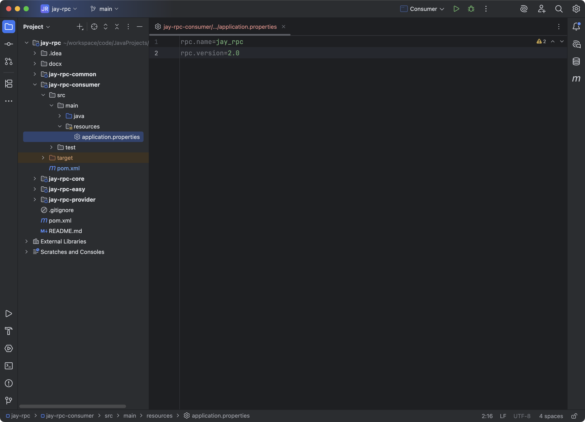

创建`Consumer`作为扩展后`RPC`项目的示例消费者类，测试配置文件读取。

代码如下：

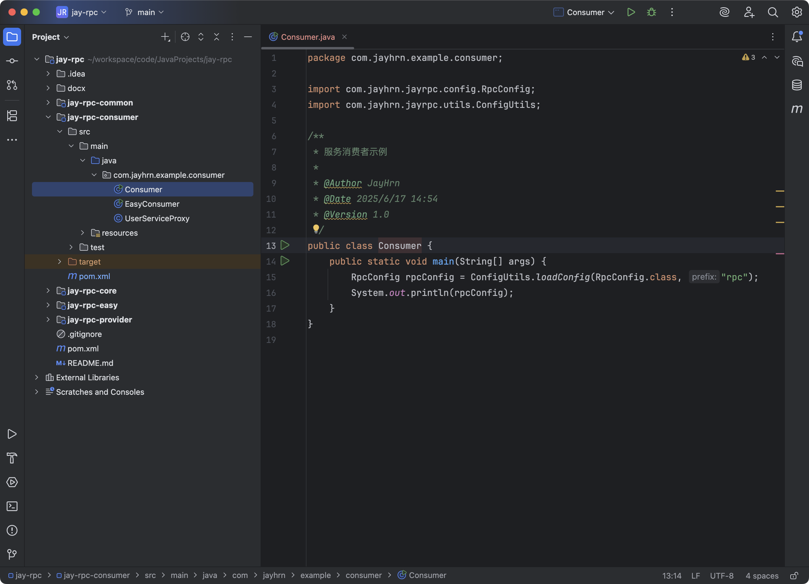

运行：

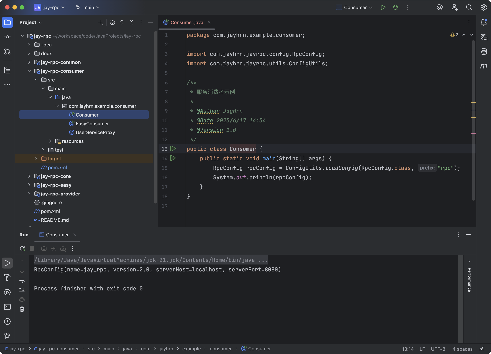

没写的就用的默认值，能够正确输出配置。

#### 测试全局配置对象加载

在`jay-rpc-provider`项目中创建`Provider`服务提供者示例类，能够根据配置动态地在不同端口启动web服务。

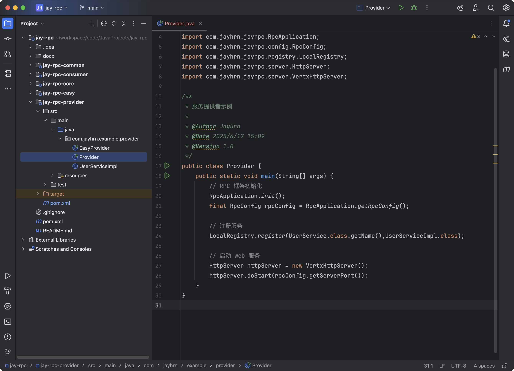

在`jay-rpc-provider`项目的`resources`目录下编写配置文件` application.properties `，代码如下：

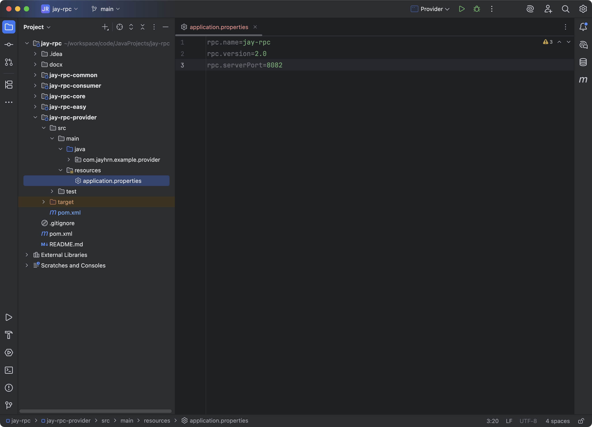

运行`Provider`，可以看到结果和配置文件的内容一致：

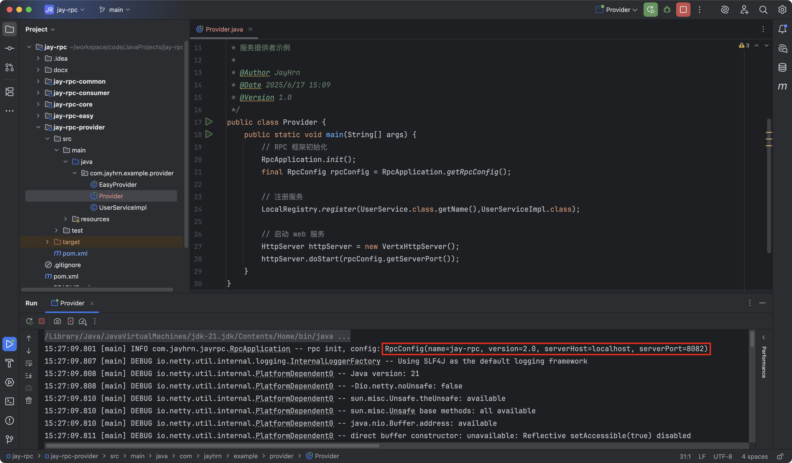

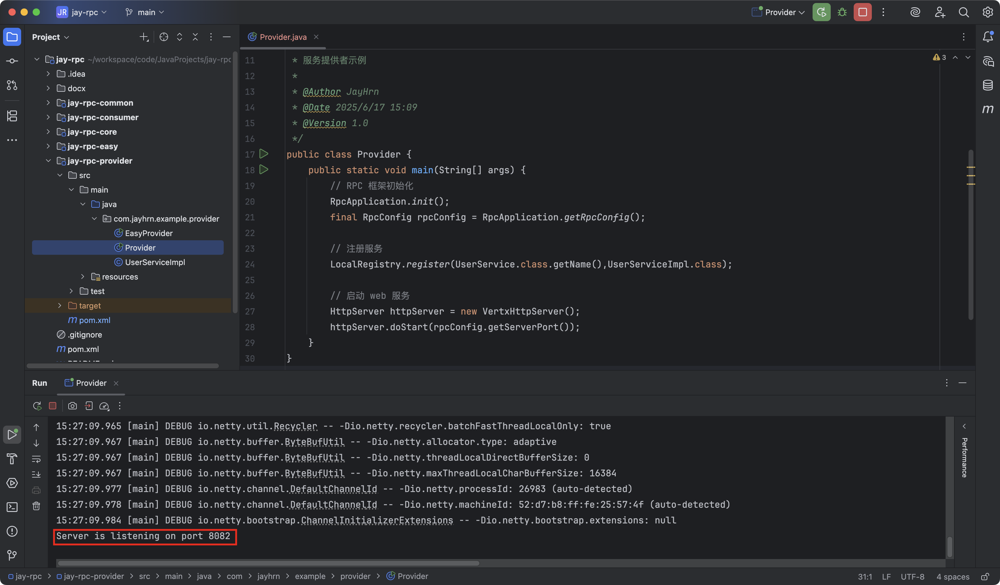

### 拓展

- 支持不同格式配置文件

- 支持监听配置文件更改，并自动更新配置对象

- 配置文件支持中文

- 配置分组