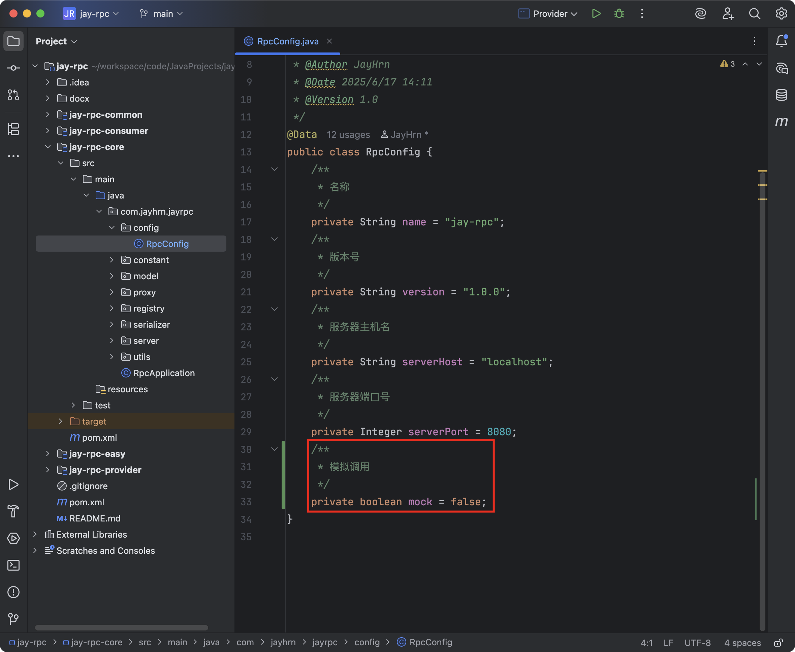
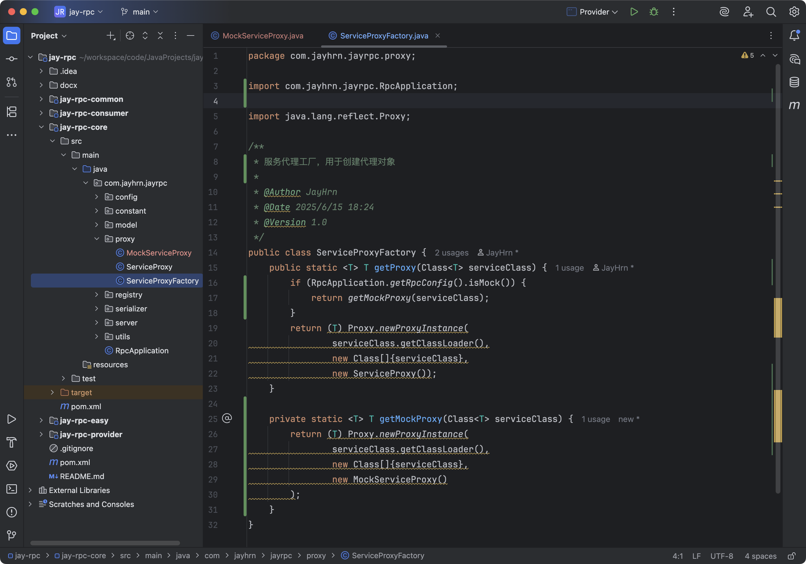
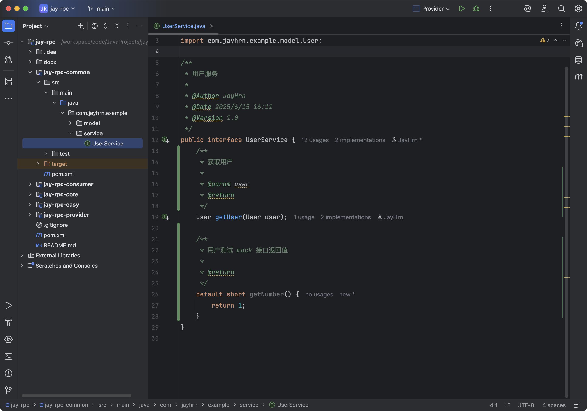
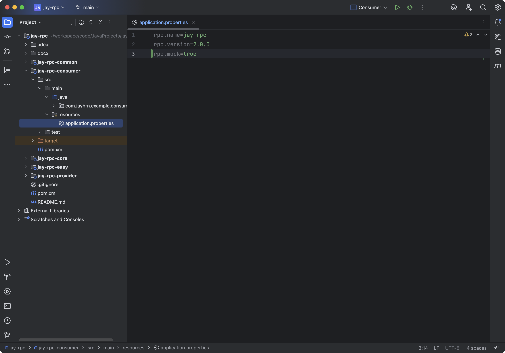
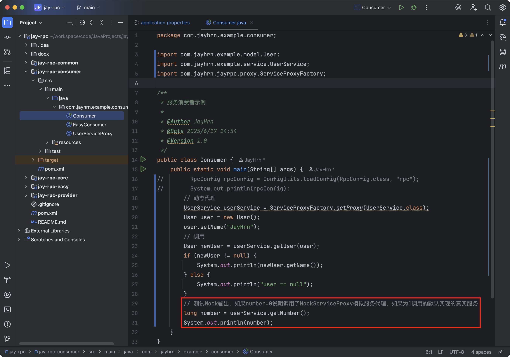
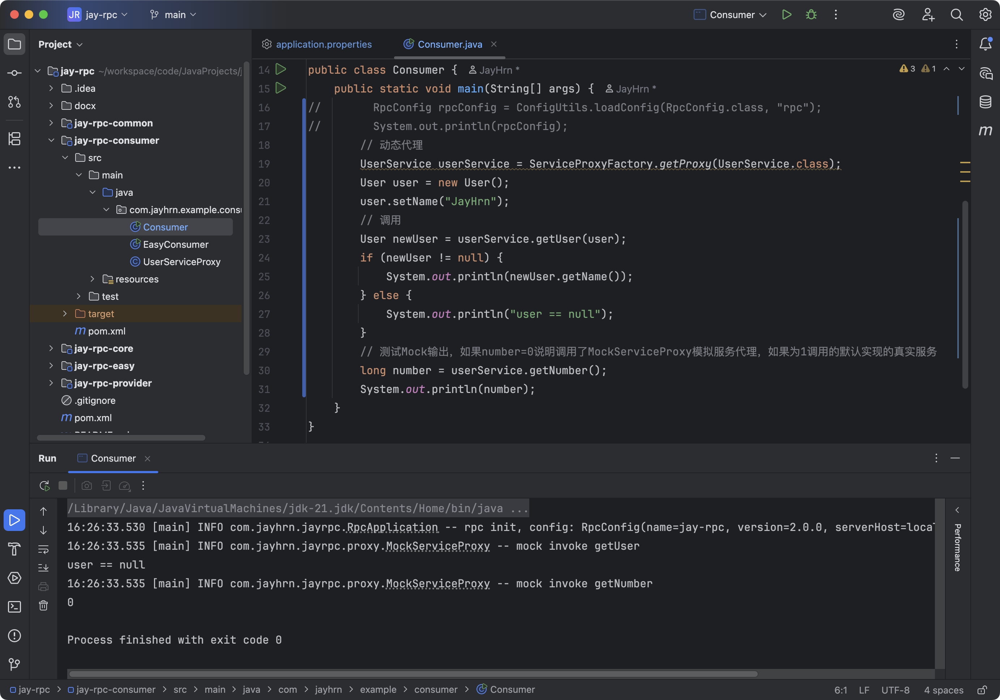

## 接口Mock

### 需求分析

#### 什么是Mock

RPC框架的核心功能是调用其他远程服务。但是在实际开发和测试过程中，有时可能无法直接访问真实的远程服务，或者访问真实的远程服务可能会产生不可控的影响，例如网络延迟、服务不稳定等。在这种情况下，就需要使用Mock服务来模拟远程服务的行为，以便进行接口的测试、开发和调试。

Mock是指模拟对象，通常用于测试代码中，特别是在单元测试中，便于我们跑通业务流程。

#### 为什么要支持Mock

虽然Mock服务并不是RPC框架的核心能力，但是它的开发成本并不高。而且给RPC框架支持Mock后，开发者就可以轻松调用服务接口、跑通业务流程，不必依赖真实的远程服务，提高使用体验，何乐而不为呢？

我们希望能够用最简单的方式一比如一个配置，就让开发者使用Mock服务。

### 设计方案

如何创建模拟对象呢？

在RPC项目[第一部分](../手写RPC框架教程（1-简易版）/手写RPC框架教程（1-简易版）.md#动态代理)中，我们就提到了一种动态创建对象的方法一一动态代理。之前是通过动态代理创建远程调用对象。同理，我们通过动态代理创建一个调用方法时返回固定值的对象，不就好了？

### 开发实现

1. 我们可以支持开发者通过修改配置文件的方式开启`mock`，那么首先给全局配置类`RpcConfig`新增`mock`字段，默认值为false。

   修改的代码如下：



2. 在`jay-rpc-core`模块的`Proxy`包下新增`MockServiceProxy`类，用于生成`mock`代理服务。在这个类中，需要提供一个根据服务接口类型返回固定值的方法。

   完整代码如下：

```java
package com.jayhrn.jayrpc.proxy;

import lombok.extern.slf4j.Slf4j;

import java.lang.reflect.InvocationHandler;
import java.lang.reflect.Method;

/**
 * Mock 服务代理（JDK 动态代理）
 *
 * @Author JayHrn
 * @Date 2025/6/17 15:54
 * @Version 1.0
 */
@Slf4j
public class MockServiceProxy implements InvocationHandler {
    /**
     * 调用代理
     *
     * @return
     * @throws Throwable
     */
    @Override
    public Object invoke(Object proxy, Method method, Object[] args) throws Throwable {
        // 根据方法的返回值类型，生成特定的默认对象
        Class<?> methodReturnType = method.getReturnType();
        log.info("mock invoke {}", method.getName());
        return getDefaultObject(methodReturnType);
    }

    /**
     * 生成指定类型的默认对象
     *
     * @param methodReturnType 方法返回类型
     * @return 对象
     */
    private Object getDefaultObject(Class<?> methodReturnType) {
        // 基本类型
        if (methodReturnType.isPrimitive()) {
            if (methodReturnType == boolean.class) {
                return false;
            } else if (methodReturnType == short.class) {
                return (short) 0;
            } else if (methodReturnType == int.class) {
                return (char) 0;
            } else if (methodReturnType == long.class) {
                return 0L;
            }
        }
        // 对象类型
        return null;
    }
}
```

在上述代码中，通过`getDefaultObject`方法，根据代理接口的`class`返回不同的默认值，比如针对`boolean`类型返回`false`、对象类型返回`null`等。

3. `ServiceProxyFactory`服务代理工厂新增获取`mock`代理对象的方法`getMockProxy`。可以通过读取已定义的全局配置 `mock` 来区分创建哪种代理对象。

   修改`ServiceProxyFactory`，完整代码如下：



### 测试

1. 可以在`jay-prc-common`模块的`UserService`中写个具有默认实现的新方法。等下需要调用该方法来测试mock代理服务是否生效，即查看调用的是模拟服务还是真实服务。

   代码如下：



2. 修改示例服务消费者`jay-rpc-consumer`模块中的`application.properties`配置文件，将mock设置为true：



3. 修改`Consumer`类，编写调用`userService.getNumber`的测试代码。

   代码如下：



4. 测试Mock输出，如果`number`输出为`0`说明调用了`MockServiceProxy`模拟服务代理，如果为`1`调用的默认实现的真实服务，因为我们前面设置了默认输出`1`，只有使用`Mock`的时候返回的是`0`。



看到输出的结果值为`0`，而不是`1`，说明调用了`MockServiceProxy`模拟服务代理。

### 拓展

完善Mock的逻辑，支持更多返回类型的默认值生成。
