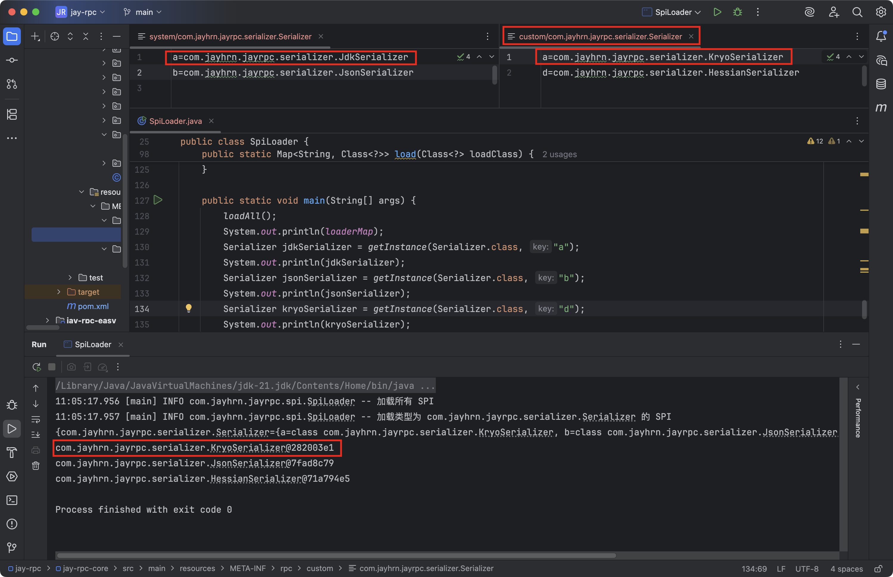

## 序列化器与SPI机制

### 需求分析

无论是请求或响应，都会涉及参数的传输。而`java`对象是存活在`JVM`虚拟机中的，如果想在其他位置存储并访问、或者在网络中进行传输，就需要进行序列化和反序列化。

我们编写了通用的序列化器接口，并且已经实现了基于Java原生序列化的序列化器。但是对于一个完善的RPC框架，我们还要思考以下3个问题：

1. 有没有更好的序列化器实现方式？
2. 如何让使用框架的开发者指定使用的序列化器？
3. 如何让使用框架的开发者自己定制序列化器？

### 设计方案

#### 序列化器实现方法

我们所追求的“更好的”序列化器，可以是具有高的性能、或者更小的序列化结果，这样就能够更快地完成`RPC`的请求和响应。

之前是为了方便，我们使用`Java`原生序列化实现序列化器，但这未必是最好的。市面上还有很多种主流的序列化方式，比如`JSON`、`Hessian`、`Kryo`、`protobuf`等。

下面简单列举它们的优缺点：

**主流序列化方式对比**

1. **JSON**

优点：

- 易读性好，可读性强，便于人类理解和调试。

- 跨语言支特广泛，几乎所有编程语言都有JSON的解析和生成库。

缺点：

- 序列化后的数据量相对较大，因为JSON使用文本格式存诸数据，需要额外的字符表示键、值和数据结构。

- 不能很好地处理复杂的数据结构和循环引用，可能导致性能下降或者序列化失败。

2. **Hessian**：http://hessian.caucho.com/


优点：

- 二进制序列化，序列化后的数据量较小，网络传输效率高。

- 支持跨语言，适用于分布式系统中的服务调用。

缺点：

- 性能较JSON略低，因为需要将对象转换为二进制格式。

- 对象必须实现Serializable接口，限制了可序列化的对象范围。

3. **Kryo**：https://github.com/EsotericSoftware/kryo

优点：

- 高性能，序列化和反序列化速度快。

- 支持循环引用和自定义序列化器，适用于复杂的对象结构

- 无需实现Serializable接口，可以序列化任意对象。

缺点：

- 不跨语言，只适用于Java。

- 对象的序列化格式不够友好，不易读懂和调试。

4. **Protobuf**

优点：

- 高效的二进制序列化，序列化后的数据量极小。

- 跨语言支持，并目提供了多种语言的实现库。

- 支持版本化和向前/向后兼容性。

缺点：

- 配置相对复杂，需要先定义数据结构的消息格式。

- 对象的序列化格式不易读懂，不便于调试。

#### 动态使用序列器

之前我们是在代码中硬编码了序列化器，比如：


如果开发者想要替换为别的序列化器，就必须修改所有的上述代码，太麻烦了！

理想情况下，应该可以通过配置文件来指定使用的序列化器。在使用序列化器时，根据居配置来获取不同的序列化器实例即可。

这个操作并不难，我们只需要定义一个`序列化器名称=>序列化器实现类对象`的Map,然后根据名称从Map中获取对象即可。

#### 自定义序列化器

如果开发者不想使用我们框架内置的序列化器，想要自己定义一个新的序列化器实现，但不能修改我们写好的框架代码，应该怎么办呢？

思路很简单：只要我们的RPC框架能够读取到用户自定义的类路径，然后加载这个类，作为`Serializer`序列化器接口的实现即可。

但是如何实现这个操作呢？

这就需要我们学习一个新的概念，也是Java中的重要特性一`SPI`机制。

**什么是SPI？**

`SPI(Service Provider Interface)服务提供接口`是`Java`的机制，主要用于实现模块化开发和插件化扩展。

`SPI`机制允许服务提供者通过特定的配置文件将自己的实现注册到系统中，然后系统通过反射机制动态加载这些实现，而不需要修改原始框架的代码，从而实现了系统的解耦、提高了可扩展性。

一个典型的SPI应用场景是JDBC(Java数据库连接库)，不同的数据库驱动程序开发者可以使用JDBC库，然后定制自己的数据库驱动程序。

此外，我们使用的主流Java开发框架中，几乎都使用到了SPI机制，比如Servlet容器、日志框架、ORM框架、Spring框架。所以这是Java开发者必须掌握的一个重要特性！

**如何实现SPI？**

分为系统实现和自定义实现。

**[系统实现]**

其实Java内已经提供了SPI机制相关的API接口，可以直接使用，这种方式最简单。

1. 首先在`resources`资源目录下创建`META-INF/services`目录，并且创建一个名称为要实现的接口的空文件。
2. 在文件中填写自己定制的接口实现类的完整类路径
3. 直接使用系统内置的ServiceLoader动态加载指定接口的实现类。

**[定制实现]**

系统实现SPI虽然简单，但是如果我们想定制多个不同的接口实现类，就没办法在框架中指定使用哪一个了，也就无法实现我们“通过配置快速指定序列化器”的需求。

所以我们需要自己定义SPI机制的实现，只要能够根据配置加载到类即可。

比如读取如下配置文件，能够得到一个`序列化器名称=>序列化器实现类对象`的映射，之后不就可以根据用户配置的序列化器名称动态加载指定实现类对象了么？

```properties
jdk=com.jayhrn.jayrpc.seralizer.JdkSeralizer
json=com.jayhrn.jayrpc.seralizer.JsonSeralizer
hessian=com.jayhrn.jayrpc.seralizer.HessianSeralizer
kryo=com.jayhrn.jayrpc.seralizer.KryoSeralizer
```

### 开发实现

#### 多种序列化器实现

我们分别实现`JSON`、`Kryo`和`Hessian`这三种主流的序列化器。

1. 首先给`jay-rpc-core`模块的`pom.xml`引入依赖


2. 然后在该模块的序列化器`serializer`包中分别实现这三种序列化器，不需要死记硬背。

**JSON序列化器**

JSON序列化器的实现相对复杂，要考虑一些对象转换的兼容性问题，比如Object数组在序列化后会丢失类型。

由于这部分代码需要使用到`jackson-databind`包，需要在`pom.xml`导入该包。


序列化器实现代码如下：

```java
package com.jayhrn.jayrpc.serializer;

import com.fasterxml.jackson.databind.ObjectMapper;
import com.jayhrn.jayrpc.model.RpcRequest;
import com.jayhrn.jayrpc.model.RpcResponse;

import java.io.IOException;

/**
 * Json 序列化器
 *
 * @Author JayHrn
 * @Date 2025/6/17 17:05
 * @Version 1.0
 */
public class JsonSerializer implements Serializer {
    private static final ObjectMapper OBJECT_MAPPER = new ObjectMapper();

    @Override
    public <T> byte[] serialize(T obj) throws IOException {
        return OBJECT_MAPPER.writeValueAsBytes(obj);
    }

    @Override
    public <T> T deserialize(byte[] bytes, Class<T> type) throws IOException {
        T obj = OBJECT_MAPPER.readValue(bytes, type);
        if (obj instanceof RpcRequest) {
            return handleRequest((RpcRequest) obj, type);
        }
        if (obj instanceof RpcResponse) {
            return handleResponse((RpcResponse) obj, type);
        }
        return obj;
    }

    /**
     * 由于 Object 的原始对象会被擦除，导致反序列化时会被作为 LinkedHashMap 无法转换成原始对象，因此这里做了特殊处理
     *
     * @param rpcRequest rpc 请求
     * @param type       类型
     * @return {@link T}
     * @throws IOException IO 异常
     */
    private <T> T handleRequest(RpcRequest rpcRequest, Class<T> type) throws IOException {
        Class<?>[] parameterTypes = rpcRequest.getParameterTypes();
        Object[] args = rpcRequest.getArgs();

        // 循环处理每个参数的类型
        for (int i = 0; i < parameterTypes.length; i++) {
            Class<?> parameterType = parameterTypes[i];
            // 如果类型不同，则需要处理一下类型
            if (!parameterType.isAssignableFrom(args[i].getClass())) {
                byte[] argBytes = OBJECT_MAPPER.writeValueAsBytes(args[i]);
                args[i] = OBJECT_MAPPER.readValue(argBytes, parameterType);
            }
        }
        return type.cast(rpcRequest);
    }

    /**
     * 由于 Object 的原始对象会被擦除，导致反序列化时会被作为 LinkedHashMap 无法转换成原始对象，因此这里做了特殊处理
     *
     * @param rpcResponse rpc响应
     * @param type        类型
     * @return {@link T}
     * @throws IOException IO 异常
     */
    private <T> T handleResponse(RpcResponse rpcResponse, Class<T> type) throws IOException {
        // 处理响应数据
        byte[] dataBytes = OBJECT_MAPPER.writeValueAsBytes(rpcResponse.getData());
        rpcResponse.setData(OBJECT_MAPPER.readValue(dataBytes, rpcResponse.getDataType()));
        return type.cast(rpcResponse);
    }
}
```

**Kryo序列化器**

Kryo本身是线程不安全的，所以需要使用ThreadLocal保证每个线程有一个单独的Kryo对象实例。

代码如下：

```java
package com.jayhrn.jayrpc.serializer;

import com.esotericsoftware.kryo.Kryo;
import com.esotericsoftware.kryo.io.Input;
import com.esotericsoftware.kryo.io.Output;

import java.io.ByteArrayInputStream;
import java.io.ByteArrayOutputStream;
import java.io.IOException;

/**
 * Kryo 序列化器
 *
 * @Author JayHrn
 * @Date 2025/6/17 18:49
 * @Version 1.0
 */
public class KryoSerializer implements Serializer {
    /**
     * Kryo 线程不安全，使用 ThreadLocal 保证每个线程只有一个 Kryo
     */
    private static final ThreadLocal<Kryo> KRYO_THREAD_LOCAL = ThreadLocal.withInitial(() -> {
        Kryo kryo = new Kryo();
        // 设置动态序列化类和反序列化类，不提前注册所有类（可能有安全问题）
        kryo.setRegistrationRequired(false);
        return kryo;
    });

    @Override
    public <T> byte[] serialize(T obj) throws IOException {
        ByteArrayOutputStream byteArrayOutputStream = new ByteArrayOutputStream();
        Output output = new Output(byteArrayOutputStream);
        KRYO_THREAD_LOCAL.get().writeObject(output, obj);
        output.close();
        return byteArrayOutputStream.toByteArray();
    }

    @Override
    public <T> T deserialize(byte[] bytes, Class<T> type) throws IOException {
        ByteArrayInputStream byteArrayInputStream = new ByteArrayInputStream(bytes);
        Input input = new Input(byteArrayInputStream);
        T result = KRYO_THREAD_LOCAL.get().readObject(input, type);
        input.close();
        return result;
    }
}
```

**Hessian序列化器**

实现比较简单，完整代码如下：

```java
package com.jayhrn.jayrpc.serializer;

import com.caucho.hessian.io.HessianInput;
import com.caucho.hessian.io.HessianOutput;

import java.io.ByteArrayInputStream;
import java.io.ByteArrayOutputStream;
import java.io.IOException;

/**
 * Hessian 序列化器
 *
 * @Author JayHrn
 * @Date 2025/6/17 18:56
 * @Version 1.0
 */
public class HessianSerializer implements Serializer {
    @Override
    public <T> byte[] serialize(T obj) throws IOException {
        ByteArrayOutputStream byteArrayOutputStream = new ByteArrayOutputStream();
        HessianOutput hessianOutput = new HessianOutput(byteArrayOutputStream);
        hessianOutput.writeObject(obj);
        return byteArrayOutputStream.toByteArray();
    }

    @Override
    public <T> T deserialize(byte[] bytes, Class<T> type) throws IOException {
        ByteArrayInputStream byteArrayInputStream = new ByteArrayInputStream(bytes);
        HessianInput hessianInput = new HessianInput(byteArrayInputStream);
        return (T) hessianInput.readObject(type);
    }
}
```

#### 动态使用序列化器

以下所有代码均放在`serializer`包下，便于维护和扩展。


1. 首先定义序列化器名称的常量，使用接口实现


2. 定义序列化器工厂

   序列化器对象是可以复用的，没必要每次执行序列化操作前邹创建一个新的对象。所以我们可以使用设计模式中的`工厂模式+单例模式`来简化创建和获取序列化器对象的操作。

   序列化器工厂代码如下，使用Map来维护序列化器实例：


3. 在全局配置类`RpcConfig`中补充序列化器的配置，代码如下：


4. 动态获取序列化器

需要将之前代码中所有用到序列化器的位置更改为“使用工厂+读取配置”来获取实现类，配置可以在`application.properties`文件中进行配置，和之前配置操作一样。

要更改的类：

- `ServiceProxy`

- `HttpServerHandler`

更改代码如下：


#### 自定义序列化器

我们使用自定义的`SPI`机制实现，支特用户自定义序列化器并指定键名。

1. 制定SPI配置目录

   系统内置的SPI机制会加载`resources`资源目录下的`META-INF/services`目录，那我们自定义的序列化器可以如法炮制，改为读取`META-INF/rpc`目录。

   我们还可以将`SPI`配置再分为系统内置SPI和用户自定义SPI,即目录如下：

   - 用户自定义`SPI:META-NF/rpc/custom`：用户可以在该目录下新建配置，加载自定义的实现类。

   - 系统内置`SPI:META-INF/rpc/system`：RPC框架自带的实现类，比如我们之前开发好的JdkSerializer。

   这样一来，所有接口的实现类都可以通过`SPI`动态加载，不用在代码中硬编码Map来维护实现类了。

   让我们编写一个系统扩展配置文件，内容为我们之前写好的序列化器。

   文件名称为`com.jayhrn.jayrpc.serializer.Serializer`，如图：


2. 编写`SpiLoader`加载器，在`jay-rpc-core`模块的`com.jayhrn.jayrpci`包里新建`spi`包。

   相当于一个工具类，提供了读取配置并加载实现类的方法。

   关键实现如下：

   1. 用Map来存储已加载的配置信息键名=>实现类。
   2. 扫描指定路径，读取每个配置文件，获取到键名=>实现类信息并存储在Map中。
   3. 定义获取实例方法，根据用户传入的接口和键名，从Map中找到对应的实现类，然后通过反射获取到实现类对象。可以维护一个对象实例缓存，创建过一次的对象从缓存中读取即可。

   完整代码如下：

```java
package com.jayhrn.jayrpc.spi;

import cn.hutool.core.io.resource.ResourceUtil;
import com.jayhrn.jayrpc.serializer.Serializer;
import lombok.extern.slf4j.Slf4j;

import java.io.BufferedReader;
import java.io.InputStreamReader;
import java.net.URL;
import java.util.Arrays;
import java.util.HashMap;
import java.util.List;
import java.util.Map;
import java.util.concurrent.ConcurrentHashMap;

/**
 * SPI 加载器
 * 自定义实现，支持键值对映射
 *
 * @Author JayHrn
 * @Date 2025/6/17 20:07
 * @Version 1.0
 */
@Slf4j
public class SpiLoader {
    /**
     * 存储已加载的类：接口名 => （key => 实现类）
     */
    private static final Map<String, Map<String, Class<?>>> loaderMap = new ConcurrentHashMap<>();
    /**
     * 对象实例缓存（避免重复 new），类路径 => 对象实例，单例模式
     */
    private static final Map<String, Object> instanceCache = new ConcurrentHashMap<>();
    /**
     * 系统 SPI 目录
     */
    private static final String RPC_SYSTEM_SPI_DIR = "META-INF/rpc/system/";
    /**
     * 用户自定义 SPI 目录
     */
    private static final String RPC_CUSTOM_SPI_DIR = "META-INF/rpc/custom/";
    /**
     * 扫描路径
     */
    private static final String[] SCAN_DIR = new String[]{RPC_SYSTEM_SPI_DIR, RPC_CUSTOM_SPI_DIR};
    /**
     * 动态加载的类列表
     */
    private static final List<Class<?>> LOAD_CLASS_LIST = Arrays.asList(Serializer.class);

    /**
     * 加载所有的 SPI
     */
    public static void loadAll() {
        log.info("加载所有 SPI");
        for (Class<?> loadClass : LOAD_CLASS_LIST) {
            load(loadClass);
        }
    }

    /**
     * 获取到某个接口的实例
     *
     * @param clazz
     * @param key
     * @param <T>
     * @return
     */
    public static <T> T getInstance(Class<?> clazz, String key) {
        String className = clazz.getName();
        Map<String, Class<?>> keyClassMap = loaderMap.get(className);
        if (keyClassMap == null) {
            throw new RuntimeException(String.format("SpiLoader 未加载 %s 类型", className));
        }
        if (!keyClassMap.containsKey(key)) {
            throw new RuntimeException(String.format("SpiLoader 的 %s 不存在 key=%s 的类型", className, key));
        }
        // 获取到要加载到实现类型
        Class<?> implClass = keyClassMap.get(key);
        // 从实例缓存中加载指定类型的实例
        String implClassName = implClass.getName();
        if (!instanceCache.containsKey(implClassName)) {
            try {
                instanceCache.put(implClassName, implClass.newInstance());
            } catch (InstantiationException | IllegalAccessException e) {
                throw new RuntimeException(String.format("%s 类实例化失败", implClassName));
            }
        }
        return (T) instanceCache.get(implClassName);
    }

    /**
     * 加载某个类型
     *
     * @param loadClass
     * @return
     */
    public static Map<String, Class<?>> load(Class<?> loadClass) {
        log.info("加载类型为 {} 的 SPI", loadClass.getName());
        // 扫描路径，用户自定义的 SPI 优先级高于系统 SPI
        Map<String, Class<?>> keyClassMap = new HashMap<>();
        for (String scanDir : SCAN_DIR) {
            List<URL> resources = ResourceUtil.getResources(scanDir + loadClass.getName());
            // 读取每个资源文件
            for (URL resource : resources) {
                try {
                    InputStreamReader inputStreamReader = new InputStreamReader(resource.openStream());
                    BufferedReader bufferedReader = new BufferedReader(inputStreamReader);
                    String line;
                    while ((line = bufferedReader.readLine()) != null) {
                        String[] strArray = line.split("=");
                        if (strArray.length > 1) {
                            String key = strArray[0];
                            String className = strArray[1];
                            keyClassMap.put(key, Class.forName(className));
                        }
                    }
                } catch (Exception e) {
                    log.info("spi resource load error", e);
                }
            }
        }
        loaderMap.put(loadClass.getName(), keyClassMap);
        return keyClassMap;
    }

    public static void main(String[] args) {
        loadAll();
        System.out.println(loaderMap);
        Serializer serializer = getInstance(Serializer.class, "jdk");
        System.out.println(serializer);
    }
}
```

上述代码中，虽然提供了`loadAll`方法，扫描所有路径下的文件进行加载，但其实没必要使用。更推荐使用`load`方法，按需加载指定的类。

注意，上述代码中获取配置文件是使用了`ResourceUtil.getResources`，而不是通过文件路径获取。因为如果框架作为依赖被引入，是无法得到正确文件路径的，因此必须用`ResourceUtil`通过`classpath`加载资源。

3. 重构序列化器工厂

   之前，我们是通过在工厂中硬编码HashMap来存储序列化器和实现类的，有了SPI后，就可以改为从SPI加载指定的序列化器对象。

   完整代码如下：


使用静态代码块，在工厂首次加载时，就会调用`SpiLoader`的`Ioad`方法加载序列化器接口的所有实现类，之后就可以通过调用`getlnstance`方法获取指定的实现类对象了。

### 测试

#### SPI加载测试

1. 获取每个实现类：


2. 修改框架`custom`和`system`下的`SPI`配置文件，任意指定键名和实现类路径，验证能否正常加载。

   比如下图的配置：


3. 如果key不存在：


4. key相同时，自定义配置覆盖系统配置：



#### 完整测试

1. 修改消费者和生产者示例项目中的配置文件，指定不同的序列化器，比如`jdk`和`json`，会由于序列化工具不一样直接报错:


2. 生产者和消费者使用一样的序列化器，例如`hessian`，运行成功：


#### 自定义序列化器

之后，我们如果要实现自定义的序列化器，只需要进行以下步骤：

1. 写一个类实现`Serializer`接口
2. 在`resourcesMETA-INF/rpc/custom`目录下新建名称为`com.jayhrn.jayrpc.serializer.Serializer`的`SPI`配置文件，加载自己写的实现类，格式为`key=value`
3. 在`application.properties`文件中使用自定义的序列化器，格式为`rpc.serializer=key`

### 拓展

- 实现更多不同协议的序列化器

- 序列化器工厂可以使用懒加载（懒汉式单例）的方式创建序列化器实例。

- `SpiLoader`支特懒加载，获取实例时才加载对应的类。