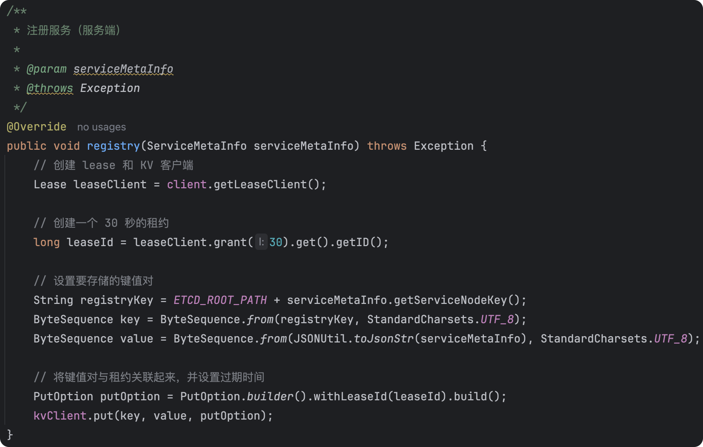

## 注册中心基本实现

### 需求分析

RPC框架的一个核心模块是注册中心，目的是帮助服务消费者获取到服务提供者的调用地址，而不是将调用地址硬编码到项目中。


### 设计方案

#### 注册中心核心能力

我们先明确注册中心的几个实现关键（核心能力）：

1. 数据分布式存储：集中的注册信息数据存储、读取和共享
2. 服务注册：服务提供者上报服务信息到注册中心
3. 服务发现：服务消费者从注册中心拉取服务信息
4. 心跳检测：定期检查服务提供者的存活状态
5. 服务注销：手动剔除节点、或者自动剔除失效节点
6. 更多优化点：比如注册中心本身的容错、服务消费者缓存等

#### 技术选型

第一点是最重要的，我们首先需要一个能够集中存储和读取数据的中间件。此外，它还需要有数据过期、数据监听的能力，便于我们移除失效节点、更新节点列表等。

此外，对于注册中心的技术选型，我们还要考虑它的性能、高可用性、高可靠性、稳定性、数据一致性、社区的生态和活跃度等。注册中心的可用性和可靠性尤其重要，因为一旦注册中心本身都挂了，会影响到所有服务的调用。

主流的注册中心实现中间件有ZooKeeper、Redis等。在本RPC框架中，使用一种更新颖的、更适合存储元信息（注册信息）的云原生中间件`Etcd`来实现注册中心。

#### Etcd入门

1. **Etcd介绍**

   https://github.com/etcd-io/etcd


Etcd是一个Go语言实现的、开源的、分布式的键值存储系统，它主要用于分布式系统中的服务发现、配置管理和分布式锁等场景。

Etcd的性能是很高的，它和云原生有着密切的关系，通常被作为云原生应用的基础设施，存储一些元信息。比如经典的容器管理平台`k8s`就使用了Etcd来存储集群配置信息、状态信息、节点信息等。

除了性能之外，Etcd采用Raft一致性算法来保证数据的一致性和可靠性，具有高可用性、强一致性、分布式特性等特点。

Etcd简单易用！提供了简单的`API`、数据的过期机制、数据的监听和通知机制等，完美满足注册中心的实现诉求。

Etcd的入门成本是极低的，只要学过Redis、ZooKeeper或者对象存储中的一个，就能够很快理解Etcd并投入实战运用。我们学知识的一个技巧，就是把新知识和老知识进行类比和关联。

2. **Etcd数据结构与特性**

Etcd的核心数据结构包括：

1. Key(键)：Etcd中的基本数据单元，类似于文件系统中的文件名。每个键都唯一标识一个值，并且可以包含子键，形成类似于路径的层次结构。
2. Value(值)：与键关联的数据，可以是任意类型的数据，通常是字符串形式。

Etcd在其数据模型和组织结构上更接近于ZooKeeper和对象存储，而不是Redis。它使用层次化的键值对来存储数据，支持类似于文件系统路径的层次结构，能够很灵活地单key查询、按前缀查询、按范围查询。

Etcd有很多核心特性，其中，应用校多的特性是：

1. Lease(租约)：用于对键值对进行TTL超时设置，即设置键值对的过期时间。当租约过期时，相关的键值对将被自动删除。
2. Watch(监听)：可以监视特定键的变化，当键的值发生变化时，会触发相应的通知。

有了这些特性，我们就能够实现注册中心的服务提供者节点过期和监听了。

3. **Etcd如何保持数据一致性**

从表层来看，Etcd支持事务操作，能够保证数据一致性。

从底层来看，Etcd使用Raft一致性算法来保证数据的一致性。

Raft是一种分布式一致性算法，它确保了分布式系统中的所有节点在任何时间点都能达成一致的数据视图。

具体来说，Raft算法通过选举机制选举出一个领导者(Leader)节点，领导者负责接收客户端的写请求，并将写操作复制到其他节点上。当客户端发送写请求时，领导者首先将写操作写入自己的日志中，并将写操作的日志条目分发给其他节点，其他节点收到日志后也将其写入自己的日志中。一旦大多数节点（即半数以上的节点）都将该日志条目成功写入到自己的日志中，该日志条目就被视为已提交，领导者会向客户端发送成功响应。在领导者发送成功响应后，该写操作就被视为已提交，从而保证了数据的一致性。

如果领导者节点宕机或失去联系，Raft算法会在其他节点中选举出新的领导者，从而保证系统的可用性和一致性。新的领导者会继续接收客户端的写请求，并负责将写操作复制到其他节点上，从而保持数据的一致性。

理解Etcd：http://play.etcd.io/play

4. **Etcd基本操作**

和所有数据存储中间件一样，基本操作无非就是：增删改查。

5. **Etcd安装**

官方下载页：https://github.com/etcd-io/etcd/releases or https://etcd.io/docs/v3.2/install/


服务默认占用2379和2380端口，作用分别如下：

- 2379：提供HTTP API服务，和etcdctr交互

- 2380：集群中节点之间通讯

如果使用的是服务器，需要配置相关信息，安装步骤可以参考如下内容，记得开放端口`2379`。

```bash
# 下载
apt-get install etcd
# 配置信息
ETCD_NAME="default"
ETCD_LISTEN_PEER_URLS="http://0.0.0.0:2380"
ETCD_LISTEN_CLIENT_URLS="http://0.0.0.0:2379"
ETCD_INITIAL_ADVERTISE_PEER_URLS="http://<你的服务器ip地址>:2380"
ETCD_ADVERTISE_CLIENT_URLS="http://<你的服务器ip地址>:2379"
ETCD_INITIAL_CLUSTER="default=http://<你的服务器ip地址>:2380"
# 启动etcd服务
systemctl start etcd
# 设置开机自启
systemctl enable etcd
```

6. **Etcd可视化工具**

etcdkeeper：https://github.com/evildecay/etcdkeeper/
kstone:https://github.com/kstone-io/kstone/tree/master/charts

7. **Etcd Java 客户端**

所谓客户端，就是操作Etcd的工具。

etcd主流的Java客户端是 jetcd: https://github.com/etcd-io/jetcd


注意，Java版本必须大于11！

用法非常简单，就像curator能够操作ZooKeeper、jedis能够操作Redis一样。

**[1] 加入依赖**


**[2] 按照官方文档的示例写Demo：**


运行代码，发现报错：


经过查询发现是`vertx-core`和`jetcd-core`版本不兼容导致的。

解决方法：切换`vertx-core`版本号，可以顺手把`jay-rpc-easy`模块的`vertx-core`版本改成相同的：


重新运行即可运行成功。

在上述代码中，我们使用kvClient来操作etcd写入和读取数据。除了kvClient客户端外，Etcd还提供了很多其他客户端。

常用的客户端和作用如下，仅作了解即可：

1. kvClient：用于对etcd中的键值对进行操作。通过kvClient可以进行设置值、获取值、删除值、列出目录等操作。
2. leaseClient：用于管理etcd的租约机制。租约是etcd中的一种时间片，用于为键值对分配生存时间，并在租约到期时自动删除相关的键值对。通过leaseClient可以创建、获取、续约和撤销租约。
3. watchClient：用于监视etcd中键的变化，并在键的值发生变化时接收通知。
4. clusterClient：用于与etcd集群进行交互，包括添加、移除、列出成员、设置选举、获取集群的健康状态、获取成员列表信息等操作！
5. authClient：用于管理etcd的身份验证和授权。通过authClient可以添加、删除、列出用户、角色等身份信息，以及授予或撤销用户或角色的权限。
6. maintenanceClient：用于执行etcd的维护操作，如健康检查、数据库备份、成员维护、数据库快照、数据库压缩等。
7. lockClient：用于实现分布式锁功能，通过lockClient可以在etcd上创建、获取、释放锁，能够轻松实现并发控制。
8. electionClient：用于实现分布式选举功能，可以在etcd上创建选举、提交选票、监视选举结果等。

绝大多数情况下，用前3个客户端就足够了。

**[3] Etcd的数据结构**

- key: "test-key"
- create_revision: 5
- mod_revision: 5
- version: 1
- value: "test_version"

Etcd除了key和vlue外，还有版本、创建版本、修改版本字段。这是因为etcd中的每个键都有一个与之关联的版本号，用于跟踪键的修改历史。当一个键的值发生变化时，其版本号也会增加。

通过使用etcd的Watch API，可以监视键的变化，并在发生变化时接收通知。这种版本机制使得etcd在分布式系统中能够实现乐观并发控制、一致性和可靠性的数据访问

#### 存储结构设计

存储结构设计的几个要点

1. key 如何设计？
2. value如何设计？
3. key什么时候过期？

由于一个服务看你需要多个服务提供者（负载均衡），我们可以有两种设计结构：

[1] 层级结构：将服务理解为文件夹、将服务对应的多个节点理解为文件夹下的文件，那么可以通过服务名称，用前缀查询的方式查询到某个服务的所有节点。

如图，键名的规则可以是`业务前缀/服务名/服务节点地址`


[2] 列表结构：将所有的服务节点以列表的形式整体作为value。


选择哪种存储结构呢？这个也会跟我们的技术选型有关。对于ZooKeeper和Etcd这种支持层级查询的中间件，**用第一种结构**会更清晰；对于Redis，由于本身就支持列表数据结构，可以选择第二种结构。

最后，一定要给key设置过期时间，比如默认30秒过期，这样如果服务提供者宕机了，也可以超时后自动移除。

### 开发实现

#### 注册中心开发

1. 注册信息定义

   在`model`包下新建`ServiceMetaInfo`类，封装服务的注册信息，包括服务名称、服务版本号、服务地址（域名和端口号）、服务分组等。


需要给`ServiceMetaInfo`增加一些工具方法，用于获取服务注册键名、获取服务注册节点键名等。

可以把版本号和分组都放到服务键名中，就可以在查询时根据这些参数获取对应版本和分组的服务了。

代码如下：


由于注册信息里包含了服务版本号字段，所以我们也可以给RpcRequest对象补充服务版本号字段，可以先作为预留字段，默认值为"1.0"，后续再自行实现。

在`RpcConstant`常量类中补充默认服务版本常量：


在`RpcRequest`请求类中使用该常量，代码如下：


在`ServiceMetaInfo`类中使用该常量，代码如下：


2. 注册中心配置

   在config包下编写注册中心配置类`RegistryConfig`，让用户配置连接注册中心所需的信息，比如注册中心类别、注册中心地址、用户名、密码、连接超时时间等。

   代码如下：


还要为RpcConfig全局配置补充注册中心配置，代码如下：


3. 注册中心接口

   遵循可扩展设计，我们先写一个注册中心接口，后续可以实现多种不同的注册中心，并且和序列化器一样，可以使用`SPI`机制动态加载。

   注册中心接口代码如下，主要是提供了初始化、注册服务、注销服务、服务发现（获取服务节点列表）、服务销毁等方法。

   在`registry`包下新建`Registry`接口，代码如下：

```java
package com.jayhrn.jayrpc.registry;

import com.jayhrn.jayrpc.config.RegistryConfig;
import com.jayhrn.jayrpc.model.ServiceMetaInfo;

import java.util.List;

/**
 * 注册中心
 *
 * @Author JayHrn
 * @Date 2025/6/19 15:33
 * @Version 1.0
 */
public interface Registry {
    /**
     * 初始化
     *
     * @param registryConfig
     */
    void init(RegistryConfig registryConfig);

    /**
     * 注册服务（服务端）
     *
     * @param serviceMetaInfo
     * @throws Exception
     */
    void registry(ServiceMetaInfo serviceMetaInfo) throws Exception;

    /**
     * 注销服务（服务端）
     *
     * @param serviceMetaInfo
     */
    void unRegistry(ServiceMetaInfo serviceMetaInfo);

    /**
     * 服务发现（获取某服务端所有节点，消费端）
     *
     * @param serviceKey 服务键名
     * @return
     */
    List<ServiceMetaInfo> serviceDiscovery(String serviceKey);

    /**
     * 服务销毁
     */
    void destroy();
}
```

4. Etcd注册中心实现

   在`registry`目录下新建`EtcdRegistry`类，实现注册中心接口，先完成初始化方法，读取注册中心配置并初始化客户端对象。

   代码如下：【之前我们那个测试就是这个文件】


上述代码中，我们定义Etcd键存储的根路径为`/rpc/`，为了区分不同的项目。

依次实现不同的方法，首先是服务注册，创建`key`并设置过期时间，`value`为服务注册信息的`JSON序列化`，代码如下。

注册服务：



注销服务，删除key：


服务发现，根据服务名称作为前缀，从Etcd获取服务下的节点列表：


注册中心销毁，用于项目关闭后释放资源：


注册中心实现类的完整代码如下：

```java
package com.jayhrn.jayrpc.registry;

import cn.hutool.json.JSONUtil;
import com.jayhrn.jayrpc.config.RegistryConfig;
import com.jayhrn.jayrpc.model.ServiceMetaInfo;
import io.etcd.jetcd.*;
import io.etcd.jetcd.options.GetOption;
import io.etcd.jetcd.options.PutOption;

import java.nio.charset.StandardCharsets;
import java.time.Duration;
import java.util.List;
import java.util.concurrent.ExecutionException;
import java.util.stream.Collectors;

/**
 * @Author JayHrn
 * @Date 2025/6/18 19:24
 * @Version 1.0
 */
public class EtcdRegistry implements Registry {

    private Client client;

    private KV kvClient;
    /**
     * 根节点
     */
    private static final String ETCD_ROOT_PATH = "/rpc/";

    @Override
    public void init(RegistryConfig registryConfig) {
        // 使用 endpoints 创建客户端
        client = Client.builder()
                .endpoints(registryConfig.getAddress())
                .connectTimeout(Duration.ofMillis(registryConfig.getTimeout()))
                .build();
        kvClient = client.getKVClient();
    }

    /**
     * 注册服务（服务端）
     *
     * @param serviceMetaInfo
     * @throws Exception
     */
    @Override
    public void register(ServiceMetaInfo serviceMetaInfo) throws Exception {
        // 创建 lease 和 KV 客户端
        Lease leaseClient = client.getLeaseClient();

        // 创建一个 30 秒的租约
        long leaseId = leaseClient.grant(30).get().getID();

        // 设置要存储的键值对
        String registryKey = ETCD_ROOT_PATH + serviceMetaInfo.getServiceNodeKey();
        ByteSequence key = ByteSequence.from(registryKey, StandardCharsets.UTF_8);
        ByteSequence value = ByteSequence.from(JSONUtil.toJsonStr(serviceMetaInfo), StandardCharsets.UTF_8);

        // 将键值对与租约关联起来，并设置过期时间
        PutOption putOption = PutOption.builder().withLeaseId(leaseId).build();
        kvClient.put(key, value, putOption);
    }

    /**
     * 注销服务（服务端）
     *
     * @param serviceMetaInfo
     */
    @Override
    public void unregister(ServiceMetaInfo serviceMetaInfo) {
        String registryKey = ETCD_ROOT_PATH + serviceMetaInfo.getServiceNodeKey();
        try {
            // 需要加上get()，否则可能导致delete操作没有完成
            kvClient.delete(ByteSequence.from(registryKey, StandardCharsets.UTF_8)).get();
        } catch (InterruptedException | ExecutionException e) {
            throw new RuntimeException(e);
        }
    }

    /**
     * 服务发现（获取某服务端所有节点，消费端）
     *
     * @param serviceKey 服务键名
     * @return
     */
    @Override
    public List<ServiceMetaInfo> serviceDiscovery(String serviceKey) {
        // 前缀搜索，结尾一定要加 '/'
        String searchPrefix = ETCD_ROOT_PATH + serviceKey + "/";

        try {
            // 前缀查询
            GetOption getOption = GetOption.builder().isPrefix(true).build();
            List<KeyValue> keyValues = kvClient.get(
                            ByteSequence.from(searchPrefix, StandardCharsets.UTF_8),
                            getOption)
                    .get()
                    .getKvs();
            // 解析服务信息
            List<ServiceMetaInfo> serviceMetaInfoList = keyValues.stream()
                    .map(keyValue -> {
                        String value = keyValue.getValue().toString(StandardCharsets.UTF_8);
                        return JSONUtil.toBean(value, ServiceMetaInfo.class);
                    }).collect(Collectors.toList());
            return serviceMetaInfoList;
        } catch (Exception e) {
            throw new RuntimeException("获取服务列表失败", e);
        }
    }

    /**
     * 服务销毁
     */
    @Override
    public void destroy() {
        System.out.println("当前节点下线");

        // 释放资源
        if (kvClient != null) {
            kvClient.close();
        }
        if (client != null) {
            client.close();
        }
    }
}
```

#### 支持配置和拓展注册中心

一个成熟的RPC框架可能会支特多个注册中心，像序列化器一样，我们的需求是，让开发者够填写配置来指定使用的注册中心，并且支特自定义注册中心，让上框架更易用、更利于扩展。

要实现这点，开发方式和序列化器也是一样的，都可以使用工厂创建对象、使用`SPI`动态加载自定义的注册中心。

1. 注册中心常量

   在`registry`包下新建`RegistryKeys`类，列举所有支持的注册中心键名。


2. 修改注册中心配置的注册中心类别`registry`


3. 使用工厂模式，支特根据`key`从`SPI`获取注册中心对象实例。

   在`registry`包下新建`RegistryFactory`类，代码如下：


这个类可以直接复制之前的`SerializerFactory`，然后略做修改。

3. 在`META-INF`的`rpc/system`目录下编写注册中心接口的SPI配置文件，文件名称为`com.jayhrn.jayrpc.registry.Registry`


4. 最后，我们需要一个位置来初始化注册中心。由于服务提供者和服务消费者都需要和注册中心建立连接，是一个RPC框架启动必不可少的环节，所以可以将初始化流程放在`RpcApplication`类中。

   修改其`init`方法代码如下：


#### 完成调用流程

下面我们要改造服务消费者调用服务的代码，跑通整个动态获取节点并调用的流程。

1. 服务消费者需要先用注册中心获取节点信息，再得到调用地址并执行

   需要给`ServiceMetaInfo`类增加一个方法，便于获取可调用的地址，代码如下：


2. 修改服务代理`ServiceProxy`类，更改调用逻辑。

```java
package com.jayhrn.jayrpc.proxy;

import cn.hutool.core.collection.CollUtil;
import cn.hutool.http.HttpRequest;
import cn.hutool.http.HttpResponse;
import com.jayhrn.jayrpc.RpcApplication;
import com.jayhrn.jayrpc.config.RpcConfig;
import com.jayhrn.jayrpc.constant.RpcConstant;
import com.jayhrn.jayrpc.model.RpcRequest;
import com.jayhrn.jayrpc.model.RpcResponse;
import com.jayhrn.jayrpc.model.ServiceMetaInfo;
import com.jayhrn.jayrpc.registry.Registry;
import com.jayhrn.jayrpc.registry.RegistryFactory;
import com.jayhrn.jayrpc.serializer.Serializer;
import com.jayhrn.jayrpc.serializer.SerializerFactory;

import java.io.IOException;
import java.lang.reflect.InvocationHandler;
import java.lang.reflect.Method;
import java.util.List;

/**
 * 服务代理（JDK 动态代理）
 *
 * @Author JayHrn
 * @Date 2025/6/15 18:27
 * @Version 1.0
 */
public class ServiceProxy implements InvocationHandler {
    /**
     * 调用代理
     *
     * @return
     * @throws Throwable
     */
    @Override
    public Object invoke(Object proxy, Method method, Object[] args) throws Throwable {
        // 指定序列化器
        final Serializer serializer = SerializerFactory.getInstance(RpcApplication.getRpcConfig().getSerializer());

        String serviceName = method.getDeclaringClass().getName();

        // 构造请求
        RpcRequest rpcRequest = RpcRequest.builder()
                .serviceName(method.getDeclaringClass().getName())
                .methodName(method.getName())
                .parameterTypes(method.getParameterTypes())
                .args(args)
                .build();
        try {
            // 序列化
            byte[] bodyBytes = serializer.serialize(rpcRequest);

            // 从注册中心获取服务提供者请求地址
            RpcConfig rpcConfig = RpcApplication.getRpcConfig();
            // 获取制定类别的注册中心
            Registry registry = RegistryFactory.getInstance(rpcConfig.getRegistryConfig().getRegistry());
            ServiceMetaInfo serviceMetaInfo = new ServiceMetaInfo();
            serviceMetaInfo.setServiceName(serviceName);
            serviceMetaInfo.setServiceVersion(RpcConstant.DEFAULT_SERVICE_VERSION);
            List<ServiceMetaInfo> serviceMetaInfoList = registry.serviceDiscovery(serviceMetaInfo.getServiceKey());
            if (CollUtil.isEmpty(serviceMetaInfoList)) {
                throw new RuntimeException("暂无服务地址");
            }

            // 暂时先取第一个
            ServiceMetaInfo selectedServiceMetaInfo = serviceMetaInfoList.get(0);

            // 发送请求
            // TODO: 注意，这里地址被硬编码了（需要使用注册中心和服务发现机制解决）
            // 2025年6月19日配置 已解决
            try (HttpResponse httpResponse = HttpRequest.post(selectedServiceMetaInfo.getServiceAddress())
                    .body(bodyBytes)
                    .execute()) {
                // 接受响应
                byte[] result = httpResponse.bodyBytes();
                // 反序列化
                RpcResponse rpcResponse = serializer.deserialize(result, RpcResponse.class);
                return rpcResponse.getData();
            }
        } catch (IOException e) {
            e.printStackTrace();
        }
        return null;
    }
}
```

注意，从注册中心获取到的服务节点地址可能是多个，我们暂时取了第一个

### 测试


#### 注册中心测试

首先验证注册中心是否正常完成服务注册、注销、服务发现。

由于之前我们填写的junit版本为`3.8.1`不支持注解，更换最新版本，代码如下，可以把其他模块的也换掉去：


编写单元测试类`RegistryTest`，代码如下：

```java
package com.jayhrn.jayrpc.registry;

import com.jayhrn.jayrpc.config.RegistryConfig;
import com.jayhrn.jayrpc.model.ServiceMetaInfo;
import org.junit.Assert;
import org.junit.Before;
import org.junit.Test;

import java.util.List;

/**
 * 注册中心测试
 *
 * @Author JayHrn
 * @Date 2025/6/17 16:58
 * @Version 1.0
 */
public class RegistryTest {
    final Registry registry = new EtcdRegistry();

    @Before
    public void init() {
        RegistryConfig registryConfig = new RegistryConfig();
        registryConfig.setAddress("http://<etcd ip>:2379");
        registry.init(registryConfig);
    }

    @Test
    public void register() throws Exception {
        ServiceMetaInfo serviceMetaInfo = new ServiceMetaInfo();
        serviceMetaInfo.setServiceName("myService");
        serviceMetaInfo.setServiceVersion("1.0");
        serviceMetaInfo.setServiceHost("<etcd ip>");
        serviceMetaInfo.setServicePort(1234);
        registry.register(serviceMetaInfo);

        serviceMetaInfo = new ServiceMetaInfo();
        serviceMetaInfo.setServiceName("myService");
        serviceMetaInfo.setServiceVersion("1.0");
        serviceMetaInfo.setServiceHost("<etcd ip>");
        serviceMetaInfo.setServicePort(1235);
        registry.register(serviceMetaInfo);

        serviceMetaInfo = new ServiceMetaInfo();
        serviceMetaInfo.setServiceName("myService");
        serviceMetaInfo.setServiceVersion("1.0");
        serviceMetaInfo.setServiceHost("<etcd ip>");
        serviceMetaInfo.setServicePort(1236);
        registry.register(serviceMetaInfo);
    }

    @Test
    public void unRegister() throws Exception {
        ServiceMetaInfo serviceMetaInfo = new ServiceMetaInfo();
        serviceMetaInfo.setServiceName("myService");
        serviceMetaInfo.setServiceVersion("1.0");
        serviceMetaInfo.setServiceHost("<etcd ip>");
        serviceMetaInfo.setServicePort(1234);
        registry.unregister(serviceMetaInfo);
    }

    @Test
    public void serviceDiscovery() {
        ServiceMetaInfo serviceMetaInfo = new ServiceMetaInfo();
        serviceMetaInfo.setServiceName("myService");
        serviceMetaInfo.setServiceVersion("1.0");
        String serviceKey = serviceMetaInfo.getServiceKey();
        List<ServiceMetaInfo> serviceMetaInfoList = registry.serviceDiscovery(serviceKey);
        for (ServiceMetaInfo serviceMetaInfoSingle : serviceMetaInfoList) {
            System.out.println(serviceMetaInfoSingle);
        }
        Assert.assertNotNull(serviceMetaInfoList);
    }
}
```

测试服务发现：首先运行`register`方法，然后执行`serviceDiscovery`方法，就会发现获取到了所有的服务。


测试服务注销：首先运行`register`方法，然后执行`ungistry`方法，最后执行`serviceDiscovery`，就会发现获取到了剩下的服务。


#### 完整流程测试

在`jay-rpc-provider`模块下修改服务提供者示例类`Provider`，路径为`com.jayhrn.example.provider.Provider`，需要初始化RPC框架并且将服务手动注册到注册中心上。

代码如下：

```
package com.jayhrn.example.provider;

import com.jayhrn.example.service.UserService;
import com.jayhrn.jayrpc.RpcApplication;
import com.jayhrn.jayrpc.config.RegistryConfig;
import com.jayhrn.jayrpc.config.RpcConfig;
import com.jayhrn.jayrpc.model.ServiceMetaInfo;
import com.jayhrn.jayrpc.registry.LocalRegistry;
import com.jayhrn.jayrpc.registry.Registry;
import com.jayhrn.jayrpc.registry.RegistryFactory;
import com.jayhrn.jayrpc.server.HttpServer;
import com.jayhrn.jayrpc.server.VertxHttpServer;

/**
 * 服务提供者示例
 *
 * @Author JayHrn
 * @Date 2025/6/17 15:09
 * @Version 1.0
 */
public class Provider {
    public static void main(String[] args) {
        // RPC 框架初始化
        RpcApplication.init();

        // 注册服务，这里需要服务后来接收的请求找到对应的实现类
        LocalRegistry.register(UserService.class.getName(), UserServiceImpl.class);

        // 注册服务到注册中心（服务名称就是服务接口名称）
        String serviceName = UserService.class.getName();

        // 获取RPC配置信息
        RpcConfig rpcConfig = RpcApplication.getRpcConfig();
        // 获取注册中心配置信息
        RegistryConfig registerConfig = rpcConfig.getRegistryConfig();
        // 获取指定类型的注册中心
        Registry registry = RegistryFactory.getInstance(registerConfig.getRegistry());
        // 注册服务信息
        ServiceMetaInfo serviceMetaInfo = new ServiceMetaInfo();
        serviceMetaInfo.setServiceName(serviceName);
        serviceMetaInfo.setServiceHost(rpcConfig.getServerHost());
        serviceMetaInfo.setServicePort(rpcConfig.getServerPort());

        try {
            // 注册服务到注册中心
            registry.register(serviceMetaInfo);
        } catch (Exception e) {
            throw new RuntimeException(e);
        }

        // 启动 web 服务
        HttpServer httpServer = new VertxHttpServer();
        httpServer.doStart(rpcConfig.getServerPort());
    }
}
```

启动消费者：


可以看到正确请求到数据。

### 拓展

后续需要进一步优化注册中心。
