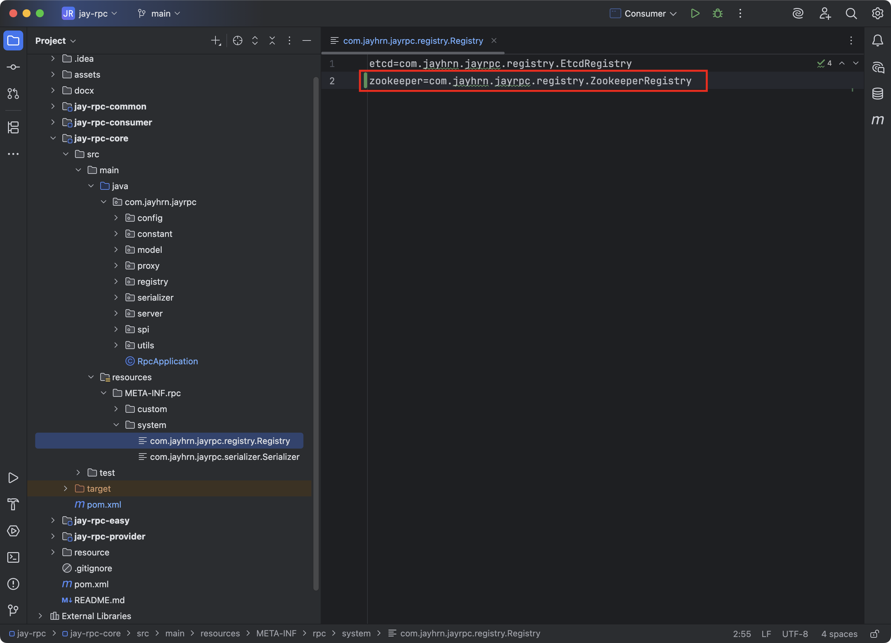

## 注册中心优化

### 需求分析

我们基于Etcd完成了基础的注册中心，能够注册和获取服务和节点信息。

但目前系统仅仅是处于可用的程度，还有很多需要解决的问题和可优化点：

1. 数据一致性：服务提供者如果下线了，注册中心需要即时更新，剔除下线节点。否则消费者可能会调用到已经下线的节点。
2. 性能优化：服务消费者每次都需要从注册中心获取服务，可以使用缓存进行优化。
3. 高可用性：保证注册中心本身不会宕机。
4. 可扩展性：实现更多其他种类的注册中心。

### 注册中心优化

#### 心跳检测和续期机制

**心跳检测介绍**

心跳检测（俗称`heartBeat`)是一种用于监测系统是否正常工作的机制。它通过定期发送心跳信号（请求）来检测目标系统的状态。

如果接收方在一定时间内没有收到心跳信号或者未正常响应请求，就会认为目标系统故障或不可用，从而触发相应的处理或告警机制。

心跳检测的应用场景非常广泛，尤其是在分布式、微服务系统中，比如集群管理、服务健康检查等。

> 我们怎么检测自己做的web后端是否正常运行呢？一个最简单的方法，就是写一个心跳检测接口。然后我们只需要执行一个脚本，定期调用这个接口，如果调用失败，就知道系统故障了。

**方案设计**

[1] 从心跳检测的概念来看，实现心跳检测一般需要2个关键：定时、网络请求。

但是使用Etcd实现心跳检测会更简单一些，因为Etcd自带了key过期机制，我们不妨换个思路：给节点注册信息一个“生命倒计时”，让节点定期续期，重置自己的倒计时。如果节点已宕机，一直不续期，Etcd就会对key进行过期删除。

**一句话总结：到时间还不续期就是寄了**

在Etcd中，我们要实现心跳检测和续期机制，可以遵循如下步骤：

1. 服务提供者向Etcd注册自己的服务信息，并在注册时设置TTL(生存时间)。
2. Etcd在接收到服务提供者的注册信息后，会自动维护服务信息的TTL，并在TTL过期时删除该服务信息。
3. 服务提供者定期请求Etcd续签自己的注册信息，重写TTL。

需要注意的是，<u>续期时间一定要小于过期时间</u>（假如过期时间是30s，续期时间就得小于30s，例如25s，这样就可以在没有过期就进行续期），<u>允许一次容错的机会</u>（在一次续约失败后在一定时间内重新进行续约，例如这次续约失败，隔2秒重新续约）。

[2] 每个服务提供者都需要找到自己注册的节点、续期自己的节点，但问题是，怎么找到当前服务提供者项目自己的节点呢？

充分利用本地的特性，在服务提供者本地维护一个已注册节点集合，注册时添加节点key到集合中，只需要续期集合内的key即可。

**开发实现**

[1] 给注册中心`Registry`接口补充心跳检测方法，代码如下：


[2] 维护续期节点集合

定义一个本机注册的节点`key`集合，用于维护续期：


在服务注册时，需要将节点添加到集合中，代码如下：


同理，在服务注销时，也要从集合中移除对应节点：


[3] 在`EtcdRegistry`中实现`heartBeat`方法。

可以使用`Hutool`工具类的`CronUtil`实现定时任务，对所有集合中的节点执行重新注册操作，这是一个小tick，就相当于续签了。

心跳检测方法的代码如下：

```java
/**
 * 心跳检测（服务端）
 */
@Override
public void heartBeat() {
    // 10秒续签一次
    CronUtil.schedule("*/10 * * * * *", new Task() {
        @Override
        public void execute() {
            // 遍历本节点所有的 key
            for (String key : localRegisterNodeKeySet) {
                try {
                    // 查询 key 对应的 values，可能多个
                    List<KeyValue> keyValues = kvClient.get(ByteSequence.from(key, StandardCharsets.UTF_8))
                            .get()
                            .getKvs();
                    // 该节点已经过期（需要重启节点才能注册）
                    if (CollUtil.isEmpty(keyValues)) {
                        continue;
                    }
                    // 节点未过期，重新注册（相当于续签）
                    // 本项目中任意一个服务之存在一个不存在副本，所以直接get(0)
                    KeyValue keyValue = keyValues.get(0);
                    String value = keyValue.getValue().toString(StandardCharsets.UTF_8);
                    ServiceMetaInfo serviceMetaInfo = JSONUtil.toBean(value, ServiceMetaInfo.class);
                    register(serviceMetaInfo);
                } catch (Exception e) {
                    throw new RuntimeException(key + "续签失败", e);
                }
            }
        }
    });

    // 支持秒级别定时任务
    CronUtil.setMatchSecond(true);
    CronUtil.start();
}
```

采用这种实现方案的好处是，即时Etcd注册中心的数据出现了丢失，通过心跳检测机制也会重新注册节点信息。

[4] 开启heartBeat

在注册中心初始化的`init`方法中，调用`heartBeat`方法即可。

代码如下：


**测试**

完善之前的`RegistryTest`单元测试代码：


使用可视化工具观察节点底部的过期时间或者使用如下命令在服务器中输出查看结果，当TTL到20左右的时候，又会重置为30，说明心跳检测和续期机制正常执行。

```bash
etcdctl get --prefix --write-out=json /rpc/myService:1.0/ \
| grep -o '"lease":[0-9]*' \
| awk -F: '{print $2}' \
| sort | uniq \
| while read lease_id; do
    hex_id=$(printf "%x" "$lease_id");
    etcdctl lease timetolive "$hex_id";
done
```


#### 服务节点下线机制

当服务提供者节点宕机时，应该从注册中心移除掉已注册的节点，否则会影响消费端调用。所以我们需要设计一套服务节点下线机制。

**方案设计**

服务节点下线又分为：

- 主动下线：服务提供者项目正常退出时，主动从注册中心移除注册信息。

- 被动下线：服务提供者项目异常退出时，利用Etcd的key过期机制自动移除。

被动下线已经可以利用Etcd的机制实现了，我们主要开发主动下线。

问题是，怎么在Java项目正常退出时，执行某个操作呢？

其实，非常简单，利用VM的ShutdownHook就能实现。JVM的ShutdownHook是Java虚拟机提供的一种机制，允许开发者在JVM即将关闭，之前执行一些清理工作或其他必要的操作，例如关闭数据库连接、释放资源、保存临时数据等。

Spring Boot也提供了类似的优雅停机能力。

**开发实现**

[1] 完善`Etcd`注册中心的`destroy`方法，补充下线节点的逻辑。

代码如下：


[2] 在`RpcApplication`的`init`方法中，注册`Shutdown Hook`，当程序正常退出时会执行注册中心的destroy方法。

代码如下：


测试方法很简单：

1. 启动服务提供者，然后观察服务是否成功被注册


注册成功，心跳检测也在执行

2. 正常停止服务提供者，然后立马观察服务信息是否被删除（应当在启动服务的30s内查看，不然当服务关闭后key也会自动过期）


也输出了当前节点下线


#### 消费端服务缓存

正常情况下，服务节点信息列表的更新频率是不高的，所以在服务消费者从注册中心获取到服务节点信息列表后，完全可以缓存在本地，下次就不用再请求注册中心获取了，够提高性能。

1. **增加本地缓存**

本地缓存的实现很简单，用一个列表来存储服务信息即可，提供操作列表的基本方法，包括：写缓存、读缓存、清空缓存。

在`registry`包下新增缓存类`RegistryServiceCache`，代码如下：

```java
package com.jayhrn.jayrpc.registry;

import com.jayhrn.jayrpc.model.ServiceMetaInfo;

import java.util.List;
import java.util.Map;
import java.util.concurrent.ConcurrentHashMap;

/**
 * 注册中心服务本地缓存（支持多个服务）
 *
 * @Author JayHrn
 * @Date 2025/6/20 14:55
 * @Version 1.0
 */
public class RegistryServiceCache {
    /**
     * 服务缓存
     */
    Map<String, List<ServiceMetaInfo>> serviceCache = new ConcurrentHashMap<>();

    /**
     * 写缓存
     *
     * @param serviceKey      服务键名
     * @param newServiceCache 更新后的缓存列表
     */
    void writeCache(String serviceKey, List<ServiceMetaInfo> newServiceCache) {
        this.serviceCache.put(serviceKey, newServiceCache);
    }

    /**
     * 读缓存
     *
     * @param serviceKey 服务键名
     * @return
     */
    List<ServiceMetaInfo> readCache(String serviceKey) {
        return this.serviceCache.get(serviceKey);
    }

    /**
     * 清空缓存
     *
     * @param serviceKey 服务键名
     */
    void clearCache(String serviceKey) {
        this.serviceCache.remove(serviceKey);
    }
}
```

2. **使用本地缓存**

[1] 修改`EtcdRegisty`的代码，添加本地缓存对象：


[2] 修改服务发现逻辑，优先从缓存获取服务；如果没有缓存，再从注册中心获取，并且设置到缓存中。

代码如下：


3. **服务缓存更新** - 监听机制

当服务注册信息发生变更（比如节点下线）时，需要即时更新消费端缓存。

问题是，怎么知道服务注册信息什么时候发生变更呢？

这就需要我们使用Etcd的watch监听机制，当监听的某个key发生修改或删除时，就会触发事件来通知监听者。什么时候去创建watch监听器呢？

我们首先要明确watch监听是服务消费者还是服务提供者执行的。由于我们的目标是更新缓存，缓存是在服务消费端维护和使用的，所以也应该是服务消费端去watch。

也就是说，只有服务消费者执行的方法中，可以创建watch监听器，那么比较合适的位置就是服务发现方法(serviceDiscovery)。可以对本次获取到的所有服务节点key进行监听。

还需要防止重复监听同一个key，可以通过定义一个已监听key的集合来实现。

下面我们来开发编码。。

[1] `Registry`注册中心接口补充监听`key`的方法，代码如下：


[2] `EtcdRegistry`类中，新增监听`key`的集合。

可以使用`ConcurrentHashSet`防止并发冲突，代码如下：


[3] 在`EtcdRegistry`类中实现监听`key`的`watch`方法

通过调用`Etcd`的`Watchclient`实现监听，如果出现了`DELETE key`删除事件，则清理服务注册缓存。

注意，即使key在注册中心被删除后再重新设置，之前的监听依旧生效。所以我们只监听首次加入到监听集合的key，防止重复。

代码如下：

```
/**
 * 监听（消费端）
 *
 * @param serviceKey 服务键名
 */
@Override
public void watch(String serviceKey) {
    Watch watchClient = client.getWatchClient();
    // 之前未被监听，开启监听
    boolean newWatch = watchingKeySet.add(serviceKey);
    if (newWatch) {
        watchClient.watch(ByteSequence.from(serviceKey, StandardCharsets.UTF_8), response -> {
            for (WatchEvent event : response.getEvents()) {
                switch (event.getEventType()) {
                    // key 删除时触发
                    case DELETE:
                        // 清理注册服务缓存
                        // 支持多个服务同时缓存
                        registryServiceCache.clearCache(serviceKey);
                        break;
                    default:
                        break;
                }
            }
        });
    }
}
```

[4] 在消费端获取服务时调用`watch`方法，对获取到的服务节点`key`进行监听。

修改服务发现方法的代码如下：


[5] 测试

1. 在`EtcdRegistry`类中加个日志，便于区分是否服务是从缓存还是注册中心获取。


2. 修改服务消费者项目，使得连续调用服务3次。


3. 运行服务提供者然后运行消费者，查看控制台输出，发现第一次从注册中心获取，后面两次从缓存中获取。


至此，消费端服务缓存功已经完成。

疑问：这里我们似乎把消费者当成是一个普通的节点，当消费者启动后，他们都会执行`RpcApplication.init()`方法，并且还会完成注册中心初始化操作。

所以目前是两个服务都会有注册中心，只是消费者的注册中心是没有注册服务，并且也是有心跳检测运行着只是实际上没有服务。

#### Zookeeper注册中心实现

和Etcd注册中心的实现方式极其相似，步聚如下：

1. 安装Zookeeper
2. 引入客户端依赖
3. 实现接口
4. SPl补充ZooKeeper注册中心

[1] 本地/服务器下载并启动ZooKeeper，本实验使用的3.8.4。

linux版本下载地址：https://zookeeper.apache.org/releases.html


如果服务器不存在Java环境，需要先下载Java，可参考如下教程

```bash
1. 安装JDK，本次使用的版本号是11，其他的可自行切换版本进行下载
sudo apt install openjdk-11-jdk
2. 查找安装路径
sudo update-alternatives --config java
3. 配置环境变量
编辑 /etc/environment 文件，添加以下行：
export JAVA_HOME=/usr/lib/jvm/java-21-openjdk-amd64/
export PATH=$JAVA_HOME/bin:$PATH
4. 激活环境
source /etc/environment
5. 验证安装
java -version
javac -version
看到输出了对应的java版本即成功
```

Zookeeper安装可以参考如下内容

```bash
1. 上传压缩包到/usr目录
2. 打开/usr目录
cd /usr
3. 解压Zookeeper
tar -zvxf apache-zookeeper-3.8.4-bin.tar.gz 
4. 进入Zookeeper文件夹
cd /usr/apache-zookeeper-3.8.4-bin/
5. 备份下初始配置
cp conf/zoo_sample.cfg conf/zoo.cfg
6. 修改配置
vim conf/zoo.cfg
7. 修改数据挂载位置
dataDir=/usr/local/zookeeper
8. 添加如下配置
# 默认是8080，因为8080可能被web应用使用，Springboot项目中tomcat的默认启动端口就是8080
admin.serverPort=9099
# 添加这个配置才能使用create -t ttl /node_name
extendedTypesEnabled=true
9. 启动（当前需在/usr/apache-zookeeper-3.8.4-bin/目录）
bin/zkServer.sh start
```

[2] 引入客户端依赖

一般我们会使用`Apache Curator`来操作ZooKeeper

引入的依赖代码如下：


[3] ZooKeeper注册中心实现，在`registry`包新建一个`ZookeeperRegistry`类，代码如下：

```java
package com.jayhrn.jayrpc.registry;

import cn.hutool.core.collection.ConcurrentHashSet;
import com.jayhrn.jayrpc.config.RegistryConfig;
import com.jayhrn.jayrpc.model.ServiceMetaInfo;
import lombok.extern.slf4j.Slf4j;
import org.apache.curator.framework.CuratorFramework;
import org.apache.curator.framework.CuratorFrameworkFactory;
import org.apache.curator.framework.recipes.cache.CuratorCache;
import org.apache.curator.framework.recipes.cache.CuratorCacheListener;
import org.apache.curator.retry.ExponentialBackoffRetry;
import org.apache.curator.x.discovery.ServiceDiscovery;
import org.apache.curator.x.discovery.ServiceDiscoveryBuilder;
import org.apache.curator.x.discovery.ServiceInstance;
import org.apache.curator.x.discovery.details.JsonInstanceSerializer;

import java.util.Collection;
import java.util.HashSet;
import java.util.List;
import java.util.Set;
import java.util.stream.Collectors;

/**
 * zookeeper 注册中心
 * 操作文档：<a href="https://curator.apache.org/docs/getting-started">Apache Curator</a>
 * 代码示例：<a href="https://github.com/apache/curator/blob/master/curator-examples/src/main/java/discovery/DiscoveryExample.java">DiscoveryExample.java</a>
 * 监听 key 示例：<a href="https://github.com/apache/curator/blob/master/curator-examples/src/main/java/cache/CuratorCacheExample.java">CuratorCacheExample.java</a>
 *
 * @Author JayHrn
 * @Date 2025/6/20 17:38
 * @Version 1.0
 */
@Slf4j
public class ZookeeperRegistry implements Registry {

    private CuratorFramework client;

    private ServiceDiscovery<ServiceMetaInfo> serviceDiscovery;

    /**
     * 本机注册的节点 key 集合（用户维护续期）
     */
    private final Set<String> localRegistryNodeKeySet = new HashSet<>();

    /**
     * 注册中心服务缓存
     */
    private final RegistryServiceCache registryServiceCache = new RegistryServiceCache();

    /**
     * 正在监听的 key 集合
     */
    private final Set<String> watchingKeySet = new ConcurrentHashSet<>();

    /**
     * 根节点
     */
    private static final String ZK_ROOT_PATH = "/rpc/zk";

    /**
     * 初始化
     *
     * @param registryConfig
     */
    @Override
    public void init(RegistryConfig registryConfig) {
        // 构建 client 实例
        client = CuratorFrameworkFactory
                .builder()
                .connectString(registryConfig.getAddress())
                .retryPolicy(new ExponentialBackoffRetry(Math.toIntExact(registryConfig.getTimeout()), 3))
                .build();

        // 构建 serviceDiscovery 实例
        serviceDiscovery = ServiceDiscoveryBuilder.builder(ServiceMetaInfo.class)
                .client(client)
                .basePath(ZK_ROOT_PATH)
                .serializer(new JsonInstanceSerializer<>(ServiceMetaInfo.class))
                .build();
        try {
            // 启动client 和 serviceDiscovery
            client.start();
            serviceDiscovery.start();
        } catch (Exception e) {
            throw new RuntimeException(e);
        }
    }

    /**
     * 注册服务（服务端）
     *
     * @param serviceMetaInfo
     * @throws Exception
     */
    @Override
    public void register(ServiceMetaInfo serviceMetaInfo) throws Exception {
        // 注册到 Zookeeper 里
        serviceDiscovery.registerService(buildServiceInstance(serviceMetaInfo));

        // 添加节点信息到本地缓存
        String registryKey = ZK_ROOT_PATH + "/" + serviceMetaInfo.getServiceNodeKey();
        localRegistryNodeKeySet.add(registryKey);
    }

    /**
     * 注销服务（服务端）
     *
     * @param serviceMetaInfo
     */
    @Override
    public void unregister(ServiceMetaInfo serviceMetaInfo) {
        try {
            serviceDiscovery.unregisterService(buildServiceInstance(serviceMetaInfo));
        } catch (Exception e) {
            throw new RuntimeException(e);
        }

        // 从本地缓存移除
        String registryKey = ZK_ROOT_PATH + "/" + serviceMetaInfo.getServiceNodeKey();
        localRegistryNodeKeySet.remove(registryKey);
    }

    /**
     * 服务发现（获取某服务端所有节点，消费端）
     *
     * @param serviceKey 服务键名
     * @return
     */
    @Override
    public List<ServiceMetaInfo> serviceDiscovery(String serviceKey) {
        // 优先从缓存获取服务
        List<ServiceMetaInfo> cachedServiceMetaInfoList = registryServiceCache.readCache(serviceKey);
        if (cachedServiceMetaInfoList != null) {
            log.info("从缓存获取服务");
            return cachedServiceMetaInfoList;
        }

        try {
            // 查询服务信息
            Collection<ServiceInstance<ServiceMetaInfo>> serviceInstanceList = serviceDiscovery.queryForInstances(serviceKey);

            // 解析服务信息
            List<ServiceMetaInfo> serviceMetaInfoList = serviceInstanceList.stream()
                    .map(ServiceInstance::getPayload)
                    .collect(Collectors.toList());

            // 写入服务缓存
            registryServiceCache.writeCache(serviceKey, serviceMetaInfoList);
            return serviceMetaInfoList;
        } catch (Exception e) {
            throw new RuntimeException("获取服务列表失败", e);
        }
    }

    /**
     * 心跳检测（服务端）
     */
    @Override
    public void heartBeat() {
        // 不需要心跳机制，建立了临时节点，如果服务器故障，则临时节点直接丢失
    }

    /**
     * 监听（消费端）
     *
     * @param serviceKey 服务键名
     */
    @Override
    public void watch(String serviceKey) {
        String watchKey = ZK_ROOT_PATH + "/" + serviceKey;
        boolean newWatch = watchingKeySet.add(watchKey);
        if (newWatch) {
            CuratorCache curatorCache = CuratorCache.build(client, watchKey);
            curatorCache.start();
            curatorCache.listenable().addListener(
                    CuratorCacheListener
                            .builder()
                            .forDeletes(childData -> registryServiceCache.clearCache(serviceKey))
                            .build()
            );
        }
    }

    /**
     * 服务销毁
     */
    @Override
    public void destroy() {
        log.info("当前节点下线");
        // 下线节点（这一步可以不做，因为都是临时接待你，服务下线，自然就被删掉了）
        for (String key : localRegistryNodeKeySet) {
            try {
                client.delete().guaranteed().forPath(key);
            } catch (Exception e) {
                throw new RuntimeException(key + "节点下线失败");
            }
        }

        // 释放资源
        if (client != null) {
            client.close();
        }
    }

    /**
     * 构建服务注册实例对象，用于向注册中心注册服务
     *
     * @param serviceMetaInfo 服务元数据信息
     * @return 转换后的服务实例对象，可直接注册到服务注册中心
     */
    private ServiceInstance<ServiceMetaInfo> buildServiceInstance(ServiceMetaInfo serviceMetaInfo) {
        String serviceAddress = serviceMetaInfo.getServiceHost() + ":" + serviceMetaInfo.getServicePort();
        try {
            return ServiceInstance
                    .<ServiceMetaInfo>builder()
                    .id(serviceAddress)
                    .name(serviceMetaInfo.getServiceKey())
                    .address(serviceAddress)
                    .payload(serviceMetaInfo)
                    .build();
        } catch (Exception e) {
            throw new RuntimeException(e);
        }
    }
}
```

[4] `SPl`增加对`ZooKeeper`的支持：



[5] 最后，可以更改服务提供者和消费者的注册中心配置来测试。


依次启动服务者和消费者，可以看到服务调用成功，使用的是zookeeper 。


没有问题，后续变成还是继续使用`Etcd`，记得切换回来。

经过我的测试发现，如果注册中心是`Etcd`的时候，我们如果是服务器不能直接`ip:port`，必须是`http://ip:port`格式，否则会报错。

但是如果是`Zookeeper`时就不需要前缀`http`。

### 拓展

- 完善服务注册信息

- 实现更多注册中心

- 保证注册中心的高可用

- 服务注册信息失效的兜底策略

- 注册中心key 监听时，采用观察者模式实现处理