## 自定义协议

### 需求分析

目前的RPC框架，我们使用`Vert.x`的`HttpServer`作为服务提供者的服务器，代码实现比较简单，其底层网络传输使用的是HTTP协议。

HTTP只是RPC框架网络传输的一种可选方式罢了。

问题来了，使用HTTP协议会有什么问题么？或者说，有没有更好的选择？

一般情况下，RPC框架会比较注重性能，而HTTP协议中的头部信息、请求响应格式较“重”，会影响网络传输性能。

所以，我们需要自己自定义一套RPC协议，比如利用TCP等传输层协议、自己定义请求响应结构，来实现性能更高、更灵活、更安全的RPC框架。

### 设计方案

自定义RPC协议可以分为2大核心部分：

- 自定义网络传输
- 自定义消息结构

#### 网络传输设计

网络传输设计的目标是：选择一个够高性通信的网络协议和传输方式。

需求分析中已经提到了，HTTP协议的头信息是比较大的，会影响传输性能。但其实除了这点外，HTTP本身属于无状态协议，这意味着每个HTTP请求都是独立的，每次请求/响应都要重新建立和关闭连接，也会影响性能。

考虑到这点，在HTTP/1.1中引入了持久连接(Keep-Alive)，允许在单个TCP连接上发送多个HTTP请求和响应，避免了每次请求都要重新建立和关闭连接的开销。

虽然如此，HTTP本身是应用层协议，我们现在设计的RPC协议也是应用层协议，性能肯定是不如底层（传输层）的TCP协议要高的。所以我们想要追求更高的性能，还是选择使用TCP协议完成网络传输，有更多的自主设计空间。

#### 消息结构体设计

消息结构设计的目标是：用最少的空间传递需要的信息。

**[1] 如何使用最少的空间呢？**

之前接触到的数据类型可能都是整型、长整型、浮点数类型等等，这些类型其实都比较“重”，占用的字节数较多。比如整型要占用4个字节、32个bit位。

我们在自定义消息结构时，想要节省空间，就要尽可能使用更轻量的类型，比如byte字节类型，只占用1个字节、8个bit位。

需要注意的是，Java中实现bit位运算拼接相对比较麻烦，所以权衡开发成本，我们设计消息结构时，尽量给每个数据凑到整个字节。

**[2] 消息内需要哪些信息呢？**

目标肯定是能够完成请求。

分析HTTP请求结构，我们能够得到RPC消息所需的信息：

- 魔数：作用是安全校验，防止服务器处理了非框架发来的乱七八糟的消息（类似于HTTPS的安全证书）
- 版本号：保证请求和响应的一致性（类似HTTP协议有1.0/2/0等版本）
- 序列化方式：来告诉服务器和客户端如何解析数据（类似HTTP的Content-Type内容类型）
- 类型：标识是请求还是响应？或者是心跳检测等其他用途。（类似HTTP有请求头和响应头）
- 状态：如果是响应，记录响应的结果（类似HTTP的200状态代码）

此外，还需要有请求id，唯一标识某个请求，因为TCP是双向通信的，需要有个唯一标识来追踪每个请求。

最后，也是最重要的，要发送body内容数据。我们暂时称它为请求体，类似于我们之前HTTP请求中发送的RpcRequest。

如果是HTTP这种协议，有专门的key/vlue结构，很容易找到完整的body数据。但基于TCP协议，想要获取到完整的body内容数据，就需要一些"小心思”了，因为TCP协议本身会存在半包和粘包问题，每次传输的数据可能是不完整的，具体的后面会讲。

所以我们需要在消息头中新增一个字段`请求体数据长度`，保证能够完整地获取body内容信息。

基于以上的思考，我们可以得到最终的消息结构设计，如下图：

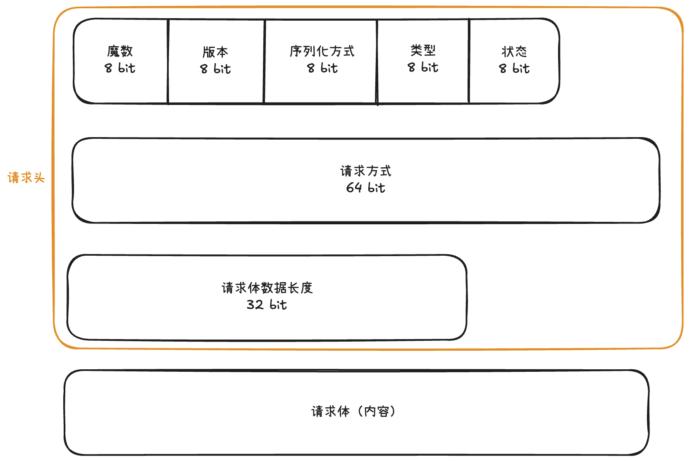

实际上，这些数据应该是紧凑的，请求头信息总长17个字节。也就是说，上述消息结构，本质上就是拼接在一起的一个字节数组。我们后续实现时，需要有`消息编码器`和`消息解码器`。编码器先new一个空的Buffer缓冲区，然后按照顺序向缓冲区依次写入这些数据；解码器在读取时也按照顺序依次读取，就还原出编码前的数据。

通过这种约定的方式，我们就不用记录头信息了。比如magic魔数，不用存储`"magic"`这个字符串，而是读取第一个字节（前8bit)就能获取到。

如果学过Redis底层，会发现很多数据结构都是这种设计。

如果大家是第一次设计协议，或者经验不足，强烈建议大家先去学一下优秀开源框架的协议设计，这样不会说毫无头绪。

比如参考[Dubbo的协议设计](https://cn.dubbo.apache.org/zh-cn/blog/2018/10/05/dubbo-%e5%8d%8f%e8%ae%ae%e8%af%a6%e8%a7%a3/)，如下图：


明确了设计后，我们来开发实现，就比较简单了。

### 开发实现

#### 消息结构

新建`protocol`包，将所有和自定义协议有关的代码都放到该包下。

**[1] 新建协议消息类ProtocolMessage**

将消息头单独封装为一个内部类，消息体可以使用泛型类型，完整代码如下：

```java
package com.jayhrn.jayrpc.protocol;

import lombok.AllArgsConstructor;
import lombok.Data;
import lombok.NoArgsConstructor;

/**
 * 协议消息结构
 *
 * @Author JayHrn
 * @Date 2025/6/21 17:47
 * @Version 1.0
 */
@Data
@AllArgsConstructor
@NoArgsConstructor
public class ProtocolMessage<T> {
    /**
     * 消息头
     */
    private Header header;

    /**
     * 消息体（请求或响应对象）
     */
    private T body;

    /**
     * 协议消息头
     */
    @Data
    public static class Header {

        /**
         * 魔数，保证安全性
         */
        private byte magic;

        /**
         * 版本号
         */
        private byte version;

        /**
         * 序列化器
         */
        private byte serializer;

        /**
         * 消息类型（请求 / 响应）
         */
        private byte type;

        /**
         * 状态
         */
        private byte status;

        /**
         * 请求 id
         */
        private long requestId;

        /**
         * 消息体长度
         */
        private int bodyLength;
    }
}
```

**[2] 新建协议常量类ProtocolConstant**

记录了和自定义协议有关的关键信息，比如消息头长度、魔数、版本号。

完整代码如下：

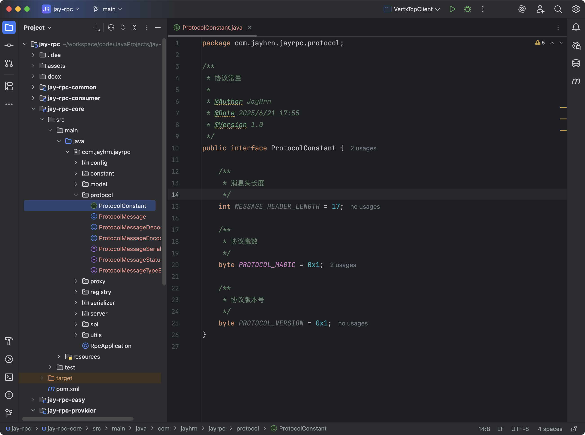

**[3] 新建消息字段的枚举类ProtocolMessageStatusEnum**

协议状态枚举，暂时只定义成功、请求失败、响应失败三种枚举值：

```java
package com.jayhrn.jayrpc.protocol;

import lombok.Getter;

/**
 * 协议消息的状态枚举
 *
 * @Author JayHrn
 * @Date 2025/6/21 18:00
 * @Version 1.0
 */
@Getter
public enum ProtocolMessageStatusEnum {
    OK("ok", 20),
    BAD_REQUEST("badRequest", 40),
    BAD_RESPONSE("badResponse", 50);

    private final String text;

    private final int value;

    ProtocolMessageStatusEnum(String text, int value) {
        this.text = text;
        this.value = value;
    }

    /**
     * 根据 value 获取枚举
     *
     * @param value
     * @return
     */
    public static ProtocolMessageStatusEnum getEnumByValue(int value) {
        for (ProtocolMessageStatusEnum anEnum : values()) {
            if (anEnum.getValue() == value) {
                return anEnum;
            }
        }
        return null;
    }
}
```

**[4] 新建协议消息类型枚举类ProtocolMessageTypeEnum**

包括请求、响应、心跳、其他。代码如下：

```java
package com.jayhrn.jayrpc.protocol;

import lombok.Getter;

/**
 * 协议消息的类型枚举
 *
 * @Author JayHrn
 * @Date 2025/6/21 18:06
 * @Version 1.0
 */
@Getter
public enum ProtocolMessageTypeEnum {
    REQUEST(0),
    RESPONSE(1),
    HEART_BEAT(2),
    OTHERS(3);

    private final int key;

    ProtocolMessageTypeEnum(int key) {
        this.key = key;
    }

    /**
     * 根据 key 获取枚举
     *
     * @param key
     * @return
     */
    public static ProtocolMessageTypeEnum getEnumByKey(int key) {
        for (ProtocolMessageTypeEnum protocolMessageTypeEnum : values()) {
            if (key == protocolMessageTypeEnum.key) {
                return protocolMessageTypeEnum;
            }
        }
        return null;
    }
}
```

**[5] 协议消息的序列化器枚举类ProtocolMessageSerializerEnum**

跟我们RPC框架已支持的序列化器对应。代码如下：

```java
package com.jayhrn.jayrpc.protocol;

import lombok.Getter;

import java.util.Arrays;
import java.util.List;
import java.util.stream.Collectors;

/**
 * 协议消息的序列化器枚举
 *
 * @Author JayHrn
 * @Date 2025/6/21 18:10
 * @Version 1.0
 */
@Getter
public enum ProtocolMessageSerializerEnum {
    JDK(0, "jdk"),
    JSON(1, "json"),
    KRYO(2, "kryo"),
    HESSIAN(3, "hessian");

    private final int key;
    private final String value;

    ProtocolMessageSerializerEnum(int key, String value) {
        this.key = key;
        this.value = value;
    }

    /**
     * 获取值列表
     *
     * @return
     */
    public static List<String> getValues() {
        return Arrays.stream(values()).map(item -> item.value).collect(Collectors.toList());
    }

    /**
     * 根据 key 获取枚举
     *
     * @param key
     * @return
     */
    public static ProtocolMessageSerializerEnum getEnumByKey(int key) {
        for (ProtocolMessageSerializerEnum protocolMessageSerializerEnum : values()) {
            if (protocolMessageSerializerEnum.getKey() == key) {
                return protocolMessageSerializerEnum;
            }
        }
        return null;
    }

    /**
     * 根据 value 获取枚举
     *
     * @param value
     * @return
     */
    public static ProtocolMessageSerializerEnum getEnumByValue(String value) {
        for (ProtocolMessageSerializerEnum protocolMessageSerializerEnum : values()) {
            if (protocolMessageSerializerEnum.getValue().equals(value)) {
                return protocolMessageSerializerEnum;
            }
        }
        return null;
    }
}
```

#### 网络传输

我们的RPC框架使用了高性能的`Vert.x`作为网络传输服务器，之前用的是HttpServer。同样，Vert.x也支持TCP服务器，相比于Netty或者自己写Socket代码，更加简单易用。

首先新建`server.tcp`包，将所有TCP服务相关的代码放到该包中。

**[1] TCP服务器实现**

新建`VertxTcpServer`类，跟之前写的VertxHttpServer类以，先创建`Vert.x`的服务器实例，然后定义处理请求的方法，比如回复"Hello,client!"，最后启动服务器。

示例代码如下：

```java
package com.jayhrn.jayrpc.server.tcp;

import io.vertx.core.Vertx;
import io.vertx.core.buffer.Buffer;
import io.vertx.core.net.NetServer;
import lombok.extern.slf4j.Slf4j;

/**
 * Vertx TCP 服务器
 *
 * @Author JayHrn
 * @Date 2025/6/21 18:29
 * @Version 1.0
 */
@Slf4j
public class VertxTcpServer {
    private byte[] handleRequest(byte[] requestData) {
        return "Hello, client!".getBytes();
    }

    public void doStart(int port) {
        // 创建 Vert.x 实例
        Vertx vertx = Vertx.vertx();

        // 创建 TCP 服务器
        NetServer server = vertx.createNetServer();

        // 处理请求
        server.connectHandler(socket -> {

            // 处理链接
            socket.handler(buffer -> {

                System.out.println("Received response from client: " + buffer.toString());

                // 处理接收到的字节数组
                byte[] requestData = buffer.getBytes();

                // 在这里自定义字节数组处理逻辑，比如解析请求，调用服务，构造响应等
                byte[] responseData = handleRequest(requestData);

                // 发送请求
                socket.write(Buffer.buffer(responseData));

            });
        });

        // 启动 TCP 服务并监听指定端口
        server.listen(port).onSuccess(response -> {
                    log.info("Server is listening on port " + port);
                })
                .onFailure(response -> {
                    log.info("Failed to start server" + response.getCause());
                });
    }

    public static void main(String[] args) {
        new VertxTcpServer().doStart(8080);
    }
}
```

上述代码中的`socket.write`方法，就是在向连接到服务器的客户瑞发送数据。注意发送的数据格式为Buffer，这是`Vert.x`为我们提供的字节数组缓冲区实现。

**[2] TCP 客户端实现**

新建`VertxTcpclient`类，先创建`Vert.x`的客户端实例，然后定义处理请求的方法，比如回复"Hello,server!!”，并建立连接。

示例代码如下：

```java
package com.jayhrn.jayrpc.server.tcp;

import io.vertx.core.Vertx;
import io.vertx.core.net.NetSocket;

/**
 * Vertx TCP 请求客户端
 *
 * @Author JayHrn
 * @Date 2025/6/21 18:42
 * @Version 1.0
 */
public class VertxTcpClient {
    public void start(int serverPort) {

        // 创建 Vertx 实例
        Vertx vertx = Vertx.vertx();

        vertx.createNetClient().connect(serverPort, "localhost", result -> {
            if (result.succeeded()) {

                System.out.println("Connected to TCP server");
                NetSocket socket = result.result();

                // 发送数据
                socket.write("Hello, Server!");

                socket.handler(buffer -> {
                    System.out.println("Received response from server: " + buffer.toString());
                });
            } else {
                System.out.println("Failed to connect to TCP server");
            }
        });
    }

    public static void main(String[] args) {
        VertxTcpClient client = new VertxTcpClient();
        client.start(8080);
    }
}
```

[3] 进行简单的测试，先启动服务器，再启动客户端，够在控制台看到它们互相打招呼的输出。

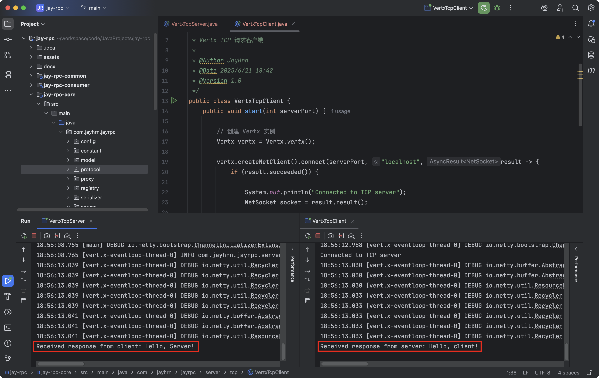

可以看到服务器接收到了客户端的请求并且处理了数据返回给客户端，客户端输出了处理之后的内容。

#### 编码 / 解码器

在上一步中，我们也注意到了，Vert.x的TCP服务器收发的消息是Buffer类型，不能直接写入一个对象。因此，我们需要编码器和解码器，将Java的消息对象和Buffer进行相互转换。

我们用一张图，通过演示整个请求和响应的过程，了解编码器和解码器的作用。

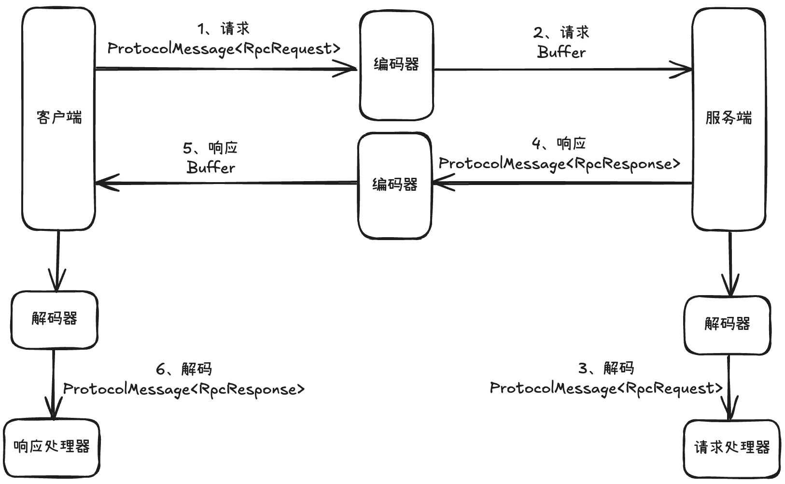

之前HTTP请求和响应时，直接从请求body处理器中获取到body字节数组，再通过序列化（反序列化）得到RpcRequest或RpcResponse对象。使用TCP服务器后，只不过改为从Buffer中获取字节数组，然后编解码为RpcRequest或RpcResponse对象。其他的后续处理流程都是可复用的。

**[1] 首先实现消息编码器**

在`protocol`包下新建`ProtocolMessageEncoder`，核心流程是依次向Buffer缓冲区写入消息对象里的字段。

代码如下：

```java
package com.jayhrn.jayrpc.protocol;

import com.jayhrn.jayrpc.serializer.Serializer;
import com.jayhrn.jayrpc.serializer.SerializerFactory;
import io.vertx.core.buffer.Buffer;

import java.io.IOException;

/**
 * 协议消息编码器
 *
 * @Author JayHrn
 * @Date 2025/6/22 13:13
 * @Version 1.0
 */
public class ProtocolMessageEncoder {
    /**
     * 编码
     *
     * @param protocolMessage
     * @return
     * @throws Exception
     */
    public static Buffer encode(ProtocolMessage<?> protocolMessage) throws IOException {
        if (protocolMessage == null || protocolMessage.getHeader() == null) {
            return Buffer.buffer();
        }
        ProtocolMessage.Header header = protocolMessage.getHeader();
        // 依次向缓存区写入字节
        Buffer buffer = Buffer.buffer();
        buffer.appendByte(header.getMagic());
        buffer.appendByte(header.getVersion());
        buffer.appendByte(header.getSerializer());
        buffer.appendByte(header.getType());
        buffer.appendByte(header.getStatus());
        buffer.appendLong(header.getRequestId());
        // 获取序列化器
        ProtocolMessageSerializerEnum serializerEnum = ProtocolMessageSerializerEnum.getEnumByKey(header.getSerializer());
        if (serializerEnum == null) {
            throw new RuntimeException("序列化协议不存在");
        }
        Serializer serializer = SerializerFactory.getInstance(serializerEnum.getValue());
        // 将需要传输的 Java 对象进行序列化
        byte[] bodyBytes = serializer.serialize(protocolMessage.getBody());
        // 写入 body 长度和数据
        buffer.appendInt(bodyBytes.length);
        buffer.appendBytes(bodyBytes);
        return buffer;
    }
}
```

**[2] 实现消息解码器**

在`protocol`包下新建`ProtocolMessageDecoder`，核心流程是依次从Buffer缓冲区的指定位置读取字段，构造出完整的消息对象，

代码如下：

```java
package com.jayhrn.jayrpc.protocol;

import com.jayhrn.jayrpc.model.RpcRequest;
import com.jayhrn.jayrpc.model.RpcResponse;
import com.jayhrn.jayrpc.serializer.Serializer;
import com.jayhrn.jayrpc.serializer.SerializerFactory;
import io.vertx.core.buffer.Buffer;

import java.io.IOException;

/**
 * 协议消息解码器
 *
 * @Author JayHrn
 * @Date 2025/6/22 13:35
 * @Version 1.0
 */
public class ProtocolMessageDecoder {
    public static ProtocolMessage<?> decode(Buffer buffer) throws IOException {
        // 分别从指定位置读出 Buffer
        ProtocolMessage.Header header = new ProtocolMessage.Header();
        byte magic = buffer.getByte(0);
        // 校验魔数
        if (magic != ProtocolConstant.PROTOCOL_MAGIC) {
            throw new IOException("消息 magic 非法");
        }
        header.setMagic(magic);
        header.setVersion(buffer.getByte(1));
        header.setSerializer(buffer.getByte(2));
        header.setType(buffer.getByte(3));
        header.setStatus(buffer.getByte(4));
        header.setRequestId(buffer.getLong(5));
        header.setBodyLength(buffer.getInt(13));
        // 解决粘包问题，只读取指定长度的数据
        byte[] bodyBytes = buffer.getBytes(17, 17 + header.getBodyLength());
        // 解析消息体
        ProtocolMessageSerializerEnum serializerEnum = ProtocolMessageSerializerEnum.getEnumByKey(header.getSerializer());
        if (serializerEnum == null) {
            throw new RuntimeException("序列化消息的协议不存在");
        }
        // 获取传输的 Java 对象类型
        ProtocolMessageTypeEnum messageTypeEnum = ProtocolMessageTypeEnum.getEnumByKey(header.getType());
        if (messageTypeEnum == null) {
            throw new RuntimeException("序列化消息的类型不存在");
        }
        // 获取序列化器
        Serializer serializer = SerializerFactory.getInstance(serializerEnum.getValue());
        // 按照 Java 对象类型进行反序列化
        switch (messageTypeEnum) {
            case REQUEST:
                RpcRequest request = serializer.deserialize(bodyBytes, RpcRequest.class);
                return new ProtocolMessage<>(header, request);
            case RESPONSE:
                RpcResponse response = serializer.deserialize(bodyBytes, RpcResponse.class);
                return new ProtocolMessage<>(header, response);
            case HEART_BEAT:
            case OTHERS:
            default:
                throw new RuntimeException("暂不支持该消息类型");
        }
    }
}
```

[3] 编写单元测试类

先编码再解码，以测试编码器和解码器的正确性，代码如下：

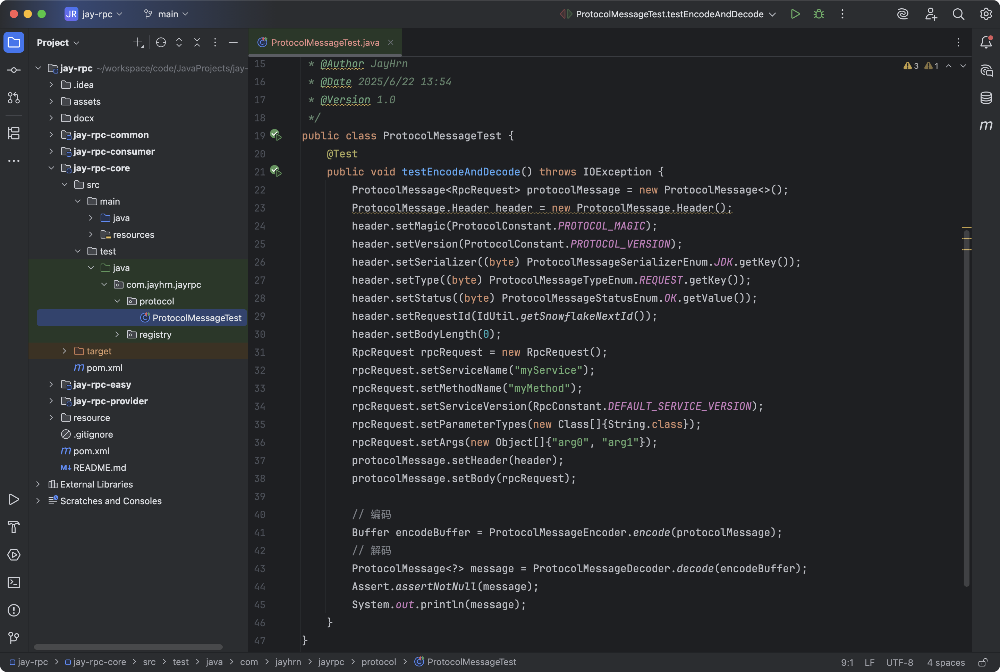

测试可以看到正确解码：

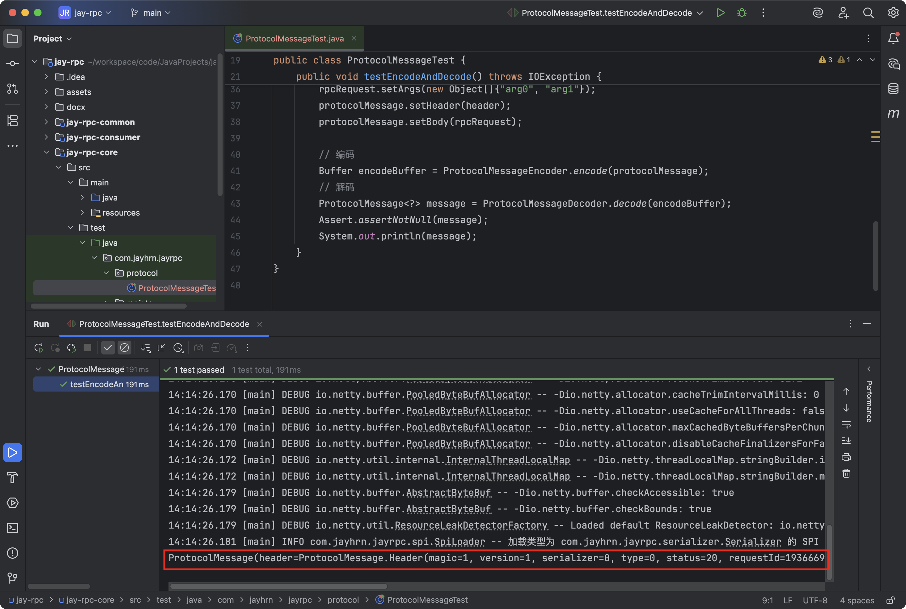

#### 请求处理器（服务提供者）

可以使用netty的pipeline组合多个handler(比如编码=>解码=>请求/响应处理)

请求处理器的作用是接受请求，然后通过反射调用服务实现类。

类似之前的HttpServerHandler，我们需要开发一个TcpServerHandler，用于处理请求。和HttpServerHandler的区别只是在获取请求、写入响应的方式上，需要调用上面开发好的编码器和解码器。

通过实现`Vert.x`提供的`Handler<NetSocket>`:接口，可以定义TCP请求处理器。

完整代码如下，大多数代码都是从之前写好的HttpServerHandler复制来的，新建`TcpServerHandler`类放在`tcp`包下：

```java
package com.jayhrn.jayrpc.server.tcp;

import com.jayhrn.jayrpc.model.RpcRequest;
import com.jayhrn.jayrpc.model.RpcResponse;
import com.jayhrn.jayrpc.protocol.*;
import com.jayhrn.jayrpc.registry.LocalRegistry;
import io.vertx.core.Handler;
import io.vertx.core.buffer.Buffer;
import io.vertx.core.net.NetSocket;

import java.io.IOException;
import java.lang.reflect.Method;

/**
 * TCP 请求处理器
 *
 * @Author JayHrn
 * @Date 2025/6/22 14:18
 * @Version 1.0
 */
public class TcpServerHandler implements Handler<NetSocket> {
    /**
     * 处理请求
     *
     * @param netSocket 需要处理的事件
     */
    @Override
    public void handle(NetSocket netSocket) {
        // 处理连接
        netSocket.handler(buffer -> {
            // 接收请求，解码
            ProtocolMessage<RpcRequest> protocolMessage;
            try {
                protocolMessage = (ProtocolMessage<RpcRequest>) ProtocolMessageDecoder.decode(buffer);
            } catch (IOException e) {
                throw new RuntimeException("协议消息解码错误");
            }
            RpcRequest rpcRequest = protocolMessage.getBody();

            // 处理请求
            // 构造响应结果对象
            RpcResponse rpcResponse = new RpcResponse();
            try {
                // 获取要调用的服务实现类，通过反射调用
                Class<?> implClass = LocalRegistry.get(rpcRequest.getServiceName());
                Method method = implClass.getMethod(rpcRequest.getMethodName(), rpcRequest.getParameterTypes());
                Object result = method.invoke(implClass.newInstance(), rpcRequest.getArgs());
                // 封装返回结果
                rpcResponse.setData(result);
                rpcResponse.setDataType(method.getReturnType());
                rpcResponse.setMessage("ok");
            } catch (Exception e) {
                e.printStackTrace();
                rpcResponse.setMessage(e.getMessage());
                rpcResponse.setException(e);
            }

            // 发送响应，编码
            ProtocolMessage.Header header = protocolMessage.getHeader();
            header.setType((byte) ProtocolMessageTypeEnum.RESPONSE.getKey());
            header.setStatus((byte) ProtocolMessageStatusEnum.OK.getValue());
            ProtocolMessage<RpcResponse> responseProtocolMessage = new ProtocolMessage<>(header, rpcResponse);
            try {
                Buffer encode = ProtocolMessageEncoder.encode(responseProtocolMessage);
                netSocket.write(encode);
            } catch (IOException e) {
                throw new RuntimeException("协议消息编码错误");
            }
        });
    }
}
```

#### 请求发送（服务消费者）

调整服务消费者发送请求的代码`com.jayhrn.jayrpc.proxy.ServiceProxy`类，改HTTP请求为TCP请求。

代码如下：

```java
package com.jayhrn.jayrpc.proxy;

import cn.hutool.core.collection.CollUtil;
import cn.hutool.core.util.IdUtil;
import com.jayhrn.jayrpc.RpcApplication;
import com.jayhrn.jayrpc.config.RpcConfig;
import com.jayhrn.jayrpc.constant.RpcConstant;
import com.jayhrn.jayrpc.model.RpcRequest;
import com.jayhrn.jayrpc.model.RpcResponse;
import com.jayhrn.jayrpc.model.ServiceMetaInfo;
import com.jayhrn.jayrpc.protocol.*;
import com.jayhrn.jayrpc.registry.Registry;
import com.jayhrn.jayrpc.registry.RegistryFactory;
import com.jayhrn.jayrpc.serializer.Serializer;
import com.jayhrn.jayrpc.serializer.SerializerFactory;
import io.vertx.core.Vertx;
import io.vertx.core.buffer.Buffer;
import io.vertx.core.net.NetClient;
import io.vertx.core.net.NetSocket;

import java.io.IOException;
import java.lang.reflect.InvocationHandler;
import java.lang.reflect.Method;
import java.util.List;
import java.util.concurrent.CompletableFuture;

/**
 * 服务代理（JDK 动态代理）
 *
 * @Author JayHrn
 * @Date 2025/6/15 18:27
 * @Version 1.0
 */
public class ServiceProxy implements InvocationHandler {
    /**
     * 调用代理
     *
     * @return
     * @throws Throwable
     */
    @Override
    public Object invoke(Object proxy, Method method, Object[] args) throws Throwable {
        // 指定序列化器
        final Serializer serializer = SerializerFactory.getInstance(RpcApplication.getRpcConfig().getSerializer());

        String serviceName = method.getDeclaringClass().getName();

        // 构造请求
        RpcRequest rpcRequest = RpcRequest.builder()
                .serviceName(method.getDeclaringClass().getName())
                .methodName(method.getName())
                .parameterTypes(method.getParameterTypes())
                .args(args)
                .build();
        try {
            // 序列化，这里不需要对 rpcRequest 进行序列化
//            byte[] bodyBytes = serializer.serialize(rpcRequest);

            // 从注册中心获取服务提供者请求地址
            RpcConfig rpcConfig = RpcApplication.getRpcConfig();
            // 获取制定类别的注册中心
            Registry registry = RegistryFactory.getInstance(rpcConfig.getRegistryConfig().getRegistry());
            ServiceMetaInfo serviceMetaInfo = new ServiceMetaInfo();
            serviceMetaInfo.setServiceName(serviceName);
            serviceMetaInfo.setServiceVersion(RpcConstant.DEFAULT_SERVICE_VERSION);
            List<ServiceMetaInfo> serviceMetaInfoList = registry.serviceDiscovery(serviceMetaInfo.getServiceKey());
            if (CollUtil.isEmpty(serviceMetaInfoList)) {
                throw new RuntimeException("暂无服务地址");
            }

            // 暂时先取第一个
            ServiceMetaInfo selectedServiceMetaInfo = serviceMetaInfoList.get(0);

            // 更改为发送 TCP 请求
            Vertx vertx = Vertx.vertx();
            NetClient netClient = vertx.createNetClient();
            CompletableFuture<RpcResponse> responseCompletableFuture = new CompletableFuture<>();
            netClient.connect(selectedServiceMetaInfo.getServicePort(), selectedServiceMetaInfo.getServiceHost(), result -> {
                if (result.succeeded()) {
                    System.out.println("Connected to TCP Server");
                    NetSocket netSocket = result.result();
                    // 发送数据
                    // 构造消息
                    ProtocolMessage<RpcRequest> protocolMessage = new ProtocolMessage<>();
                    ProtocolMessage.Header header = new ProtocolMessage.Header();
                    header.setMagic(ProtocolConstant.PROTOCOL_MAGIC);
                    header.setVersion(ProtocolConstant.PROTOCOL_VERSION);
                    header.setSerializer((byte) ProtocolMessageSerializerEnum.getEnumByValue(RpcApplication.getRpcConfig().getSerializer()).getKey());
                    header.setType((byte) ProtocolMessageTypeEnum.REQUEST.getKey());
                    header.setRequestId(IdUtil.getSnowflakeNextId());
                    protocolMessage.setHeader(header);
                    protocolMessage.setBody(rpcRequest);
                    // 编码请求
                    try {
                        Buffer encode = ProtocolMessageEncoder.encode(protocolMessage);
                        netSocket.write(encode);
                    } catch (IOException e) {
                        throw new RuntimeException("协议消息编码错误");
                    }

                    // 接收响应
                    netSocket.handler(buffer -> {
                        try {
                            ProtocolMessage<RpcResponse> rpcResponseProtocolMessage = (ProtocolMessage<RpcResponse>) ProtocolMessageDecoder.decode(buffer);
                            responseCompletableFuture.complete(rpcResponseProtocolMessage.getBody());
                        } catch (IOException e) {
                            throw new RuntimeException("协议消息解码错误");
                        }
                    });
                } else {
                    System.err.println("Failed to connect to TCP Server");
                }
            });
            RpcResponse rpcResponse = responseCompletableFuture.get();
            // 关闭连接
            netClient.close();
            return rpcResponse.getData();


            // 发送请求，如下的内容为发送 HTTP 请求，已不使用，将在下一次 commit 时删除
            // TODO: 注意，这里地址被硬编码了（需要使用注册中心和服务发现机制解决）
            // 2025年6月19日配置 已解决
//            try (HttpResponse httpResponse = HttpRequest.post(selectedServiceMetaInfo.getServiceAddress())
//                    .body(bodyBytes)
//                    .execute()) {
//                // 接受响应
//                byte[] result = httpResponse.bodyBytes();
//                // 反序列化
//                RpcResponse rpcResponse = serializer.deserialize(result, RpcResponse.class);
//                return rpcResponse.getData();
//            }
        } catch (Exception e) {
            e.printStackTrace();
        }
        return null;
    }
}
```

这里的代码看着比较复杂，但只需要关注上述代码中注释了“发送TCP请求”的部分即可。由于`Vert.x`提供的请求处理器是异步、反应式的，我们为了更方便地获取结果，可以使用`CompletableFuture`转异步为同
步，参考代码如下：

```java
CompletableFuture<RpcResponse> responseCompletableFuture = new CompletableFuture<>();
netClient.connect(selectedServiceMetaInfo.getServicePort(), selectedServiceMetaInfo.getServiceHost(), result -> {
    if (result.succeeded()) {
      					// 完成了响应
                responseCompletableFuture.complete(rpcResponseProtocolMessage.getBody());
        });
});
// 阻塞，直到响应完成，才会继续执行下去
RpcResponse rpcResponse = responseCompletableFuture.get();
```

### 测试

编写好上述代码后，我们就可以先测试请求响应流程是否跑通了。

将VertxTcpServer类的doStart方法中`server.connectHandler()`方法的入参改为`TcpServerHandler`类的实例

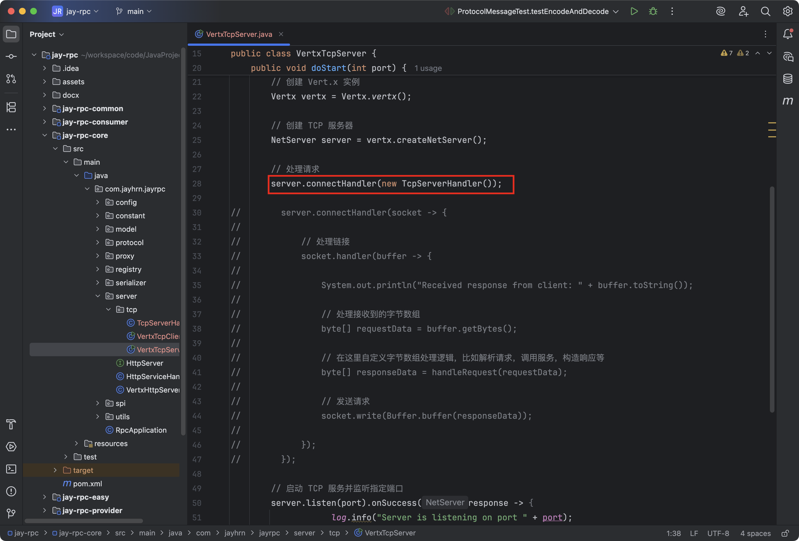

修改服务提供者`Provider`代码，改为启动TCP服务器。完整代码如下：

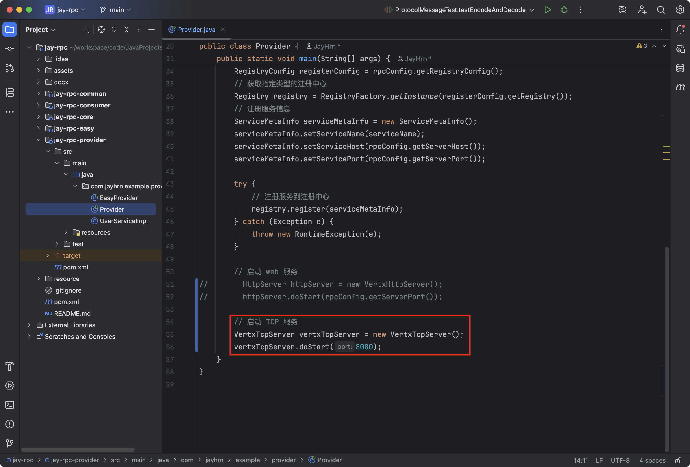

启动服务提供者和服务消费者：

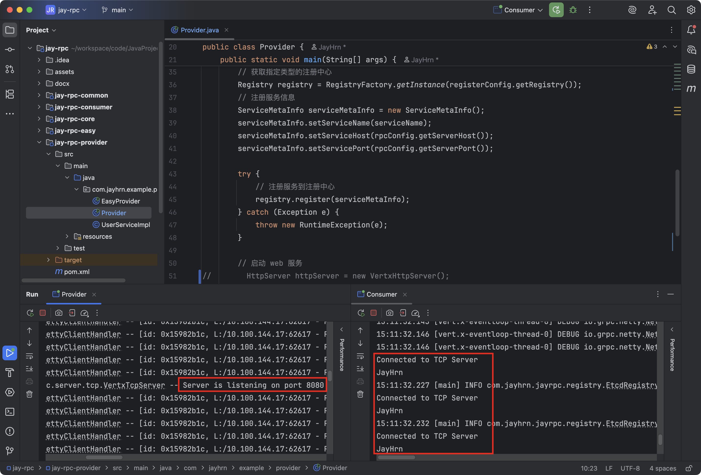

正常完成调用。如果不能，那可能就是出现了我们接下来要讲的问题——粘包半包问题。

### 粘包半包问题解决

#### 什么是粘包和半包

使用TCP协议网络通讯时，可能会出现半包和粘包问题。

举个例子就明白了。

理想情况下，假如我们客户端连续2次要发送的消息是：

```markdown
// 第一次
Hello, Server!Hello, Server!Hello, Server!Hello, Server!
// 第二次
Hello, Server!Hello, Server!Hello, Server!Hello, Server!
```

但是服务端收到的消息情况可是：

[1] 每次收到的数据更少了，这种情况叫做半包：

```markdown
// 第一次
Hello, Server!Hello, Server!
// 第二次
Hello, Server!Hello, Server!Hello, Server!
```

[2] 每次收到的数据更多了，这种情况叫做粘包：

```markdown
// 第三次
Hello, Server!Hello, Server!Hello, Server!Hello, Server!Hello, Server!
```

#### 半包粘包问题演示

为了更好地理解半包和粘包，我们可以编写代码来测试。

[1] 修改TCP客户端代码，连续发送1000次消息：

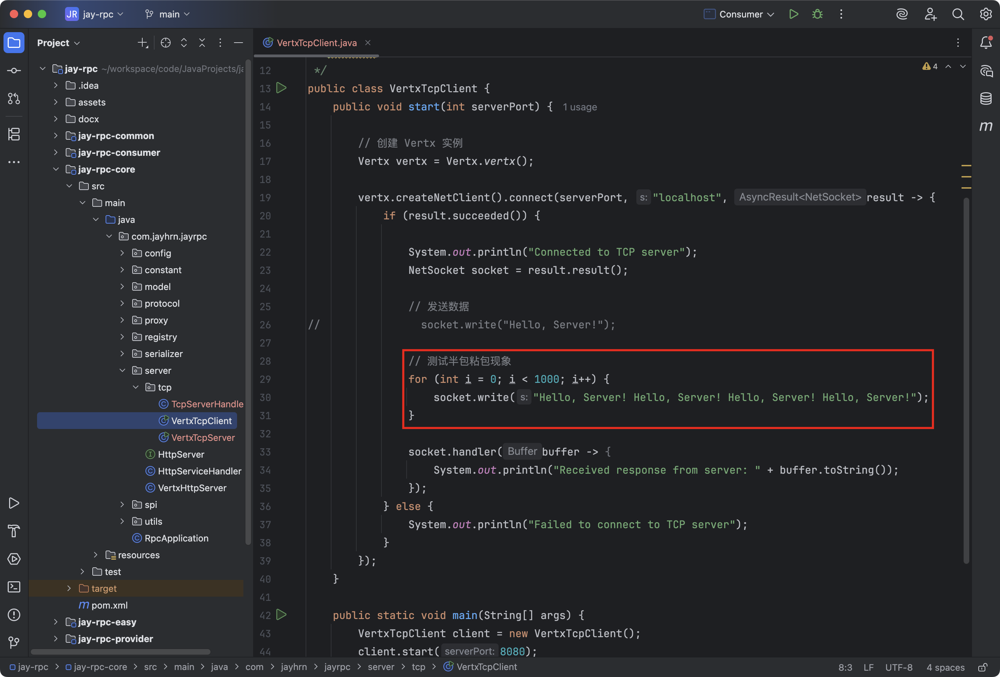

[2] 修改TCP服务端代码，打印出每次收到的消息：

```java
package com.jayhrn.jayrpc.server.tcp;

import io.vertx.core.Vertx;
import io.vertx.core.net.NetServer;
import lombok.extern.slf4j.Slf4j;

/**
 * Vertx TCP 服务器
 *
 * @Author JayHrn
 * @Date 2025/6/21 18:29
 * @Version 1.0
 */
@Slf4j
public class VertxTcpServer {
    private byte[] handleRequest(byte[] requestData) {
        return "Hello, client!".getBytes();
    }

    public void doStart(int port) {
        // 创建 Vert.x 实例
        Vertx vertx = Vertx.vertx();

        // 创建 TCP 服务器
        NetServer server = vertx.createNetServer();

        // 处理请求
//        server.connectHandler(new TcpServerHandler());

        server.connectHandler(socket -> {

            // 处理链接
            socket.handler(buffer -> {

//                System.out.println("Received response from client: " + buffer.toString());

                String testMessage = "Hello, Server! Hello, Server! Hello, Server! Hello, Server!";
                int messageLength = testMessage.getBytes().length;

                if (buffer.getBytes().length < messageLength) {
                    System.out.println("半包, length: " + buffer.getBytes().length);
                    return;
                }

                if (buffer.getBytes().length > messageLength) {
                    System.out.println("粘包, length: " + buffer.getBytes().length);
                }

                String str = new String(buffer.getBytes(0, messageLength));
                System.out.println(str);

                if (testMessage.equals(str)) {
                    System.out.println("Good");
                }

//                // 处理接收到的字节数组
//                byte[] requestData = buffer.getBytes();
//
//                // 在这里自定义字节数组处理逻辑，比如解析请求，调用服务，构造响应等
//                byte[] responseData = handleRequest(requestData);
//
//                // 发送请求
//                socket.write(Buffer.buffer(responseData));

            });
        });

        // 启动 TCP 服务并监听指定端口
        server.listen(port).onSuccess(response -> {
                    log.info("Server is listening on port " + port);
                })
                .onFailure(response -> {
                    log.info("Failed to start server" + response.getCause());
                });
    }

    public static void main(String[] args) {
        new VertxTcpServer().doStart(8080);
    }
}
```

[3] 测试运行，查看服务端控制台，发现服务端接受消息时，可能出现半包和粘包：

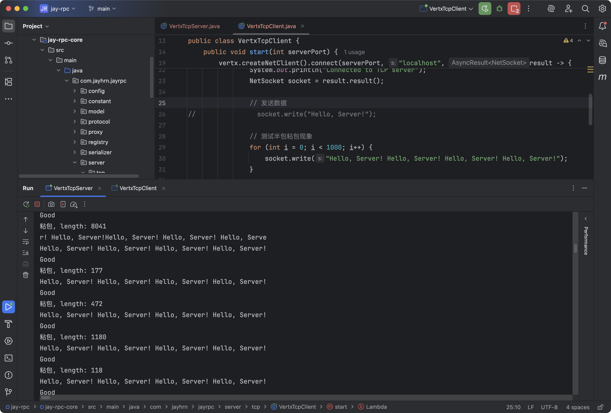

不过我这里没有出现半包，那就多试几次，发现也确实出现了半包：

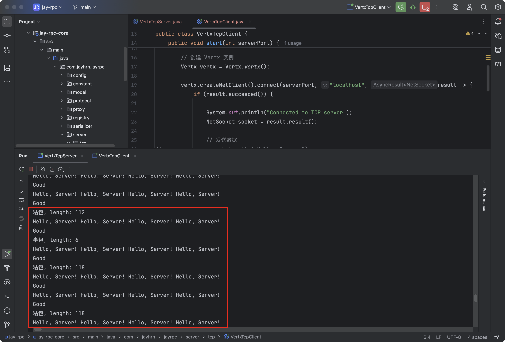

#### 如何解决半包

解决半包的核心思路是：在消息头中设置请求体的长度，服务端接收时，判断每次消息的长度是否符合预期，不完整就不读，留到下一次接收到消息时再读取。

示例代码如下：

```java
if (buffer = =null || buffer.length() == 0) {
		throw new RunTimeException("消息 buffer 为空");
}
if (buffer.getBytes().length < ProtocolConstant.MESSAGE_HEADER_LENGTH) {
		throw new RunTimeException("出现了半包问题");
}
```

#### 如何解决粘包

解决粘包的核心思路也是类以的：每次只读取指定长度的数据，超过长度的留着下一次接收到消息时再读取。

示例代码如下：

```java
// 解决粘包问题
byte[] bodyBytes = buffer.getBytes(17, 17 + header.getBodyLength());
```

听上去简单，但实现起来还是比较麻烦的，要记录每次接收到的消息位置，维护字节数组缓存。

#### Vert.x解决半包和粘包

在`Vert.x`框架中，可以使用内置的RecordParser完美解决半包粘包，它的作用是：保证下次读取到特定长度的字符。

先不要急着直接修改业务代码，而是先学会该类库的使用，跑通测试流程，再引入到自己的业务代码中。

**基础代码**

[1] 先小试牛刀，使用`RecordParser`来读取固定长度的消息，

示例代码如下：

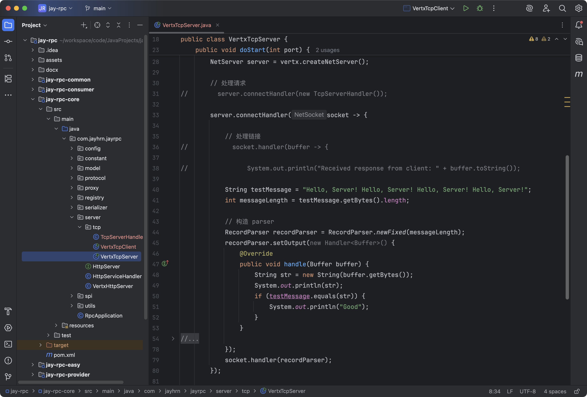

上述代码的核心是`RecordParser.newFixed(messageLength)`，为`Parser`指定每次读取固定值长度的内容。

测试，发现，这次的输出结果非常整齐，解决了半包和粘包：

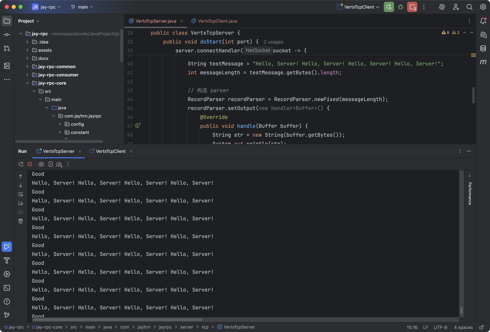

[2] 实际运用中，消息体的长度是不固定的，所以要通过调整`RecordParser`的固定长度（变长）来解决。

那我们的思路可以是，将读取完整的消息拆分为2次：

1. 先完整读取请求头信息，由于请求头信息长度是固定的，可以使用`RecordParser`保证每次都完整读取。
2. 再根据请求头长度信息更改`RecordParser`的固定长度，保证完整获取到请求体。

修改测试`VertxTpcServer`代码如下：

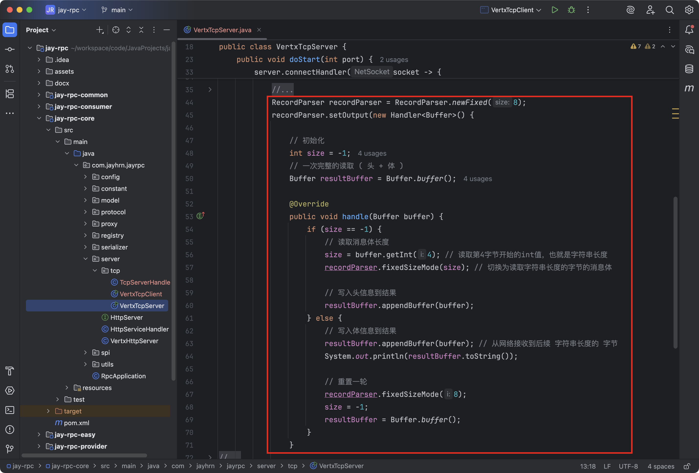

修改测试`VertxTpcClient`代码如下，自己构造了一个变长、长度信息不在Buffer最开头（而是有一定偏移量）的消息：

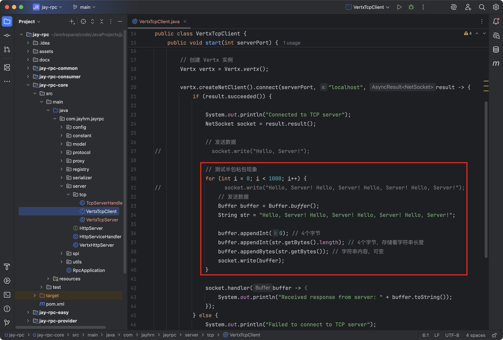

测试结果应该也是能够正常读取到消息的，不会出现半包和粘包。

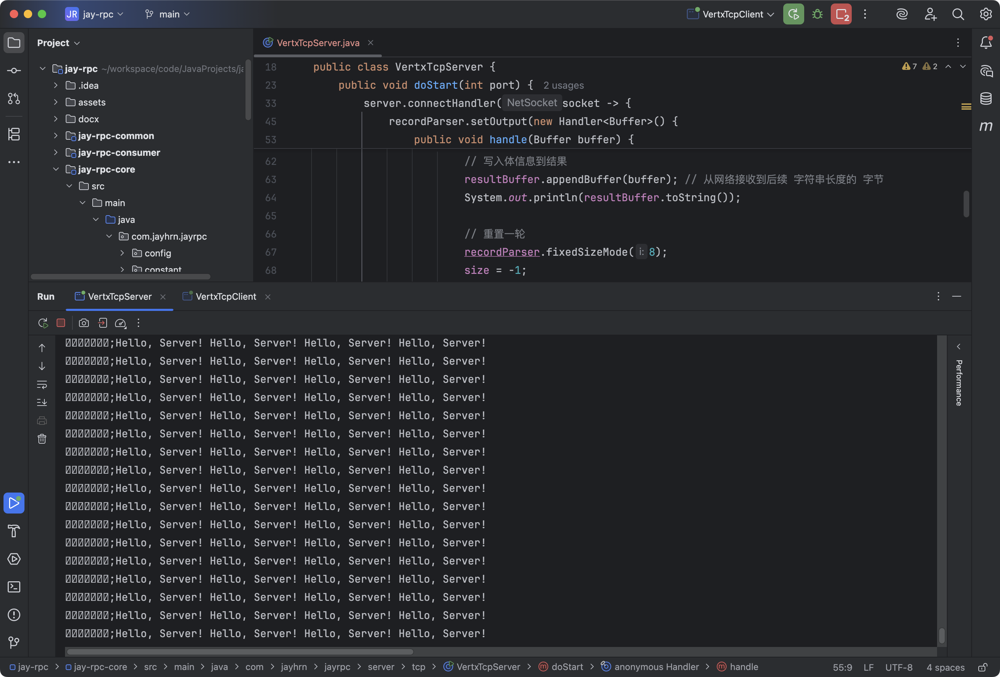

**封装半包粘包处理器**

我们会发现，解决半包粘包，问题还是有一定的代码量的，而且由于`ServiceProxy(消费者)`和请求`TcpServerHandler(提供者)`都需要接受Buffer，所以都需要半包粘包问题处理。

那我们就应该要想到：需要对代码进行封装复用了。

这里我们可以使用设计模式中的装饰者模式，使用RecordParser对原有的Buffer处理器的能力进行增强。

装饰者模式可以简单理解为给对象穿装备，增强对象的能力。

在`server.tcp`包下新建`TcpBufferHandlerWrapper`类，实现并增强`Handler<Buffer>`接口。

完整代码如下：

```java
package com.jayhrn.jayrpc.server.tcp;

import com.jayhrn.jayrpc.protocol.ProtocolConstant;
import io.vertx.core.Handler;
import io.vertx.core.buffer.Buffer;
import io.vertx.core.parsetools.RecordParser;

/**
 * TCP 消息处理器包装
 *
 * @Author JayHrn
 * @Date 2025/6/22 16:35
 * @Version 1.0
 */
public class TcpBufferHandlerWrapper implements Handler<Buffer> {

    /**
     * 解析器，用于解决半包、粘包问题
     */
    private final RecordParser recordParser;

    public TcpBufferHandlerWrapper(Handler<Buffer> bufferHandler) {
        this.recordParser = initRecordParser(bufferHandler);
    }

    @Override
    public void handle(Buffer buffer) {
        recordParser.handle(buffer);
    }

    /**
     * 初始化解析器
     *
     * @param bufferHandler
     * @return
     */
    private RecordParser initRecordParser(Handler<Buffer> bufferHandler) {
        // 构造 parser
        RecordParser parser = RecordParser.newFixed(ProtocolConstant.MESSAGE_HEADER_LENGTH);

        parser.setOutput(new Handler<Buffer>() {
            // 初始化
            int size = -1;
            // 一次完整的读取 (头 + 体）
            Buffer resultBuffer = Buffer.buffer();

            @Override
            public void handle(Buffer buffer) {
                // 1. 每次循环，首先读取消息头
                if (size == -1) {
                    // 读取消息体长度
                    size = buffer.getInt(13);
                    parser.fixedSizeMode(size);
                    // 写入头信息到结果
                    resultBuffer.appendBuffer(buffer);
                } else {
                    // 2. 然后读取消息体
                    // 写入体信息到结果
                    resultBuffer.appendBuffer(buffer);
                    // 已拼接为完整 Buffer，执行处理
                    bufferHandler.handle(resultBuffer);

                    // 重置一轮
                    parser.fixedSizeMode(ProtocolConstant.MESSAGE_HEADER_LENGTH);
                    size = -1;
                    resultBuffer = Buffer.buffer();
                }
            }
        });

        return parser;
    }
}
```

其实就是把`RecordParser`的代码粘了过来，当调用处理器的`handle`方法时，改为调用`recordParser.handle`。

#### 优化客户端代码

有了半包粘包处理器，我们就可以很轻松地在业务代码中运用它了。

**[1] 修改TCP请求处理器**

使用`TcpBufferHandlerWrapper`来封装之前处理请求的代码，请求逻辑不用变，修改后的代码如下：

```java
package com.jayhrn.jayrpc.server.tcp;

import com.jayhrn.jayrpc.model.RpcRequest;
import com.jayhrn.jayrpc.model.RpcResponse;
import com.jayhrn.jayrpc.protocol.*;
import com.jayhrn.jayrpc.registry.LocalRegistry;
import io.vertx.core.Handler;
import io.vertx.core.buffer.Buffer;
import io.vertx.core.net.NetSocket;

import java.io.IOException;
import java.lang.reflect.Method;

/**
 * TCP 请求处理器
 *
 * @Author JayHrn
 * @Date 2025/6/22 14:18
 * @Version 1.0
 */
public class TcpServerHandler implements Handler<NetSocket> {
    /**
     * 处理请求
     *
     * @param netSocket 需要处理的事件
     */
    @Override
    public void handle(NetSocket netSocket) {
        // 处理连接
        TcpBufferHandlerWrapper bufferHandlerWrapper = new TcpBufferHandlerWrapper(buffer -> {
            // 接收请求，解码
            ProtocolMessage<RpcRequest> protocolMessage;
            try {
                protocolMessage = (ProtocolMessage<RpcRequest>) ProtocolMessageDecoder.decode(buffer);
            } catch (IOException e) {
                throw new RuntimeException("协议消息解码错误");
            }
            RpcRequest rpcRequest = protocolMessage.getBody();

            // 处理请求
            // 构造响应结果对象
            RpcResponse rpcResponse = new RpcResponse();
            try {
                // 获取要调用的服务实现类，通过反射调用
                Class<?> implClass = LocalRegistry.get(rpcRequest.getServiceName());
                Method method = implClass.getMethod(rpcRequest.getMethodName(), rpcRequest.getParameterTypes());
                Object result = method.invoke(implClass.newInstance(), rpcRequest.getArgs());
                // 封装返回结果
                rpcResponse.setData(result);
                rpcResponse.setDataType(method.getReturnType());
                rpcResponse.setMessage("ok");
            } catch (Exception e) {
                e.printStackTrace();
                rpcResponse.setMessage(e.getMessage());
                rpcResponse.setException(e);
            }

            // 发送响应，编码
            ProtocolMessage.Header header = protocolMessage.getHeader();
            header.setType((byte) ProtocolMessageTypeEnum.RESPONSE.getKey());
            header.setStatus((byte) ProtocolMessageStatusEnum.OK.getValue());
            ProtocolMessage<RpcResponse> responseProtocolMessage = new ProtocolMessage<>(header, rpcResponse);
            try {
                Buffer encode = ProtocolMessageEncoder.encode(responseProtocolMessage);
                netSocket.write(encode);
            } catch (IOException e) {
                throw new RuntimeException("协议消息编码错误");
            }
        });

        netSocket.handler(bufferHandlerWrapper);
    }
}
```

其实就是使用一个Wrapper对象包装了之前的代码，就解决了半包粘包。是不是很简单？这就是装饰者模式的妙用！

**[2] 修改客户端处理响应的代码**

之前我们是把所有发送请求、处理响应的代码都写到了`ServiceProxy`中，使得这个类的代码“臃肿不堪”。

我们干脆做个优化，把所有的请求响应逻辑提取出来，封装为单独的`VertxTcpClient`类，放在server.tcp包下。

`VertxTcpClient`的完整代码如下：

```java
package com.jayhrn.jayrpc.server.tcp;

import cn.hutool.core.util.IdUtil;
import com.jayhrn.jayrpc.RpcApplication;
import com.jayhrn.jayrpc.model.RpcRequest;
import com.jayhrn.jayrpc.model.RpcResponse;
import com.jayhrn.jayrpc.model.ServiceMetaInfo;
import com.jayhrn.jayrpc.protocol.*;
import io.vertx.core.Vertx;
import io.vertx.core.buffer.Buffer;
import io.vertx.core.net.NetClient;
import io.vertx.core.net.NetSocket;

import java.io.IOException;
import java.util.concurrent.CompletableFuture;
import java.util.concurrent.ExecutionException;

/**
 * Vertx TCP 请求客户端
 *
 * @Author JayHrn
 * @Date 2025/6/21 18:42
 * @Version 1.0
 */
public class VertxTcpClient {

    /**
     * 发送请求
     *
     * @param request
     * @param serviceMetaInfo
     * @return
     * @throws ExecutionException
     * @throws InterruptedException
     */
    public static RpcResponse doRequest(RpcRequest request, ServiceMetaInfo serviceMetaInfo) throws ExecutionException, InterruptedException {
        // 发送 TCP 请求
        Vertx vertx = Vertx.vertx();
        NetClient netClient = vertx.createNetClient();
        CompletableFuture<RpcResponse> responseCompletableFuture = new CompletableFuture<>();
        netClient.connect(serviceMetaInfo.getServicePort(), serviceMetaInfo.getServiceHost(), result -> {
            if (!result.succeeded()) {
                System.out.println("Failed to connect to TCP server");
                return;
            }
            NetSocket netSocket = result.result();
            // 发送请求
            // 构造消息
            ProtocolMessage<RpcRequest> protocolMessage = new ProtocolMessage<>();
            ProtocolMessage.Header header = new ProtocolMessage.Header();
            header.setMagic(ProtocolConstant.PROTOCOL_MAGIC);
            header.setVersion(ProtocolConstant.PROTOCOL_VERSION);
            header.setSerializer((byte) ProtocolMessageSerializerEnum.getEnumByValue(RpcApplication.getRpcConfig().getSerializer()).getKey());
            header.setType((byte) ProtocolMessageTypeEnum.REQUEST.getKey());
            // 生成全局请求 ID
            header.setRequestId(IdUtil.getSnowflakeNextId());
            protocolMessage.setHeader(header);
            protocolMessage.setBody(request);

            // 编码请求
            try {
                Buffer encodeBuffer = ProtocolMessageEncoder.encode(protocolMessage);
                netSocket.write(encodeBuffer);
            } catch (IOException e) {
                throw new RuntimeException("协议消息编码错误");
            }

            // 接收响应
            TcpBufferHandlerWrapper tcpBufferHandlerWrapper = new TcpBufferHandlerWrapper(buffer -> {
                try {
                    ProtocolMessage<RpcResponse> rpcResponseProtocolMessage = (ProtocolMessage<RpcResponse>) ProtocolMessageDecoder.decode(buffer);
                    responseCompletableFuture.complete(rpcResponseProtocolMessage.getBody());
                } catch (IOException e) {
                    throw new RuntimeException("协议信息解码错误");
                }
            });
            netSocket.handler(tcpBufferHandlerWrapper);
        });

        RpcResponse rpcResponse = responseCompletableFuture.get();
        // 关闭连接
        netClient.close();
        return rpcResponse;
    }

    public void start(int serverPort) {

        // 创建 Vertx 实例
        Vertx vertx = Vertx.vertx();

        vertx.createNetClient().connect(serverPort, "localhost", result -> {
            if (result.succeeded()) {

                System.out.println("Connected to TCP server");
                NetSocket socket = result.result();

                // 发送数据
//                socket.write("Hello, Server!");

                // 测试半包粘包现象
                for (int i = 0; i < 1000; i++) {
//                    socket.write("Hello, Server! Hello, Server! Hello, Server! Hello, Server!");
                    // 发送数据
                    Buffer buffer = Buffer.buffer();
                    String str = "Hello, Server! Hello, Server! Hello, Server! Hello, Server!";

                    buffer.appendInt(0); // 4个字节
                    buffer.appendInt(str.getBytes().length); // 4个字节，存储着字符串长度
                    buffer.appendBytes(str.getBytes()); // 字符串内容，可变
                    socket.write(buffer);
                }

                socket.handler(buffer -> {
                    System.out.println("Received response from server: " + buffer.toString());
                });
            } else {
                System.out.println("Failed to connect to TCP server");
            }
        });
    }

    public static void main(String[] args) {
        VertxTcpClient client = new VertxTcpClient();
        client.start(8080);
    }
}
```

注意，上述代码中，也使用了`TcpBufferHandlerWrapper`对处理响应的代码进行了封装。

修改`ServiceProxy`代码，调用`VertxTcpClient`，修改后的代码如下：

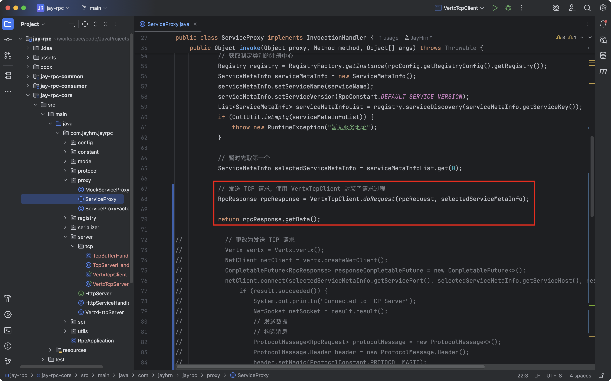

#### 测试

由于之前修改了`VertxTcpServer`，我们需要修改回来：

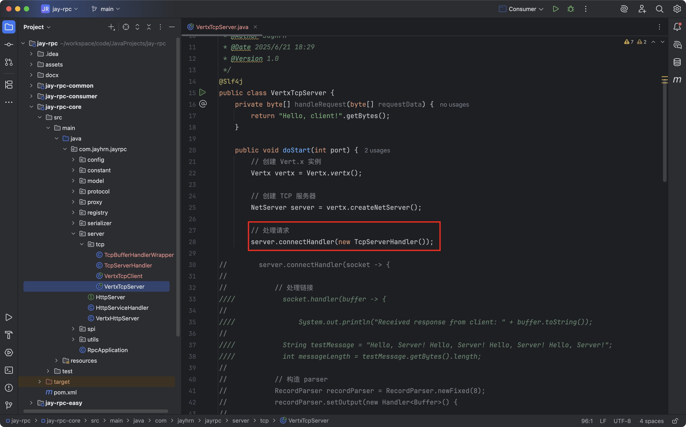

正常启动服务提供者和服务消费者：

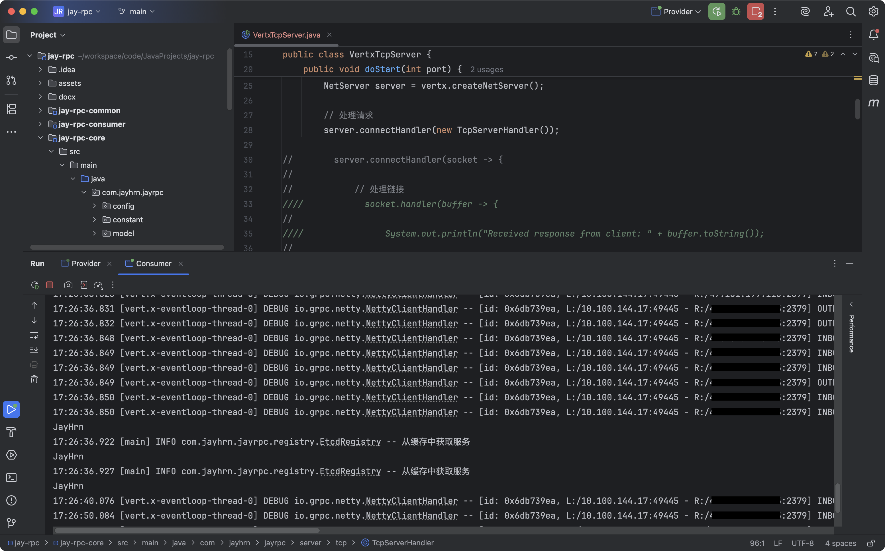

可以看到整体功能正常。

**思考**

为什么tcpServer不提供个server接口，或者和httpServer共用接口？

目前的想法：替换这两个服务器（协议实现）涉及的改动点非常多，比如RPC协议、请求处理器等，不是直接通过配置就替换的，而且RPC框架一般也不需要替换底层的协议，只使用TCP会更好。

### 拓展

- 自己定义一个占用空间更少的RPC 协议的消息结构
