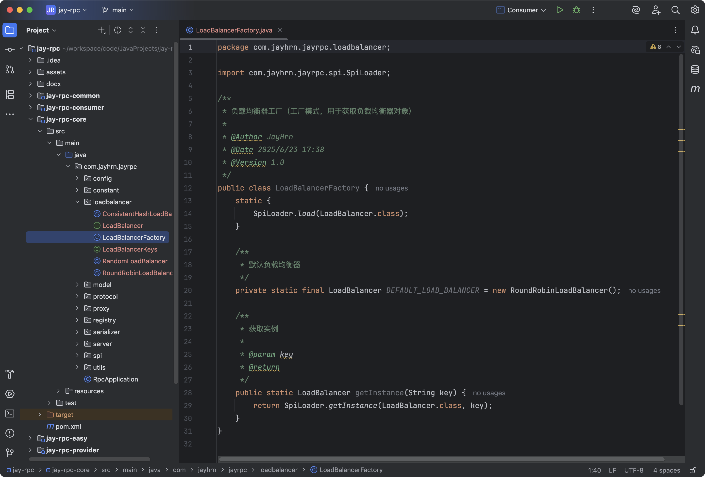

## 负载均衡

### 需求分析

现在我们的RPC框架已经可以从注册中心获取到服务提供者的注册信息了，同一个服务可能会有多个服务提供者，但是目前我们消费者始终读取了第一个服务提供者节点发起调用，不仅会增大单个节点的压力而且没有利用好其他节点的资源。

我们完全可以从服务提供者节点中，选择一个服务提供者发起请求，而不是每次都请求同一个服务提供者，这个操作就叫做负载均衡。

### 负载均衡

#### 什么是负载均衡

让我们把这个词拆开来看：

- 何为负载？可以把负载理解为要处理的工作和压力，比如网络请求、事务、数据处理任务等。
- 何为均衡？把工作和压力平均地分配给多个工作者，从而分难每个工作者的压力，保证大家正常工作。

用个比喻，假设餐厅里只有一个服务员，如果顾客非常多，他可能会忙不过来，没法及时上菜莱、忙中生乱；而且他的压力会越来越大，最严重的情况下就累倒了无法继续工作。而如果有多个服务员，大家能够服务更多的顾客，即使有一个服务员生病了，其他服务员也能帮忙顶上。

所以，负载均衡是一种用来分配网络或计算负载到多个资源上的技术。它的目的是确保每个资源都够有效地处理负载、增加系统的并发量、避免某些资源过载而导致性能下降或服务不可用的情况。

回归到我们的RPC框架，负载均衡的作用是从一组可用的服务提供者中选择一个进行调用。

常用的负载均衡实现技术有Nginx（七层负载均衡）、LVS(四层负载均衡)等。

#### 常见负载均衡算法

负载均衡学习的重点就是它的算法一按照什么策略选泽资源。

不同的负载均衡算法，适用的场景也不同，一定要根据实际情况选取，主流的负载均衡算法如下：

- 轮询(Round Robin)：按照循环的顺序将请求分配给每个服务器，适用于各服务器性能相近的情况。

- 随机(Random)：随机选择一个服务器来处理请求，适用于服务器性能相近且负载均匀的情况。

- 加权轮询(Weighted Round Robin)：根据服务器的性能或权重分配请求，性能更好的服务器会获得更多的请求，适用于服务器性能不均的情况。

- 加权随机(Weighted Random)：根据服务器的权重随机选择一个服务器处理请求，适用于服务器性能不均的情况。

- 最小连接数(Least Connections)：选择当前连接数最少的服务器来处理请求，适用于长连接场景。

- IP Hash：根据客户端P地址的哈希值选怿服务器处理请求，确保同一客户瑞的请求始终被分配到同一台服务器上，适用于需要保特会话一致性的场景。

#### 一致性Hash

一致性哈希(Consistent Hashing)是一种经典的哈希算法，用于将请求分配到多个节点或服务器上，非常适用于负载均衡。

它的核心思想是将整个哈希值空间划分成一个环状结构，每个节点或服务器在环上占据一个位置，每个请求根据其哈希值映射到环上的一个点，然后顺时针寻找第一个大于或等于该哈希值的节点，将请求路由到该节点上。

一致性哈希环结构如图：


上图中，请求A会交给服务器C来处理。

好像也没什么特别的啊？还整个环？

其实，一致性哈希还解决了节点下线和倾斜问题。

**[1] 节点下线**

当某个节点下线时，其负载会被平均分傩到其他节点上，而不会影响到整个系统的稳定性，因为只有部分请求会受到影响。

如下图，服务器C下线后，请求A会交给服务器A来处理（<u>顺时针</u>寻找第一个大于或等于该哈希值的节点），而服务器B接收到的请求保特不变。


如果是轮询取模算法，只要节点数变了，很有可能大多数服务器处理的请求者都要发生变化，对系统的影响巨大。

**[2] 倾斜问题**

通过虚拟节点的引入，将每个物理节点映射到多个虚拟节点上，使得节点在哈希环上的分布更加均匀，减少了节点间的负载差异。

举个例子，节点很少的情况下，环的情况可如下图：


这样就会导致绝大多数的请求都会发给服务器C，而服务器A的“领地”非常少，几乎不会有请求。

引入虚拟节点后，环的情况变为：


这样一来，每个服务器接受到的请求会更容易平均。

### 开发实现

#### 多种负载均衡器实现

在RPC项目中新建`loadbalancer`包，将所有负载均衡器相关的代码放到该包下。

**[1] 编写负载均衡器通用接口**

提供一个选择服务方法，接受请求参数和可用服务列表，可以根据这些信息进行选择。

代码如下：


**[2] 轮询负载均衡器**

在`loadBalancer`包下新建`RoundRobinLoadBalancer`类，代码如下：

```java
package com.jayhrn.jayrpc.loadbalancer;

import com.jayhrn.jayrpc.model.ServiceMetaInfo;

import java.util.List;
import java.util.Map;
import java.util.concurrent.atomic.AtomicInteger;

/**
 * 轮询负载均衡器
 *
 * @Author JayHrn
 * @Date 2025/6/23 17:04
 * @Version 1.0
 */
public class RoundRobinLoadBalancer implements LoadBalancer {
    
    /**
     * 当前轮询的下标
     */
    private final AtomicInteger currentIndex = new AtomicInteger(0);

    /**
     * 选择服务调用
     *
     * @param requestParams       请求参数
     * @param serviceMetaInfoList 可用服务列表
     * @return
     */
    @Override
    public ServiceMetaInfo select(Map<String, Object> requestParams, List<ServiceMetaInfo> serviceMetaInfoList) {
        if (serviceMetaInfoList.isEmpty()) {
            return null;
        }
        // 只有一个服务，无需轮询
        int size = serviceMetaInfoList.size();
        if (size == 1) {
            return serviceMetaInfoList.get(0);
        }
        // 取模算法轮询
        int index = currentIndex.getAndIncrement() % size;
        return serviceMetaInfoList.get(index);
    }
}
```

**[3] 随机负载均衡器**

在`loadBalancer`包下新建`RandomLoadBalancer`类，使用Java自带的`Random`类实现随机选取即可，代码如下：

```java
package com.jayhrn.jayrpc.loadbalancer;

import com.jayhrn.jayrpc.model.ServiceMetaInfo;

import java.util.List;
import java.util.Map;
import java.util.Random;

/**
 * 随机负载均衡器
 *
 * @Author JayHrn
 * @Date 2025/6/23 17:12
 * @Version 1.0
 */
public class RandomLoadBalancer implements LoadBalancer {

    /**
     * 随机数
     */
    private final Random random = new Random();

    /**
     * 选择服务调用
     *
     * @param requestParams       请求参数
     * @param serviceMetaInfoList 可用服务列表
     * @return
     */
    @Override
    public ServiceMetaInfo select(Map<String, Object> requestParams, List<ServiceMetaInfo> serviceMetaInfoList) {
        if (serviceMetaInfoList.isEmpty()) {
            return null;
        }
        int size = serviceMetaInfoList.size();
        // 只有一个服务，不用随机
        if (size == 1) {
            return serviceMetaInfoList.get(0);
        }
        return serviceMetaInfoList.get(random.nextInt(size));
    }
}
```

[4] 一致性Hash负载均衡器

在`loadBalancer`包下新建`ConsistentHashLoadBalancer`类，可以使用`TreeMap`实现一致性`Hash`环，该数据结构提供了`ceilingEntry`和`firstEntry`两个方法，便于获取符合算法要求的节点。

代码如下：

```java
package com.jayhrn.jayrpc.loadbalancer;

import com.jayhrn.jayrpc.model.ServiceMetaInfo;

import java.util.List;
import java.util.Map;
import java.util.TreeMap;

/**
 * 一致性哈希负载均衡
 *
 * @Author JayHrn
 * @Date 2025/6/23 17:19
 * @Version 1.0
 */
public class ConsistentHashLoadBalancer implements LoadBalancer {

    /**
     * 一致性 hash 环，存放虚拟节点
     */
    private final TreeMap<Integer, ServiceMetaInfo> virtualNodes = new TreeMap<>();

    /**
     * 虚拟节点数
     */
    private static final int VIRTUAL_NODE_NUM = 100;

    /**
     * 选择服务调用
     *
     * @param requestParams       请求参数
     * @param serviceMetaInfoList 可用服务列表
     * @return
     */
    @Override
    public ServiceMetaInfo select(Map<String, Object> requestParams, List<ServiceMetaInfo> serviceMetaInfoList) {
        if (serviceMetaInfoList.isEmpty()) {
            return null;
        }

        // 构建虚拟节点环
        for (ServiceMetaInfo serviceMetaInfo : serviceMetaInfoList) {
            for (int i = 0; i < VIRTUAL_NODE_NUM; i++) {
                int hash = getHash(serviceMetaInfo.getServiceAddress() + "#" + i);
                virtualNodes.put(hash, serviceMetaInfo);
            }
        }

        // 获取调用请求的 hash 值
        int hash = getHash(requestParams);

        // 选择最接近且大于等于调用请求 hash 值的虚拟节点
        Map.Entry<Integer, ServiceMetaInfo> entry = virtualNodes.ceilingEntry(hash);
        if (entry == null) {
            // 如果没有大于等于调用请求 hash 值的虚拟节点，则返回环首部的节点
            entry = virtualNodes.firstEntry();
        }
        return entry.getValue();
    }

    /**
     * Hash 算法，可自行实现
     *
     * @param key
     * @return
     */
    private int getHash(Object key) {
        return key.hashCode();
    }
}
```

上述代码中，注意两点：

1. 根据`requestParams`对象计算`Hash`值，这里只是简单地调用了对象的`hashCode`方法，也可以根据需求实现自己的Hash算法。
2. 每次调用负载均衡器时，都会重新构造Hash环，这是为了能够即时处理节点的变化。

#### 支持配置和拓展负载均衡器

一个成熟的RPC框架可能会支持多个负载均衡器，像序列化器和注册中心一样，我们的需求是，让开发者能够填写配置来指定使用的负载均衡器，并且支持自定义负载均衡器，让框架更易用、更利于扩展。

要实现这点，开发方式和序列化器、注册中心都是一样的，都可以使用工厂创建对象、使用`SPI`动态加载自定义的注册中心。

**[1] 负载均衡器常量**

在`loadbalancer`包下新建`LoadBalancerKeys`类，列举所有支持的负载均衡器键名。

代码如下：


**[2] 使用工厂模式，根据key从SPI获取负载均衡器对象实例**

在`loadbalancer`包下新建`LoadBalancerFactory`类，代码如下：



这个类可以直接复制之前的`SerializerFactory`，然后略敏修改。可以发现，只要跑通了一次SPI机制，后续的开发就很简单了~

**[3] 编写负载均衡器接口的SPI配置文件**

在`META-INF`的`rpc/system`目录下编写负载均衡器接口的SPI配置文件，文件名称为`com.jayhrn.jayrpc.loadbalancer.LoadBalancer`


**[4] RpcConfig全局配置新增负载均衡器**

为`RpcConfig`全局配置新增负载均衡器的配置，代码如下：


#### 应用负载均衡器

现在，我们就能使用负载均衡器了。修改`ServiceProxy`的代码，将“固定调用第一个服务节点”改为“调用负载均衡器获取一个服务节点”。

修改后的核心代码如下：


由于之前的注释描述有点小问题以及存在许多废弃代码，给出修改之后完整的代码：

```java
package com.jayhrn.jayrpc.proxy;

import cn.hutool.core.collection.CollUtil;
import com.jayhrn.jayrpc.RpcApplication;
import com.jayhrn.jayrpc.config.RpcConfig;
import com.jayhrn.jayrpc.constant.RpcConstant;
import com.jayhrn.jayrpc.loadbalancer.LoadBalancer;
import com.jayhrn.jayrpc.loadbalancer.LoadBalancerFactory;
import com.jayhrn.jayrpc.model.RpcRequest;
import com.jayhrn.jayrpc.model.RpcResponse;
import com.jayhrn.jayrpc.model.ServiceMetaInfo;
import com.jayhrn.jayrpc.registry.Registry;
import com.jayhrn.jayrpc.registry.RegistryFactory;
import com.jayhrn.jayrpc.server.tcp.VertxTcpClient;

import java.lang.reflect.InvocationHandler;
import java.lang.reflect.Method;
import java.util.HashMap;
import java.util.List;
import java.util.Map;

/**
 * 服务代理（JDK 动态代理）
 *
 * @Author JayHrn
 * @Date 2025/6/15 18:27
 * @Version 1.0
 */
public class ServiceProxy implements InvocationHandler {
    /**
     * 调用代理
     *
     * @return
     * @throws Throwable
     */
    @Override
    public Object invoke(Object proxy, Method method, Object[] args) throws Throwable {

        // 构造请求
        String serviceName = method.getDeclaringClass().getName();

        RpcRequest rpcRequest = RpcRequest.builder()
                .serviceName(serviceName)
                .methodName(method.getName())
                .parameterTypes(method.getParameterTypes())
                .args(args)
                .build();
        try {
            // 从注册中心获取服务提供者请求地址
            RpcConfig rpcConfig = RpcApplication.getRpcConfig();
            // 获取指定类别的注册中心
            Registry registry = RegistryFactory.getInstance(rpcConfig.getRegistryConfig().getRegistry());
            ServiceMetaInfo serviceMetaInfo = new ServiceMetaInfo();
            serviceMetaInfo.setServiceName(serviceName);
            serviceMetaInfo.setServiceVersion(RpcConstant.DEFAULT_SERVICE_VERSION);
            List<ServiceMetaInfo> serviceMetaInfoList = registry.serviceDiscovery(serviceMetaInfo.getServiceKey());
            if (CollUtil.isEmpty(serviceMetaInfoList)) {
                throw new RuntimeException("暂无服务地址");
            }

            // 暂时先取第一个
//            ServiceMetaInfo selectedServiceMetaInfo = serviceMetaInfoList.get(0);

            // 负载均衡
            LoadBalancer loadBalancer = LoadBalancerFactory.getInstance(rpcConfig.getLoadBalancer());
            // 将调用方法名（请求路径）作为负载均衡参数
            Map<String, Object> requestParams = new HashMap<>();
            requestParams.put("methodName", rpcRequest.getMethodName());
            ServiceMetaInfo selectedServiceMetaInfo = loadBalancer.select(requestParams, serviceMetaInfoList);

            // 发送 TCP 请求，使用 VertxTcpClient 封装了请求过程
            RpcResponse rpcResponse = VertxTcpClient.doRequest(rpcRequest, selectedServiceMetaInfo);

            return rpcResponse.getData();
        } catch (Exception e) {
            e.printStackTrace();
        }
        return null;
    }
}
```

上述代码中，我们给负载均衡器传入了一个名称为`requestParams`的`HashMap`，并且将请求方法名作为参数放到了HashMap中。如果使用的是一致性Hash算法，那么会根据requestParams计算Hash值，调用相同方法的请求Hash值肯定相同，所以总会请求到同一个服务器节点上。

### 测试

#### 测试负载均衡算法

首先编写单元测试类`LoadBalancerTest`，代码如下：


依次切换负载均衡器实现类，观察结果。

**[1] 轮询负载均衡器**


可以看到依次切换服务节点，符合轮询负载均衡器的特点。

**[2] 随机负载均衡器**


没有任何规律，符合随机负载均衡器的特点。

**[2] 一致性Hash负载均衡器**


每次都是放到固定的节点上面，符合一致性Hash负载均衡器的特点。

#### 测试负载均衡器调用

首先在不同的端口启动2个服务提供者，然后启动服务消费者项目，通过控制台输出来观察每次请求的节点地址。

我们分别测试8080 和8081端口。

为了便于看到请求的具体信息，为`ServeiceProxy`添加日志，在该类上添加`@Slif4j`注解：


同时启动端口分别为`8080`和`8081`的服务端，默认是`轮询`，我们修改服务消费者调用次数改成`5`，便于查看请求结果(因为日志输出会导致第1次请求的日志信息距离第2次请求的日志信息较远，截图只能看到第2次到最后一次的调用情况），可以看到结果符合`轮询负载均衡算法`。


切换配置负载均衡算法，切换成`一致性Hahs负载均衡器`，服务消费者和服务提供者都要配置，都在`application.properties`文件中配置：


重新启动服务端和消费端，可以看到每次请求的结果都一样，符合`一致性Hash负载均衡算法`的预期结果。


随机负载均衡器可自行测试，方法和上述一样，修改`application.properties`配置文件即可。

### 拓展

- 实现更多不同算法的负载均衡器
- 自定义一致性Hash负载均衡算法中的Hash算法

### RPC框架-负载均衡(注册中心)

