## 重试机制

### 需求分析

目前，如果使用RPC框架的服务消费者调用接口失败，就会直接报错。

调用接口失败可能有很多原因，有时可是服务提供者返回了错误，但有时可能只是网络不稳定或服务提供者重启等临时性问题。这种情况下，我们可能更希望服务消费者拥有自动重试的能力，提高系统的可用性。

### 设计方案

#### 重试机制

重试的概念可以理解为就是“不行再来”。

我们需要掌握的是"如何设计重试机制”，重试机制的核心是重试策略，一般来说，包含以下几个考虑点：

1. 什么时候、什么条件下重试？
2. 重试时间（确定下一次的重试时间）？
3. 什么时候、什么条件下停止重试？
4. 重试后要做什么？

#### 重试条件

首先是什么时候、什么条件下重试？

这个比较好思考，如果我们希望提高系统的可用性，当由于网络等异常情况发生时，触发重试。

#### 重试时间

重试时间（也叫重试等待）的策略就比较丰富了，可能会用到一些算法，主流的重试时间算法有：

- 固定重试间隔(Fixed Retry Interval)：在每次重试之间使用固定的时间间隔
- 指数退避重试(Exponential Backoff Retry)：在每次失败后，重试的时间间隔会以指数级增加，以避免请求过于密集
- 随机延迟重试(Random Delay Retry)：在每次重试之间使用随机的时间间隔，以避免请求的同时发生
- 可变延迟重试(Variable Delay Retry)：这种策略更“高级”了，根据先前重试的成功或失败情况，动态调整一次重试的延迟时间。比如根据前一次的响应时间调整下一次重试的等待时间

值得一提的是，以上的策略可以组合使用的，一定要根据具体情况和需求灵活调整。比如可以先使用指数退避重试策略，如果连续多次重试失败，则切换到固定重试策略。

#### 停止重试

一般来说，重试次数是有上限的，否则随着报错的增多，系统同时发生的重试也会越来越多，造成雪崩。

主流的停止重试策略有：

- 最大尝试次数：一般重试当达到最大次数时不再重试
- 超时停止：重试达到最大时间的时候，停止重试

#### 重试后工作

最后一点是重试后要做什么事情？一般来说就是重复执行原本要做的操作，比如发送请求失败了，那就再发一次请求。

需要注意的是，当重试次数超过上限时，往往还要进行其他的操作，比如：

1. 通知告警：让开发者人工介入
2. 降级容错：改为调用其他接口、或者执行其他操作

#### 重试方案设计

回归到我们的RPC框架，消费者发起调用的代码如下：

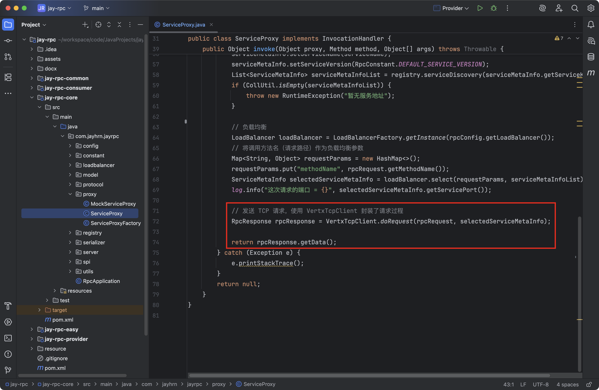

我们完全可以将`VertxTcpClient.doRequest`封装为一个可重试的任务，如果请求失败（重试条件），系统就会自动按照重试策咯再次发起请求，不用开发者关心。

和序列化器、注册中心、负载均衡器一样，重试策略本身也可以使用`SPI`+工厂的方式，允许开发者动态配置和扩展自己的重试策略。

最后，如果重试超过一定次数，我们就停止重试，并且抛出异常。

### 开发实现

#### 多种重试策略实现

在`jay-rpc-core`模块中新建`fault.retry`包，将所有重试相关的代码放到该包下。

**[1] 编写重试策略通用接口**

新建`RetryStrategy`提供一个重试方法，接受一个具体的任务参数，可以使用`Callable`类代表一个任务。

代码如下：

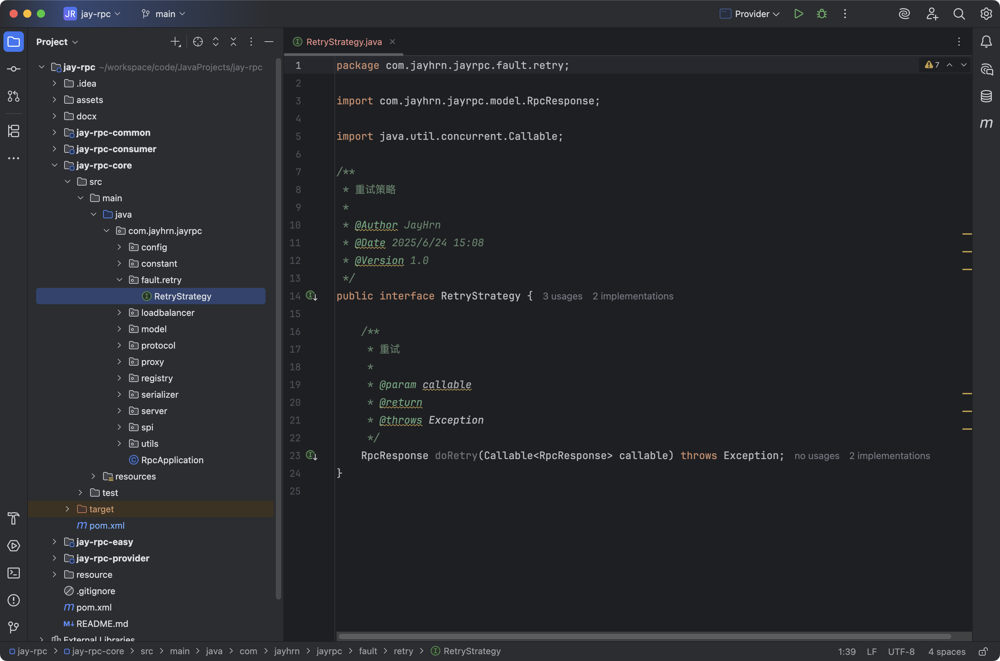

**[2] 引入Guava-Retrying 重试库**

代码如下：

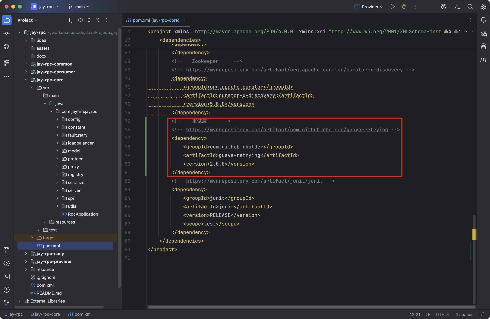

**[3] 不重试策略实现**

就是直接执行一次任务，代码如下：

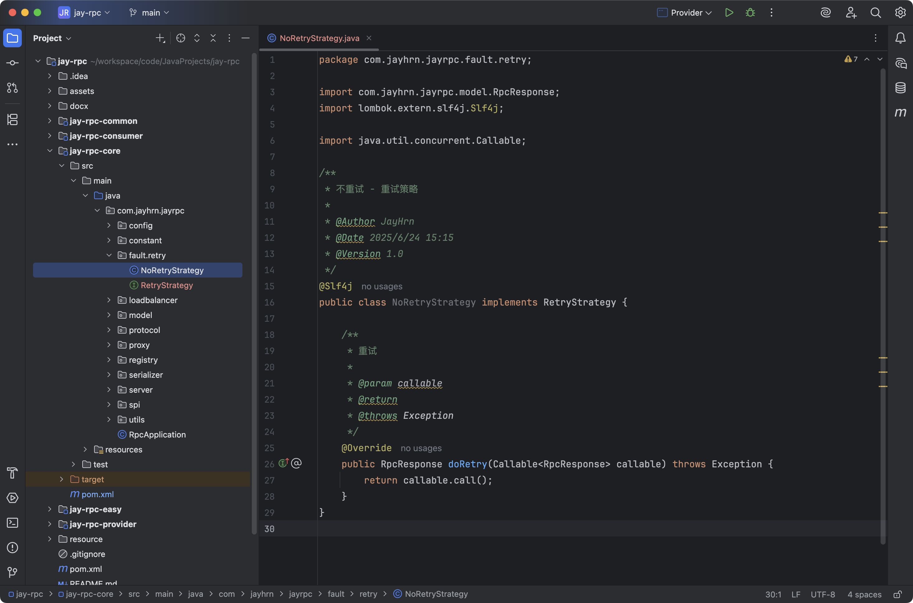

**[4] 固定重试间隔策略实现**

使用`Guava-Retrying`提供的`RetryerBuilder` 能够很方便地指定重试条件、重试等待策略、重试停止策略、重试工作等。

代码如下：

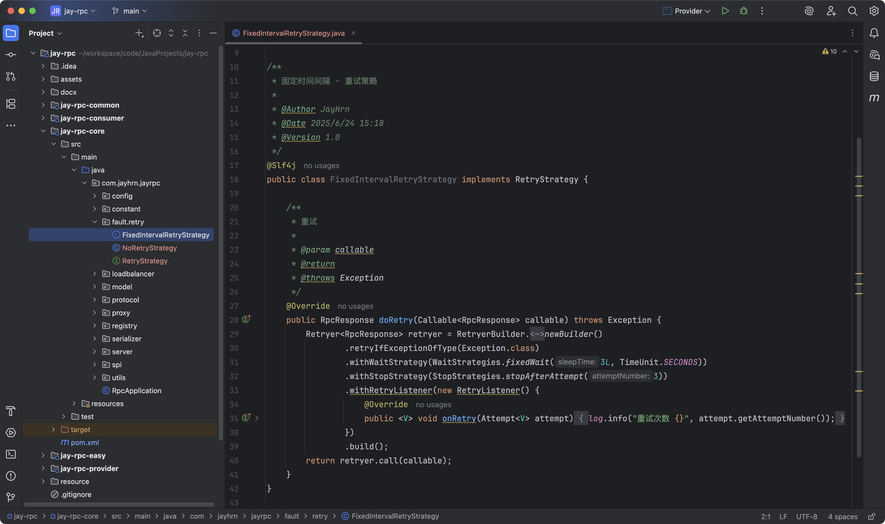

上述代码中，重试策略如下：

- 重试条件：使用`retryIfExceptionOfType`方法指定当出现`Exception`异常时重试。

- 重试等待策略：使用`withWaitStrategy`方法指定策略，选择`fixedWait`固定时间间隔策略。

- 重试停止策略：使用`withStopStrategy`方法指定策略，选择`stopAfterAttempt`超过最大重试次数停止。

- 重试工作：使用`withRetryListener`监听重试，每次重试时，除了再次执行任务外，还能够打印当前的重试次数。

**[5] 编写单元测试，验证不同策略**

编写一个单元测试，验证不同的重试策略。

单元测试代码如下：

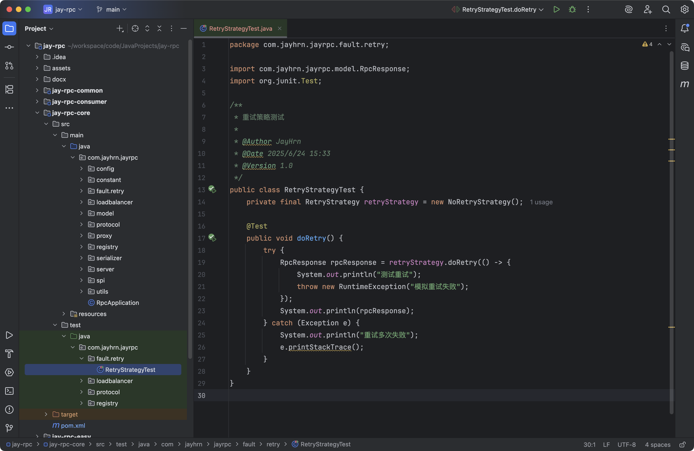

测试`不重试策略`：

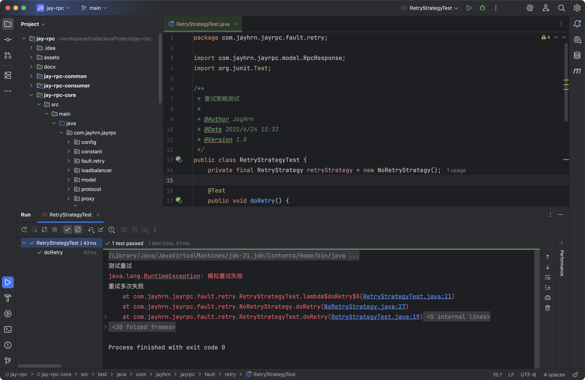

测试`固定时间间隔重试策略`：

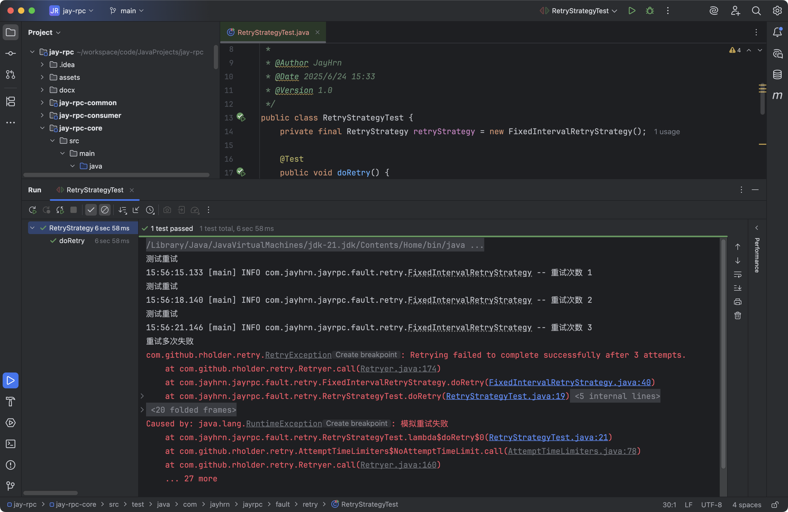

#### 支持配置和拓展重试策略

一个成熟的RPC框架可会支持多种不同的重试策略，像序列化器、注册中心、负载均衡器一样，我们的需求是，让开发者能够填写配置来指定使用的重试策略，并且支持自定义重试策略，让框架更易用、更利于扩展。

要实现这点，开发方式和序列化器、注册中心、负载均衡器都是一样的，都可以使用工厂创建对象、使用`SPI`动态加载自定义的注册中心。

**[1] 重试策略常量**

在`fault.retry`包下新建`RetryStrategyKeys`类，列举所有支持的重试策略键名。

代码如下：

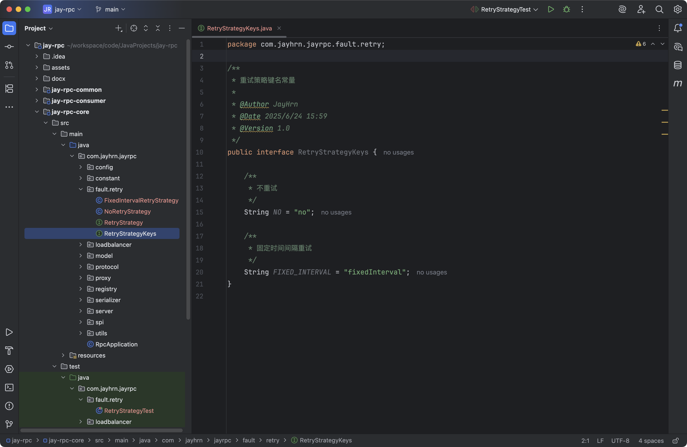

**[2] 使用工厂模式，根据key从`SPI`获取重试策略对象实例**

在`fault.retry`包下新建`RetryStrategyFactory`类，代码如下：

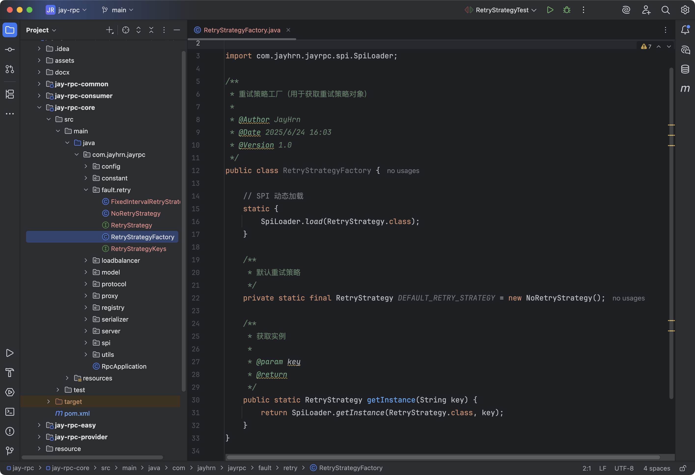

**[3] 编写重试策略接口的SPl配置**

在`META-INF`的`rpc/system`目录下编写重试策略接口的`SPl`配置文件，文件名称为`com.jayhrn.jayrpc.fault.retry.RetryStrategy`

如图：

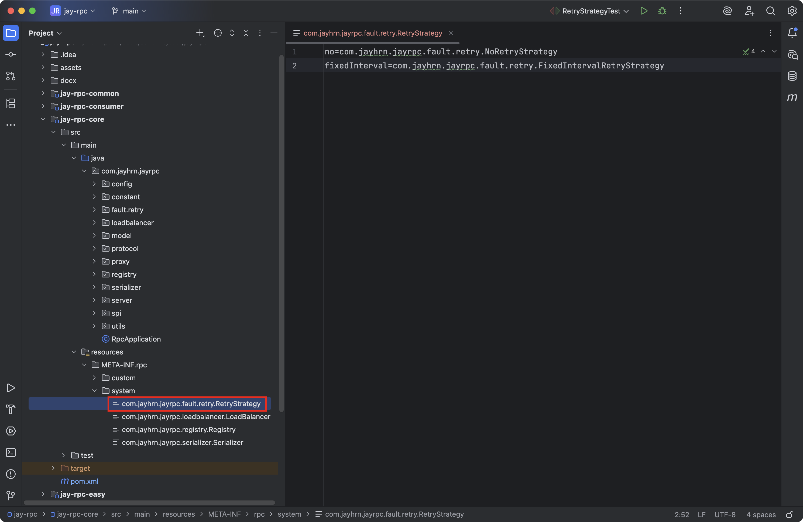

**[4] RpcConfig全局配置新增重试策略的配置**

默认策略是不重试，代码如下：

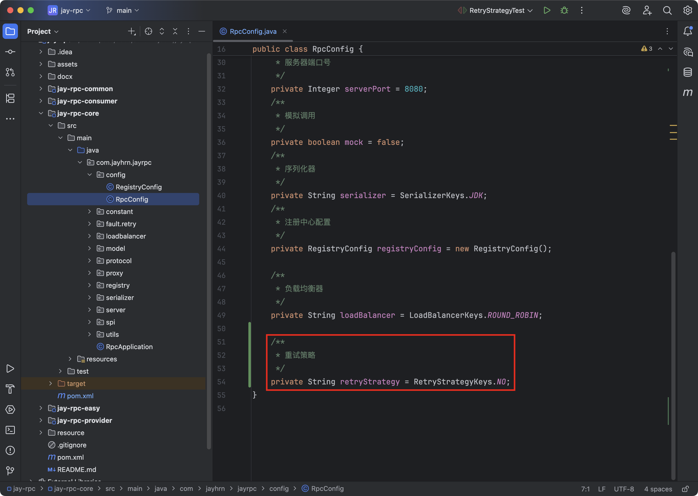

#### 应用重试功能

现在，我们就能够愉快地使用重试功能了。修改`ServiceProxy`的代码，从工厂中获取重试器，并且将请求代码封装为一个`Callable`接口，作为重试器的参数，调用重试器即可。

修改的代码如下：

上述代码中，使用`Lambda`表达式将`VertxTcpClient.doRequest`封装为了一个匿名函数，简化了代码。

修改后的`ServiceProxy`的完整代码如下：

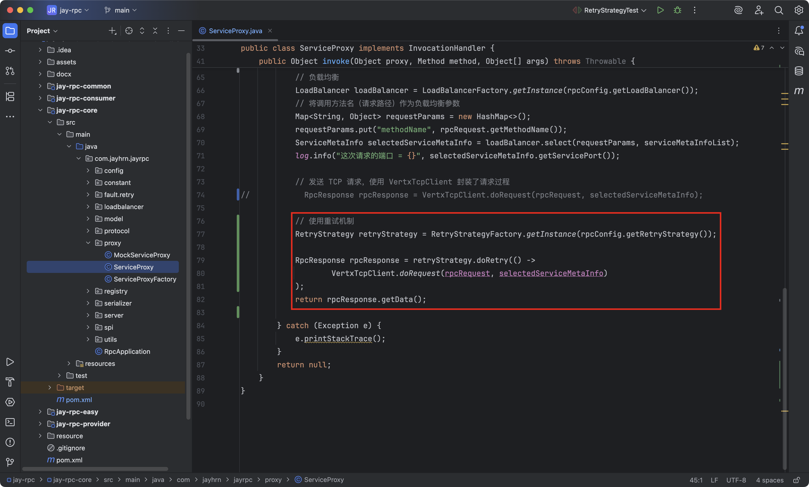

我们会发现，即使引入了重试机制，整段代码并没有变得更复杂，这就是可扩展性设计的巧妙之处。

### 测试

配置消费者重试策略：

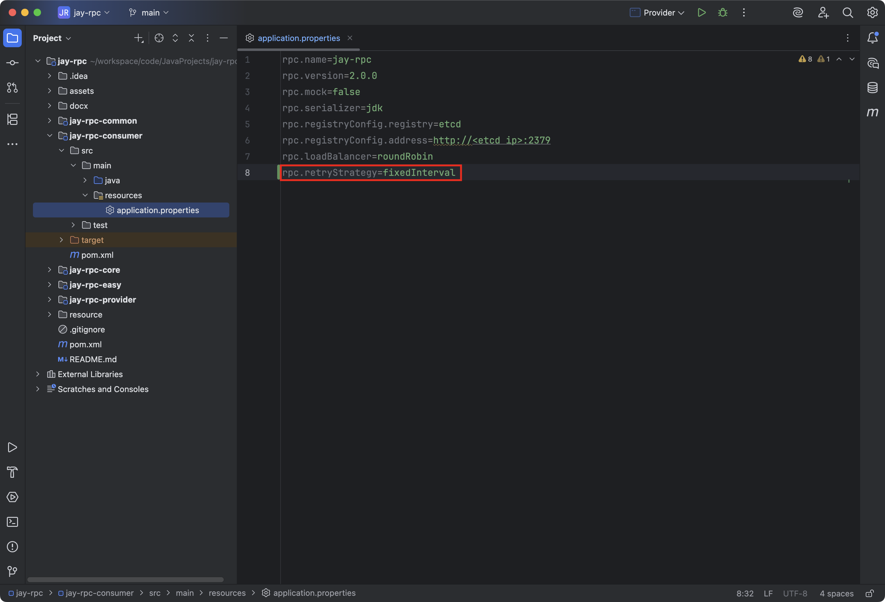

由于重试比较难重现，可以自行去实现。

参考方案：首先启动服务提供者，然后使用Debug模式启动服务消费者，当服务消费者发起调用时，立刻停止服务提供者，就会看到调用失败后重试的情况。

### 扩展

- 新增更多不同类型的重试器